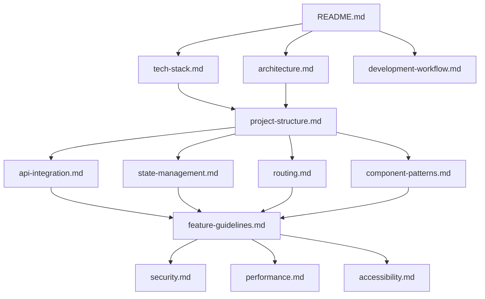
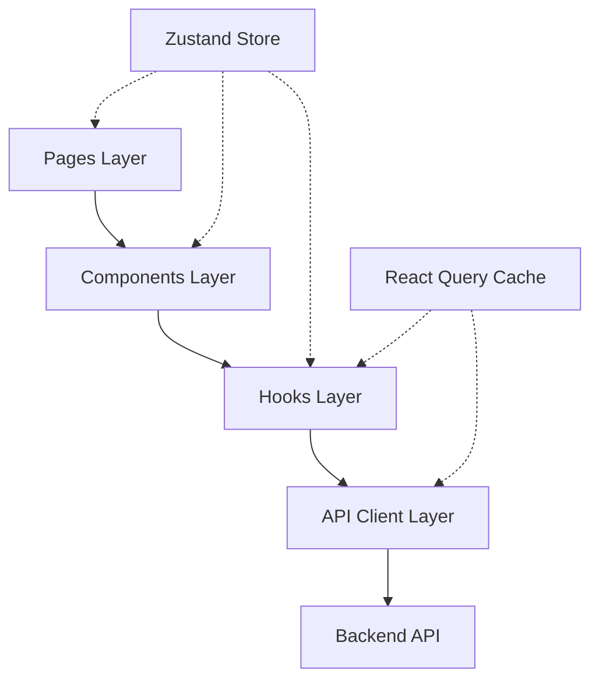
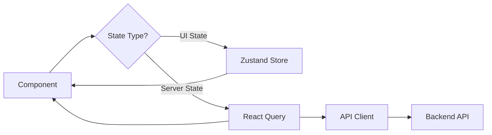

# Design Document

## Overview

This design document outlines the structure, content, and approach for creating comprehensive technical documentation for the LinkShield client-side application. The documentation will serve as the definitive guide for agentic platforms and developers implementing client features. Each documentation file will be structured to provide both conceptual understanding and practical implementation guidance, with code examples, diagrams, and clear explanations of architectural decisions.

The documentation emphasizes that the LinkShield client is a thin presentation layer that consumes the backend API at https://www.linkshield.site/api/v1. All business logic, data validation, and security enforcement reside in the backend. The client is responsible solely for user interface, user experience, state management, and API communication.

## Architecture

### Documentation Structure

```
docs/
└── client/
    ├── README.md                    # Overview and navigation
    ├── tech-stack.md                # Complete technology stack
    ├── architecture.md              # Architectural principles and patterns
    ├── project-structure.md         # Directory organization
    ├── api-integration.md           # Backend API communication
    ├── state-management.md          # State management patterns
    ├── routing.md                   # Navigation and routing
    ├── component-patterns.md        # Component design patterns
    ├── security.md                  # Security best practices
    ├── development-workflow.md      # Dev setup and workflows
    ├── feature-guidelines.md        # Feature implementation guide
    ├── performance.md               # Performance optimization
    ├── accessibility.md             # Accessibility standards
    └── diagrams/                    # Mermaid diagrams
        ├── architecture-overview.mmd
        ├── data-flow.mmd
        ├── auth-flow.mmd
        └── component-hierarchy.mmd
```

### Documentation Flow



## Documentation Files Design

### 1. README.md

**Purpose**: Entry point providing overview and navigation to all documentation.

**Structure**:
```markdown
# LinkShield Client Documentation

## Overview
[Brief description of the client application]

## Architecture Principles
- API-driven thin client
- Backend handles all business logic
- Client focuses on UX and presentation

## Documentation Index
[Links to all documentation files with brief descriptions]

## Quick Start
[Link to development-workflow.md]

## Feature Specifications
[Link to client_architecture/ folder]
```

### 2. tech-stack.md

**Purpose**: Comprehensive list of all technologies, frameworks, and tools.

**Structure**:

#### Core Technologies
```markdown
## Core Framework & Language

### React 18.2+
- **Purpose**: UI library for building component-based interfaces
- **Why**: Industry standard, excellent ecosystem, hooks API
- **Documentation**: https://react.dev

### TypeScript 5.0+
- **Purpose**: Type-safe JavaScript superset
- **Why**: Catch errors at compile time, better IDE support, self-documenting code
- **Configuration**: Strict mode enabled
- **Documentation**: https://www.typescriptlang.org
```

#### State Management
```markdown
## State Management

### Zustand 4.4+
- **Purpose**: Global UI state management
- **Why**: Lightweight, simple API, no boilerplate
- **Use Cases**: Auth state, UI preferences, global notifications
- **Documentation**: https://github.com/pmndrs/zustand

### TanStack Query (React Query) 5.0+
- **Purpose**: Server state management and data fetching
- **Why**: Caching, background updates, optimistic updates, request deduplication
- **Use Cases**: All API data fetching and mutations
- **Documentation**: https://tanstack.com/query
```

#### Routing
```markdown
## Routing

### React Router 6.20+
- **Purpose**: Client-side routing
- **Why**: Declarative routing, nested routes, data loading
- **Features**: Route protection, lazy loading, search params
- **Documentation**: https://reactrouter.com
```

#### Forms & Validation
```markdown
## Forms & Validation

### React Hook Form 7.48+
- **Purpose**: Form state management and validation
- **Why**: Performant, minimal re-renders, easy integration
- **Documentation**: https://react-hook-form.com

### Zod 3.22+
- **Purpose**: Schema validation
- **Why**: TypeScript-first, composable, runtime validation
- **Integration**: Used with React Hook Form for form validation
- **Documentation**: https://zod.dev
```

#### UI Components
```markdown
## UI Component Library

### shadcn/ui (Radix UI + Tailwind)
- **Purpose**: Accessible, customizable component primitives
- **Why**: Copy-paste components, full control, accessible by default
- **Components**: Button, Dialog, Form, Table, Toast, etc.
- **Documentation**: https://ui.shadcn.com

### Tailwind CSS 3.4+
- **Purpose**: Utility-first CSS framework
- **Why**: Rapid development, consistent design, small bundle size
- **Configuration**: Custom theme with LinkShield brand colors
- **Documentation**: https://tailwindcss.com
```

#### HTTP Client
```markdown
## HTTP Client

### Axios 1.6+
- **Purpose**: Promise-based HTTP client
- **Why**: Interceptors, request/response transformation, automatic JSON parsing
- **Configuration**: Base URL, auth interceptor, error handling
- **Documentation**: https://axios-http.com
```

#### Development Tools
```markdown
## Development Tools

### Vite 5.0+
- **Purpose**: Build tool and dev server
- **Why**: Fast HMR, optimized builds, modern ESM support
- **Documentation**: https://vitejs.dev

### ESLint 8.54+
- **Purpose**: Code linting
- **Configuration**: React, TypeScript, accessibility rules
- **Documentation**: https://eslint.org

### Prettier 3.1+
- **Purpose**: Code formatting
- **Configuration**: Consistent formatting across team
- **Documentation**: https://prettier.io
```

#### Testing
```markdown
## Testing Framework

### Vitest 1.0+
- **Purpose**: Unit and integration testing
- **Why**: Fast, Vite-native, Jest-compatible API
- **Documentation**: https://vitest.dev

### React Testing Library 14.1+
- **Purpose**: Component testing
- **Why**: Tests user behavior, not implementation details
- **Documentation**: https://testing-library.com/react

### Playwright 1.40+
- **Purpose**: End-to-end testing
- **Why**: Cross-browser, reliable, great debugging
- **Documentation**: https://playwright.dev
```

#### Additional Libraries
```markdown
## Additional Libraries

### date-fns 3.0+
- **Purpose**: Date manipulation and formatting
- **Why**: Lightweight, immutable, tree-shakeable

### react-hot-toast 2.4+
- **Purpose**: Toast notifications
- **Why**: Lightweight, customizable, accessible

### lucide-react 0.294+
- **Purpose**: Icon library
- **Why**: Consistent design, tree-shakeable, React components

### recharts 2.10+
- **Purpose**: Charts and data visualization
- **Why**: React-native, composable, responsive
```

### 3. architecture.md

**Purpose**: Explain architectural principles, patterns, and design decisions.

**Structure**:

#### Architectural Principles
```markdown
## Core Architectural Principles

### 1. API-Driven Thin Client

The LinkShield client is a **thin presentation layer** that consumes the backend API. This architectural decision has several implications:

**Backend Responsibilities**:
- All business logic
- Data validation and sanitization
- Security enforcement
- Rate limiting
- Data persistence
- External service integration

**Client Responsibilities**:
- User interface rendering
- User interaction handling
- Client-side routing
- State management (UI and server state)
- API communication
- User experience optimization

**Why This Matters**:
- Security is enforced on the backend, not the client
- Client-side validation is for UX only, not security
- Route protection is a UX feature, not a security measure
- The client can be rebuilt with different technologies without changing business logic
```

#### Layered Architecture
```markdown
## Layered Architecture

The client follows a clear layered architecture:



### Pages Layer
- Route-level components
- Layout composition
- Page-specific logic
- Data fetching orchestration

### Components Layer
- Reusable UI components
- Shared components (Button, Input, Modal)
- Feature-specific components
- Presentation logic only

### Hooks Layer
- Custom React hooks
- API query hooks (React Query)
- Form hooks (React Hook Form)
- Shared logic extraction

### API Client Layer
- Axios instance configuration
- Request/response interceptors
- API method definitions
- Error handling
```

#### Component Architecture
```markdown
## Component Architecture

### Functional Components with Hooks

All components use functional components with hooks:

```typescript
// ✅ Good: Functional component with TypeScript
interface UserCardProps {
  user: User;
  onEdit: (user: User) => void;
}

export const UserCard: React.FC<UserCardProps> = ({ user, onEdit }) => {
  const [isExpanded, setIsExpanded] = useState(false);
  
  return (
    <div className="user-card">
      {/* Component JSX */}
    </div>
  );
};

// ❌ Bad: Class component
class UserCard extends React.Component {
  // Don't use class components
}
```

### Component Composition

Build complex UIs from small, focused components:

```typescript
// Large feature component composed of smaller components
export const DashboardPage = () => {
  return (
    <PageLayout>
      <PageHeader title="Dashboard" />
      <StatsGrid>
        <StatCard label="Total Checks" value={stats.totalChecks} />
        <StatCard label="Threats Detected" value={stats.threats} />
        <StatCard label="API Calls" value={stats.apiCalls} />
      </StatsGrid>
      <RecentActivity activities={activities} />
    </PageLayout>
  );
};
```
```

#### State Management Architecture
```markdown
## State Management Architecture

### Separation of Concerns

The application uses two state management solutions for different purposes:

**Zustand for Global UI State**:
- Authentication state (user, token, isAuthenticated)
- UI preferences (theme, language, sidebar collapsed)
- Global notifications (toasts, alerts)
- Temporary UI state that needs to be shared

**React Query for Server State**:
- All data fetched from the API
- Caching and background updates
- Optimistic updates
- Request deduplication



### Why This Separation?

- **Clear Boundaries**: UI state vs server state are fundamentally different
- **Optimized Caching**: React Query handles server state caching automatically
- **Simpler Code**: Each tool does what it's best at
- **Better Performance**: React Query prevents unnecessary API calls
```

### 4. project-structure.md

**Purpose**: Define the directory structure and file organization.

**Structure**:

```markdown
## Project Structure

### Root Directory

```
linkshield-client/
├── public/                      # Static assets
│   ├── favicon.ico
│   ├── logo.svg
│   └── robots.txt
├── src/                         # Source code
├── docs/                        # Documentation
├── tests/                       # Test files
├── .env.example                 # Environment variables template
├── .eslintrc.json              # ESLint configuration
├── .prettierrc                 # Prettier configuration
├── index.html                  # HTML entry point
├── package.json                # Dependencies and scripts
├── tsconfig.json               # TypeScript configuration
├── vite.config.ts              # Vite configuration
├── tailwind.config.js          # Tailwind CSS configuration
└── playwright.config.ts        # Playwright E2E configuration
```

### Source Directory Structure

```
src/
├── main.tsx                    # Application entry point
├── App.tsx                     # Root component
├── pages/                      # Page components (routes)
│   ├── HomePage.tsx
│   ├── LoginPage.tsx
│   ├── DashboardPage.tsx
│   └── ...
├── components/                 # Reusable components
│   ├── ui/                     # Base UI components (shadcn/ui)
│   │   ├── button.tsx
│   │   ├── input.tsx
│   │   ├── dialog.tsx
│   │   └── ...
│   ├── layout/                 # Layout components
│   │   ├── PageLayout.tsx
│   │   ├── Header.tsx
│   │   ├── Sidebar.tsx
│   │   └── Footer.tsx
│   ├── auth/                   # Auth-specific components
│   │   ├── LoginForm.tsx
│   │   ├── RegisterForm.tsx
│   │   └── RequireAuth.tsx
│   └── shared/                 # Shared feature components
│       ├── LoadingSpinner.tsx
│       ├── ErrorBoundary.tsx
│       └── ...
├── hooks/                      # Custom React hooks
│   ├── useAuth.ts
│   ├── useUrlCheck.ts
│   ├── useAiAnalysis.ts
│   └── ...
├── services/                   # API client modules
│   ├── api.ts                  # Axios instance configuration
│   ├── auth.service.ts
│   ├── url-check.service.ts
│   ├── ai-analysis.service.ts
│   └── ...
├── stores/                     # Zustand stores
│   ├── authStore.ts
│   ├── uiStore.ts
│   └── notificationStore.ts
├── types/                      # TypeScript types and interfaces
│   ├── user.types.ts
│   ├── url-check.types.ts
│   ├── api.types.ts
│   └── ...
├── utils/                      # Utility functions
│   ├── formatters.ts
│   ├── validators.ts
│   ├── constants.ts
│   └── ...
├── config/                     # Configuration files
│   ├── env.ts                  # Environment variables
│   └── routes.ts               # Route definitions
└── styles/                     # Global styles
    ├── globals.css
    └── tailwind.css
```

### File Naming Conventions

- **Components**: PascalCase (e.g., `UserCard.tsx`)
- **Hooks**: camelCase with `use` prefix (e.g., `useAuth.ts`)
- **Services**: camelCase with `.service` suffix (e.g., `auth.service.ts`)
- **Types**: camelCase with `.types` suffix (e.g., `user.types.ts`)
- **Utils**: camelCase (e.g., `formatters.ts`)
- **Stores**: camelCase with `Store` suffix (e.g., `authStore.ts`)

### Feature-Based Organization

For large features, use feature folders:

```
src/
└── features/
    ├── url-analysis/
    │   ├── components/
    │   │   ├── UrlHistoryTable.tsx
    │   │   ├── CheckDetailView.tsx
    │   │   └── BulkAnalysisForm.tsx
    │   ├── hooks/
    │   │   ├── useUrlCheck.ts
    │   │   └── useUrlHistory.ts
    │   ├── types/
    │   │   └── url-check.types.ts
    │   ├── services/
    │   │   └── url-check.service.ts
    │   └── pages/
    │       ├── UrlAnalysisPage.tsx
    │       └── CheckDetailPage.tsx
    └── dashboard/
        ├── components/
        ├── hooks/
        ├── types/
        └── pages/
```
```

### 5. api-integration.md

**Purpose**: Explain how to integrate with the backend API.

**Key Sections**:
- Axios instance configuration
- Request/response interceptors
- Authentication header injection
- Error handling and mapping
- Rate limit handling
- API service module pattern
- React Query integration
- TypeScript typing for requests/responses

**Code Examples**:
```typescript
// API client configuration
export const apiClient = axios.create({
  baseURL: import.meta.env.VITE_API_BASE_URL || 'https://www.linkshield.site/api/v1',
  timeout: 30000,
  headers: {
    'Content-Type': 'application/json',
  },
});

// Request interceptor
apiClient.interceptors.request.use(
  (config) => {
    const token = authStore.getState().token;
    if (token) {
      config.headers.Authorization = `Bearer ${token}`;
    }
    return config;
  },
  (error) => Promise.reject(error)
);

// Response interceptor
apiClient.interceptors.response.use(
  (response) => response.data,
  (error) => {
    if (error.response?.status === 401) {
      authStore.getState().clearAuth();
      window.location.href = '/login';
    }
    
    if (error.response?.status === 429) {
      toast.error('Rate limit exceeded. Please try again later.');
    }
    
    return Promise.reject(error);
  }
);
```

### 6. state-management.md

**Purpose**: Explain state management patterns and best practices.

**Key Sections**:
- Zustand store creation and usage
- React Query setup and configuration
- Query keys organization
- Caching strategies
- Optimistic updates
- Pagination with infinite queries
- Real-time updates with polling

**Code Examples**:
```typescript
// Zustand store
export const useAuthStore = create<AuthStore>((set) => ({
  user: null,
  token: null,
  isAuthenticated: false,
  
  setUser: (user) => set({ user, isAuthenticated: true }),
  setToken: (token) => set({ token }),
  clearAuth: () => set({ user: null, token: null, isAuthenticated: false }),
}));

// React Query hook
export const useUrlHistory = (filters: UrlHistoryFilters) => {
  return useQuery({
    queryKey: ['url-history', filters],
    queryFn: () => urlCheckService.getHistory(filters),
    staleTime: 2 * 60 * 1000, // 2 minutes
    gcTime: 10 * 60 * 1000, // 10 minutes
  });
};

// Mutation with optimistic update
export const useVoteReport = () => {
  const queryClient = useQueryClient();
  
  return useMutation({
    mutationFn: ({ reportId, voteType }: VoteParams) => 
      reportsService.vote(reportId, voteType),
    onMutate: async ({ reportId, voteType }) => {
      // Cancel outgoing refetches
      await queryClient.cancelQueries({ queryKey: ['report', reportId] });
      
      // Snapshot previous value
      const previousReport = queryClient.getQueryData(['report', reportId]);
      
      // Optimistically update
      queryClient.setQueryData(['report', reportId], (old: Report) => ({
        ...old,
        votes: old.votes + (voteType === 'up' ? 1 : -1),
      }));
      
      return { previousReport };
    },
    onError: (err, variables, context) => {
      // Rollback on error
      queryClient.setQueryData(['report', variables.reportId], context?.previousReport);
    },
    onSettled: (data, error, variables) => {
      // Refetch after mutation
      queryClient.invalidateQueries({ queryKey: ['report', variables.reportId] });
    },
  });
};
```

### 7. routing.md

**Purpose**: Explain routing setup and navigation patterns.

**Key Sections**:
- React Router setup
- Route definitions
- Protected routes implementation
- Nested routes and layouts
- Route parameters and query params
- Programmatic navigation
- Lazy loading routes

### 8. component-patterns.md

**Purpose**: Document component design patterns and best practices.

**Key Sections**:
- Functional components with TypeScript
- Props interface design
- Component composition
- Render props and children patterns
- Custom hooks for logic extraction
- Form components with React Hook Form
- Error boundaries
- Loading states and skeletons

### 9. security.md

**Purpose**: Document security best practices for the client.

**Key Sections**:
- Token storage strategies
- XSS prevention
- CSRF considerations
- Input validation (UX, not security)
- Sensitive data handling
- API key management
- Third-party dependency security

### 10. development-workflow.md

**Purpose**: Guide developers through setup and daily workflows.

**Key Sections**:
- Initial setup steps
- Environment variables configuration
- Running development server
- Code quality commands (lint, format, type-check)
- Testing commands
- Building for production
- Deployment process

### 11. feature-guidelines.md

**Purpose**: Provide step-by-step guide for implementing new features.

**Key Sections**:
- Feature implementation checklist
- Creating feature structure
- Implementing API integration
- Building UI components
- Adding routes and navigation
- Writing tests
- Accessibility implementation
- Documentation requirements

### 12. performance.md

**Purpose**: Document performance optimization techniques.

**Key Sections**:
- Code splitting and lazy loading
- Bundle size optimization
- Image optimization
- React Query caching
- React rendering optimization (memo, useMemo, useCallback)
- List virtualization
- Debouncing and throttling

### 13. accessibility.md

**Purpose**: Document accessibility standards and implementation.

**Key Sections**:
- WCAG 2.1 Level AA compliance
- Semantic HTML
- ARIA attributes
- Keyboard navigation
- Focus management
- Color contrast
- Screen reader testing
- Automated accessibility testing

## Data Models

### Documentation Metadata

```typescript
interface DocumentationFile {
  filename: string;
  title: string;
  description: string;
  lastUpdated: string;
  requirements: string[]; // Requirement IDs from requirements.md
  relatedDocs: string[]; // Related documentation files
  codeExamples: CodeExample[];
  diagrams: Diagram[];
}

interface CodeExample {
  language: string;
  code: string;
  description: string;
  filename?: string;
}

interface Diagram {
  type: 'mermaid' | 'image';
  content: string;
  caption: string;
}
```

## Implementation Approach

### Documentation Writing Process

1. **Research Phase**
   - Review existing client_architecture specs
   - Review backend API documentation
   - Identify technology choices and patterns
   - Gather code examples from existing implementations

2. **Structure Phase**
   - Create document outline
   - Define sections and subsections
   - Plan code examples and diagrams
   - Identify cross-references

3. **Writing Phase**
   - Write conceptual explanations
   - Add code examples with comments
   - Create Mermaid diagrams
   - Add cross-references to related docs

4. **Review Phase**
   - Verify technical accuracy
   - Check code examples compile/run
   - Ensure completeness
   - Validate against requirements

### Code Example Standards

All code examples must:
- Be syntactically correct and runnable
- Include TypeScript types
- Include comments explaining key concepts
- Follow project coding standards
- Be realistic and practical
- Show both good and bad examples where helpful

### Diagram Standards

All diagrams must:
- Use Mermaid format for version control
- Be clear and easy to understand
- Include captions explaining the diagram
- Use consistent styling and colors
- Focus on one concept per diagram

## Testing Strategy

### Documentation Validation

1. **Technical Accuracy**
   - Code examples compile without errors
   - API endpoints match backend specification
   - TypeScript types are correct
   - Commands execute successfully

2. **Completeness**
   - All requirements addressed
   - All sections have content
   - Cross-references are valid
   - No broken links

3. **Clarity**
   - Explanations are clear and concise
   - Examples are relevant and helpful
   - Diagrams enhance understanding
   - Structure is logical

4. **Consistency**
   - Formatting is consistent across files
   - Terminology is consistent
   - Code style is consistent
   - Structure follows template

### Review Checklist

- [ ] All requirements from requirements.md are addressed
- [ ] Code examples are tested and working
- [ ] Diagrams are clear and accurate
- [ ] Cross-references are valid
- [ ] Formatting is consistent
- [ ] No spelling or grammar errors
- [ ] Technical terms are explained
- [ ] Examples are practical and realistic

## Security Considerations

1. **No Sensitive Data**: Documentation must not include actual API keys, tokens, or credentials
2. **Environment Variables**: Use placeholder values in examples
3. **Security Emphasis**: Clearly state that client-side security is for UX, not enforcement
4. **Best Practices**: Document security best practices without creating false sense of security

## Accessibility

1. **Clear Language**: Use plain language, avoid jargon where possible
2. **Code Formatting**: Use proper markdown code blocks with language specification
3. **Alt Text**: Provide captions for all diagrams
4. **Structure**: Use proper heading hierarchy
5. **Links**: Use descriptive link text

## Performance Considerations

1. **File Size**: Keep individual documentation files under 500 lines
2. **Images**: Use Mermaid diagrams instead of images where possible
3. **Code Examples**: Keep examples focused and concise
4. **Cross-References**: Link to other docs instead of duplicating content
