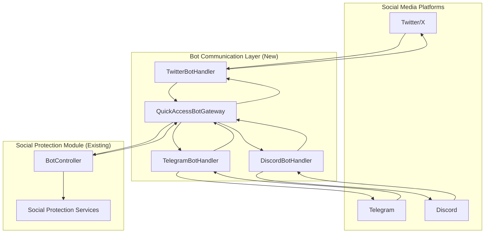

# Social Media Bot Service Design

## Overview

The Social Media Bot Service is a pure communication layer that facilitates interaction between social media platforms (Twitter, Telegram, Discord) and LinkShield's existing social protection services. The service acts as a unified bot framework with no business logic - it handles platform-specific protocols, command parsing, and response formatting while delegating all analysis and decision-making to the existing `BotController` in the social protection module.

## Architecture

### High-Level Architecture



### Communication Flow

1. **Inbound**: Platform → Bot Handler → Gateway → BotController
2. **Outbound**: BotController → Gateway → Bot Handler → Platform

### Separation of Concerns

- **Bot Handlers**: Platform-specific communication protocols and formatting
- **Gateway**: Request routing and response coordination
- **BotController**: All business logic, analysis, and decision-making
- **Social Protection Services**: Threat detection, compliance checking, follower analysis

## Components and Interfaces

### 1. Enhanced Bot Handlers

**Purpose**: Handle platform-specific communication protocols and command interfaces.

#### TwitterBotHandler
```python
class TwitterBotHandler:
    async def handle_webhook(self, payload: Dict[str, Any]) -> Dict[str, Any]:
        """Handle Twitter webhook events and commands"""
        
    async def parse_command(self, tweet_data: Dict[str, Any]) -> BotCommand:
        """Parse Twitter mentions/DMs into standardized commands"""
        
    async def format_response(self, response: Dict[str, Any]) -> Dict[str, Any]:
        """Format BotController response for Twitter (thread, DM, etc.)"""
        
    async def send_response(self, formatted_response: Dict[str, Any]) -> bool:
        """Send response back to Twitter platform"""
```

#### TelegramBotHandler
```python
class TelegramBotHandler:
    async def handle_webhook(self, payload: Dict[str, Any]) -> Dict[str, Any]:
        """Handle Telegram webhook events and commands"""
        
    async def parse_command(self, message_data: Dict[str, Any]) -> BotCommand:
        """Parse Telegram messages into standardized commands"""
        
    async def format_response(self, response: Dict[str, Any]) -> Dict[str, Any]:
        """Format BotController response for Telegram (message, inline keyboard)"""
        
    async def send_response(self, formatted_response: Dict[str, Any]) -> bool:
        """Send response back to Telegram platform"""
```

#### DiscordBotHandler
```python
class DiscordBotHandler:
    async def handle_webhook(self, payload: Dict[str, Any]) -> Dict[str, Any]:
        """Handle Discord interaction events and commands"""
        
    async def parse_command(self, interaction_data: Dict[str, Any]) -> BotCommand:
        """Parse Discord interactions into standardized commands"""
        
    async def format_response(self, response: Dict[str, Any]) -> Dict[str, Any]:
        """Format BotController response for Discord (embed, components)"""
        
    async def send_response(self, formatted_response: Dict[str, Any]) -> bool:
        """Send response back to Discord platform"""
```

### 2. Standardized Command Interface

**Purpose**: Provide consistent command structure across platforms.

```python
@dataclass
class BotCommand:
    command_type: str  # "analyze_account", "check_compliance", "analyze_followers"
    platform: PlatformType
    user_id: str
    parameters: Dict[str, Any]
    metadata: Dict[str, Any]  # Platform-specific context

@dataclass
class BotResponse:
    success: bool
    data: Dict[str, Any]
    error_message: Optional[str]
    response_type: str  # "analysis_result", "compliance_check", "follower_analysis"
    formatting_hints: Dict[str, Any]  # Platform-specific formatting guidance
```

### 3. Enhanced QuickAccessBotGateway

**Purpose**: Route commands between bot handlers and BotController.

```python
class QuickAccessBotGateway:
    async def route_command(self, command: BotCommand) -> BotResponse:
        """Route standardized command to appropriate BotController method"""
        
    async def handle_account_analysis(self, command: BotCommand) -> BotResponse:
        """Route to BotController account analysis functionality"""
        
    async def handle_compliance_check(self, command: BotCommand) -> BotResponse:
        """Route to BotController compliance checking functionality"""
        
    async def handle_follower_analysis(self, command: BotCommand) -> BotResponse:
        """Route to BotController follower analysis functionality"""
```

### 4. BotController Extensions (if needed)

**Purpose**: Add any missing functionality to the existing BotController.

```python
# Extensions to existing BotController class
class BotController:
    # Existing methods...
    
    async def analyze_account_safety(
        self, 
        user: User, 
        account_identifier: str, 
        platform: PlatformType
    ) -> Dict[str, Any]:
        """Analyze account safety using existing social protection services"""
        
    async def check_content_compliance(
        self, 
        user: User, 
        content: str, 
        platform: PlatformType
    ) -> Dict[str, Any]:
        """Check content compliance using existing analysis services"""
        
    async def analyze_verified_followers(
        self, 
        user: User, 
        account_identifier: str, 
        platform: PlatformType
    ) -> Dict[str, Any]:
        """Analyze verified followers using existing follower services"""
```

## Data Models

### Bot Communication Models

```python
@dataclass
class PlatformCommand:
    """Raw command data from platform"""
    platform: PlatformType
    raw_data: Dict[str, Any]
    timestamp: datetime
    user_context: Dict[str, Any]

@dataclass
class FormattedResponse:
    """Platform-specific formatted response"""
    platform: PlatformType
    response_data: Dict[str, Any]
    delivery_method: str  # "reply", "dm", "thread", "embed"
    formatting_applied: List[str]
```

### Command Registry

```python
class CommandRegistry:
    """Registry of supported commands across platforms"""
    
    SUPPORTED_COMMANDS = {
        "analyze_account": {
            "twitter": ["@bot analyze @username", "@bot check @username"],
            "telegram": ["/analyze_account @username", "/check_account @username"],
            "discord": ["/analyze_account user:@username", "/check_account user:@username"]
        },
        "check_compliance": {
            "twitter": ["@bot check_compliance \"content\""],
            "telegram": ["/check_compliance content", "/compliance \"content\""],
            "discord": ["/check_compliance content:\"text\"", "/compliance content:\"text\""]
        },
        "analyze_followers": {
            "twitter": ["@bot analyze_followers", "@bot followers"],
            "telegram": ["/analyze_followers", "/followers", "/verified_followers"],
            "discord": ["/analyze_followers", "/followers", "/verified_followers"]
        }
    }
```

## Error Handling

### Error Categories

1. **Command Parsing Errors**: Invalid command syntax or parameters
2. **Platform API Errors**: Rate limits, authentication failures, API unavailability
3. **BotController Errors**: Analysis failures, timeouts, service unavailability
4. **Response Formatting Errors**: Issues formatting responses for specific platforms

### Error Handling Strategy

```python
class BotErrorHandler:
    async def handle_parsing_error(self, error: Exception, platform: PlatformType) -> BotResponse:
        """Handle command parsing errors with helpful guidance"""
        
    async def handle_platform_error(self, error: Exception, platform: PlatformType) -> BotResponse:
        """Handle platform API errors with appropriate fallbacks"""
        
    async def handle_controller_error(self, error: Exception, platform: PlatformType) -> BotResponse:
        """Handle BotController errors with graceful degradation"""
        
    async def handle_formatting_error(self, error: Exception, platform: PlatformType) -> BotResponse:
        """Handle response formatting errors with fallback formatting"""
```

## Testing Strategy

### Unit Testing

1. **Command Parsing Tests**: Test command parsing for each platform
2. **Response Formatting Tests**: Test response formatting for each platform
3. **Gateway Routing Tests**: Test command routing and response handling
4. **Error Handling Tests**: Test error scenarios and fallback responses

### Integration Testing

1. **Platform Handler Integration**: Test integration with platform APIs
2. **BotController Integration**: Test communication with existing BotController
3. **End-to-End Command Flow**: Test complete command processing flow
4. **Cross-Platform Consistency**: Test consistent behavior across platforms

### Mock Testing Strategy

```python
class TestBotHandlers:
    @pytest.fixture
    def mock_bot_controller(self):
        """Mock BotController for testing bot handlers"""
        return Mock(spec=BotController)
    
    async def test_twitter_command_parsing(self):
        """Test Twitter command parsing without business logic"""
        
    async def test_telegram_response_formatting(self):
        """Test Telegram response formatting without analysis logic"""
        
    async def test_discord_error_handling(self):
        """Test Discord error handling without social protection logic"""
```

## Security Considerations

### Bot-Specific Security

1. **Command Validation**: Validate all commands before forwarding to BotController
2. **Rate Limiting**: Implement bot-specific rate limiting per platform
3. **Authentication**: Verify webhook signatures and bot authenticity
4. **Input Sanitization**: Sanitize user inputs before processing

### Data Protection

1. **Minimal Data Collection**: Only collect data necessary for command processing
2. **Secure Transmission**: Use secure channels for BotController communication
3. **No Business Data Storage**: Store no analysis results or business logic data
4. **Platform Compliance**: Comply with each platform's data handling requirements

## Deployment Strategy

### Phased Deployment

1. **Phase 1**: Implement basic command parsing and routing infrastructure
2. **Phase 2**: Add platform-specific handlers and response formatting
3. **Phase 3**: Integrate with existing BotController and test end-to-end flows
4. **Phase 4**: Add advanced features like bulk processing and real-time updates

### Configuration Management

```python
# Bot service configuration
BOT_SERVICE_ENABLED=true
SUPPORTED_PLATFORMS=["twitter", "telegram", "discord"]
COMMAND_TIMEOUT_SECONDS=30
MAX_CONCURRENT_COMMANDS=100
RESPONSE_CACHE_TTL=300

# Platform-specific configuration
TWITTER_BOT_ENABLED=true
TELEGRAM_BOT_ENABLED=true
DISCORD_BOT_ENABLED=true
```

This design ensures the bot service remains a pure communication layer while leveraging all existing business logic in the social protection module through the BotController interface.