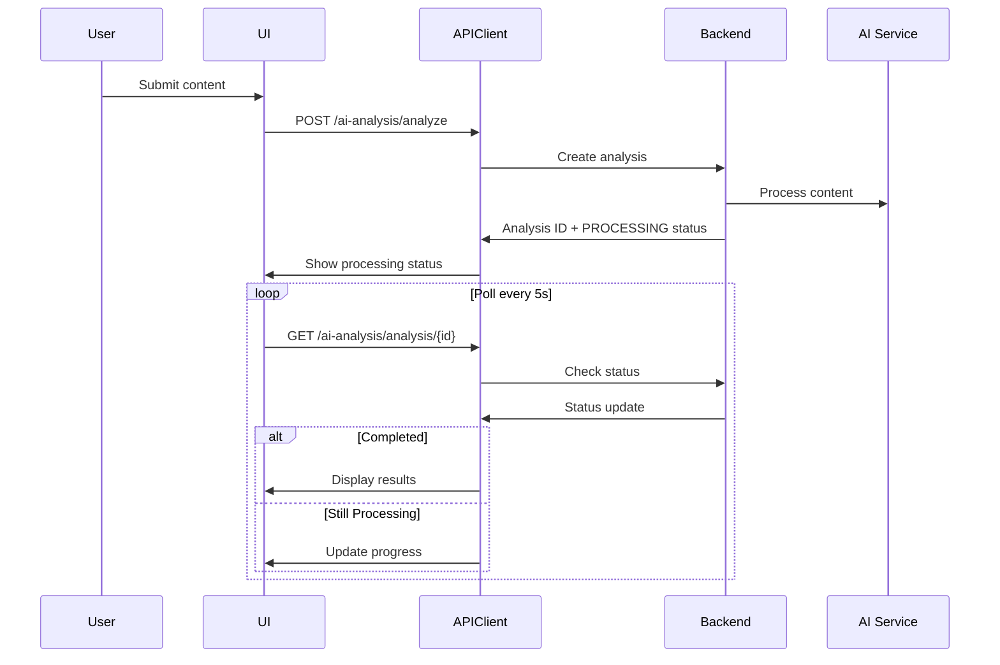

# Design Document

## Overview

The AI Analysis feature provides intelligent content analysis using OpenAI GPT models to detect phishing, assess content quality, identify manipulation tactics, and discover similar threat patterns. The design emphasizes real-time processing feedback, clear visualization of AI insights, and seamless integration with URL checking workflows.

## Architecture

### Component Hierarchy

```
AiAnalysisLayout
├── AiAnalyzePage
│   ├── ContentInputForm
│   ├── ProcessingStatus
│   └── QuickResults
├── AnalysisDetailPage
│   ├── AnalysisSummary
│   ├── ThreatIndicators
│   ├── ManipulationTactics
│   ├── Recommendations
│   └── SimilarContentPanel
├── AnalysisHistoryPage
│   ├── HistoryFilters
│   └── AnalysisHistoryTable
├── DomainStatsPage
│   ├── DomainInput
│   └── DomainStatsPanel
└── ServiceStatusBanner
```

### Data Flow



## Components and Interfaces

### 1. AiAnalyzePage

**Purpose**: Main page for submitting content for AI analysis.

**State**:
```typescript
interface AiAnalyzePageState {
  inputType: 'url' | 'text';
  content: string;
  isSubmitting: boolean;
  analysisId?: string;
  status?: AnalysisStatus;
}

type AnalysisStatus = 'PENDING' | 'PROCESSING' | 'COMPLETED' | 'FAILED';
```

### 2. ContentInputForm

**Props**:
```typescript
interface ContentInputFormProps {
  onSubmit: (data: AnalysisRequest) => void;
  isLoading: boolean;
}

interface AnalysisRequest {
  content_type: 'url' | 'text';
  content: string;
  analysis_type?: 'phishing' | 'quality' | 'comprehensive';
}
```

**Validation**:
- URL: Valid URL format
- Text: Min 50 chars, max 10000 chars
- Content type: Required

### 3. ProcessingStatus

**Props**:
```typescript
interface ProcessingStatusProps {
  status: AnalysisStatus;
  progress?: number;
  estimatedTime?: number;
  error?: string;
}
```

**Display States**:
- PENDING: "Queued for analysis..."
- PROCESSING: Progress bar with estimated time
- COMPLETED: Success message with view results link
- FAILED: Error message with retry button

### 4. AnalysisDetailPage

**Purpose**: Display comprehensive AI analysis results.

**Data Model**:
```typescript
interface AiAnalysis {
  id: string;
  content_preview: string;
  content_type: 'url' | 'text';
  status: AnalysisStatus;
  phishing_score: number; // 0-100
  content_quality_score: number; // 0-100
  risk_level: 'LOW' | 'MEDIUM' | 'HIGH' | 'CRITICAL';
  threat_indicators: ThreatIndicator[];
  manipulation_tactics: ManipulationTactic[];
  recommendations: Recommendation[];
  confidence_score: number; // 0-100
  analyzed_at: string;
  completed_at?: string;
  error_message?: string;
}

interface ThreatIndicator {
  type: string;
  description: string;
  severity: 'LOW' | 'MEDIUM' | 'HIGH';
  confidence: number;
  examples: string[];
}

interface ManipulationTactic {
  tactic: string;
  description: string;
  examples: string[];
  impact: string;
}

interface Recommendation {
  title: string;
  description: string;
  priority: 'LOW' | 'MEDIUM' | 'HIGH';
  action: string;
}
```

### 5. ThreatIndicators

**Props**:
```typescript
interface ThreatIndicatorsProps {
  indicators: ThreatIndicator[];
}
```

**Display**:
- List of threat indicators with severity badges
- Expandable sections for examples
- Confidence scores with visual indicators

### 6. SimilarContentPanel

**Props**:
```typescript
interface SimilarContentPanelProps {
  analysisId: string;
}

interface SimilarContent {
  id: string;
  content_preview: string;
  similarity_score: number; // 0-100
  risk_level: string;
  analyzed_at: string;
  common_threats: string[];
}
```

### 7. AnalysisHistoryPage

**Purpose**: Display user's AI analysis history with filtering.

**Filters**:
```typescript
interface HistoryFilters {
  risk_level?: 'LOW' | 'MEDIUM' | 'HIGH' | 'CRITICAL';
  status?: AnalysisStatus;
  date_from?: string;
  date_to?: string;
  page: number;
  page_size: number;
}
```

### 8. DomainStatsPage

**Purpose**: Display AI analysis statistics for a domain.

**Data Model**:
```typescript
interface DomainAiStats {
  domain: string;
  total_analyses: number;
  average_phishing_score: number;
  average_quality_score: number;
  threat_distribution: {
    threat_type: string;
    count: number;
    percentage: number;
  }[];
  score_trends: {
    date: string;
    phishing_score: number;
    quality_score: number;
  }[];
  common_threats: {
    threat: string;
    occurrences: number;
  }[];
}
```

### 9. ServiceStatusBanner

**Props**:
```typescript
interface ServiceStatusBannerProps {
  status: 'operational' | 'degraded' | 'down';
  message?: string;
  estimatedResolution?: string;
  queueLength?: number;
}
```

## State Management

### React Query Hooks

```typescript
// Submit Analysis
const useSubmitAnalysis = () => {
  return useMutation({
    mutationFn: (data: AnalysisRequest) => aiAnalysisAPI.analyze(data),
  });
};

// Get Analysis with Polling
const useAnalysis = (analysisId: string, enabled: boolean = true) => {
  return useQuery({
    queryKey: ['ai-analysis', analysisId],
    queryFn: () => aiAnalysisAPI.getAnalysis(analysisId),
    enabled,
    refetchInterval: (data) => {
      if (data?.status === 'PROCESSING' || data?.status === 'PENDING') {
        return 5000; // Poll every 5 seconds
      }
      return false; // Stop polling when complete
    },
  });
};

// Similar Content
const useSimilarContent = (analysisId: string) => {
  return useQuery({
    queryKey: ['similar-content', analysisId],
    queryFn: () => aiAnalysisAPI.getSimilarContent(analysisId),
  });
};

// Analysis History
const useAnalysisHistory = (filters: HistoryFilters) => {
  return useQuery({
    queryKey: ['ai-analysis-history', filters],
    queryFn: () => aiAnalysisAPI.getHistory(filters),
    keepPreviousData: true,
  });
};

// Domain Stats
const useDomainStats = (domain: string) => {
  return useQuery({
    queryKey: ['domain-ai-stats', domain],
    queryFn: () => aiAnalysisAPI.getDomainStats(domain),
    enabled: !!domain,
  });
};

// Retry Analysis
const useRetryAnalysis = () => {
  const queryClient = useQueryClient();
  return useMutation({
    mutationFn: (analysisId: string) => aiAnalysisAPI.retryAnalysis(analysisId),
    onSuccess: (_, analysisId) => {
      queryClient.invalidateQueries({ queryKey: ['ai-analysis', analysisId] });
    },
  });
};

// Service Status
const useServiceStatus = () => {
  return useQuery({
    queryKey: ['ai-service-status'],
    queryFn: aiAnalysisAPI.getStatus,
    refetchInterval: 60000, // Refresh every minute
  });
};
```

## API Client

```typescript
export const aiAnalysisAPI = {
  analyze: async (data: AnalysisRequest): Promise<AiAnalysis> => {
    const response = await apiClient.post('/ai-analysis/analyze', data);
    return response.data;
  },
  
  getAnalysis: async (analysisId: string): Promise<AiAnalysis> => {
    const response = await apiClient.get(`/ai-analysis/analysis/${analysisId}`);
    return response.data;
  },
  
  getSimilarContent: async (analysisId: string): Promise<SimilarContent[]> => {
    const response = await apiClient.get(`/ai-analysis/analysis/${analysisId}/similar`);
    return response.data;
  },
  
  getHistory: async (filters: HistoryFilters): Promise<AnalysisHistoryResponse> => {
    const params = new URLSearchParams();
    Object.entries(filters).forEach(([key, value]) => {
      if (value !== undefined) params.append(key, String(value));
    });
    const response = await apiClient.get(`/ai-analysis/history?${params}`);
    return response.data;
  },
  
  getDomainStats: async (domain: string): Promise<DomainAiStats> => {
    const response = await apiClient.get(`/ai-analysis/domain/${domain}/stats`);
    return response.data;
  },
  
  retryAnalysis: async (analysisId: string): Promise<AiAnalysis> => {
    const response = await apiClient.post(`/ai-analysis/analysis/${analysisId}/retry`);
    return response.data;
  },
  
  getStatus: async (): Promise<ServiceStatus> => {
    const response = await apiClient.get('/ai-analysis/status');
    return response.data;
  },
};
```

## Error Handling

```typescript
const errorMessages: Record<string, string> = {
  AI_SERVICE_UNAVAILABLE: 'AI analysis service is temporarily unavailable. Please try again later.',
  MODEL_LOAD_FAILED: 'AI model could not be loaded. Please check service status.',
  ANALYSIS_FAILED: 'Content analysis failed. Please try again.',
  INSUFFICIENT_CONTENT: 'Not enough content to analyze. Minimum 50 characters required.',
  CONTENT_TOO_LONG: 'Content exceeds maximum length of 10,000 characters.',
  ANALYSIS_TIMEOUT: 'Analysis operation timed out. Please retry.',
  RETRY_LIMIT_EXCEEDED: 'Maximum retry attempts reached. Please try again later.',
  ANALYSIS_NOT_FOUND: 'Analysis not found.',
  RATE_LIMIT_EXCEEDED: 'Too many requests. Please try again in {retry_after} seconds.',
};
```

## UI/UX Design

### Risk Level Badges

```typescript
const getRiskLevelConfig = (riskLevel: string) => {
  const config = {
    LOW: { color: 'green', icon: 'check-circle', label: 'Low Risk' },
    MEDIUM: { color: 'yellow', icon: 'alert-triangle', label: 'Medium Risk' },
    HIGH: { color: 'orange', icon: 'alert-circle', label: 'High Risk' },
    CRITICAL: { color: 'red', icon: 'x-octagon', label: 'Critical Risk' },
  };
  return config[riskLevel];
};
```

### Score Display

```typescript
const getScoreColor = (score: number) => {
  if (score >= 80) return 'red'; // High risk
  if (score >= 50) return 'orange';
  if (score >= 30) return 'yellow';
  return 'green'; // Low risk
};
```

## Testing Strategy

### Unit Tests
- Content validation logic
- Score calculations
- Risk level determination
- Polling logic

### Integration Tests
- Submit analysis and poll for results
- View analysis details
- Find similar content
- Retry failed analysis
- View history with filters

### E2E Tests
- Complete analysis workflow
- Processing status updates
- View and interact with results
- Navigate to similar content

## Accessibility

- Forms with proper labels and validation
- Processing status announced to screen readers
- Charts with text alternatives
- Keyboard navigation for all interactive elements
- Color-blind friendly risk indicators

## Performance Considerations

- Efficient polling with automatic stop on completion
- Debounced content input (300ms)
- Lazy loading of similar content
- Chart data memoization
- Optimistic UI updates
