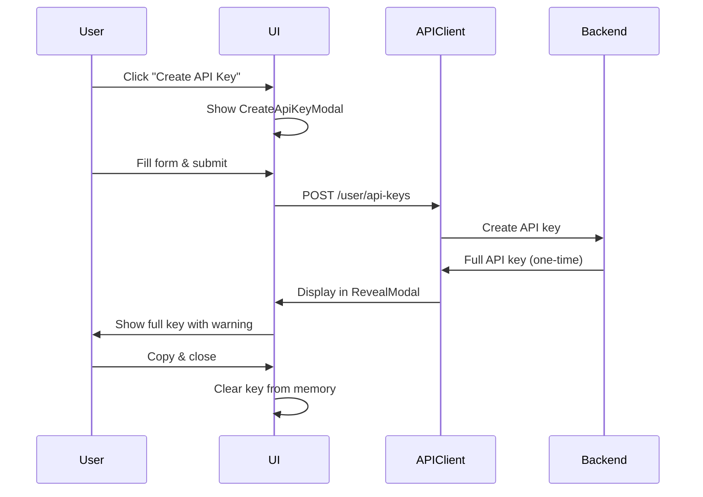

# Design Document

## Overview

The API Key Management feature provides a secure interface for users to create, view, and manage API keys for programmatic access to LinkShield services. The design emphasizes security by displaying full keys only once at creation and implementing secure clipboard operations.

## Architecture

### Component Hierarchy

```
ApiKeysPage
├── ApiKeysHeader
│   └── CreateApiKeyButton
├── ApiKeysList
│   ├── ApiKeysTable
│   │   └── ApiKeyRow (expandable)
│   └── EmptyState
└── Modals
    ├── CreateApiKeyModal
    ├── ApiKeyRevealModal
    └── DeleteApiKeyDialog
```

### Data Flow



## Components and Interfaces

### 1. ApiKeysPage

**Purpose**: Main container for API key management.

**State**:
```typescript
interface ApiKeysPageState {
  isCreateModalOpen: boolean;
  selectedKeyId: string | null;
  isDeleteDialogOpen: boolean;
}
```

### 2. CreateApiKeyModal

**Props**:
```typescript
interface CreateApiKeyModalProps {
  isOpen: boolean;
  onClose: () => void;
  onSuccess: (apiKey: ApiKeyResponse) => void;
}

interface CreateApiKeyFormData {
  name: string;
  description?: string;
  expires_at?: string;
  permissions: Permission[];
}

type Permission = 'url_check' | 'ai_analysis' | 'reports' | 'profile';
```

**Validation**:
- Name: Required, 3-50 characters
- Description: Optional, max 200 characters
- Expires At: Optional, must be future date
- Permissions: At least one required

### 3. ApiKeyRevealModal

**Props**:
```typescript
interface ApiKeyRevealModalProps {
  apiKey: string;
  keyName: string;
  isOpen: boolean;
  onClose: () => void;
}
```

**Security Features**:
- Display full key only once
- Copy to clipboard button
- Warning about one-time display
- Auto-clear from memory on close
- No console logging

## Data Models

```typescript
interface ApiKey {
  id: string;
  name: string;
  description?: string;
  key_preview: string;
  permissions: Permission[];
  is_active: boolean;
  expires_at?: string;
  last_used_at?: string;
  created_at: string;
}

interface ApiKeyResponse extends ApiKey {
  api_key: string; // Full key, only on creation
}
```

## State Management

### React Query Hooks

```typescript
const useApiKeys = () => {
  return useQuery({
    queryKey: ['api-keys'],
    queryFn: apiKeysAPI.getApiKeys,
    staleTime: 2 * 60 * 1000,
  });
};

const useCreateApiKey = () => {
  const queryClient = useQueryClient();
  return useMutation({
    mutationFn: apiKeysAPI.createApiKey,
    onSuccess: () => {
      queryClient.invalidateQueries({ queryKey: ['api-keys'] });
    },
  });
};

const useDeleteApiKey = () => {
  const queryClient = useQueryClient();
  return useMutation({
    mutationFn: apiKeysAPI.deleteApiKey,
    onSuccess: () => {
      queryClient.invalidateQueries({ queryKey: ['api-keys'] });
    },
  });
};
```

## API Client

```typescript
export const apiKeysAPI = {
  getApiKeys: async (): Promise<ApiKey[]> => {
    const response = await apiClient.get('/user/api-keys');
    return response.data;
  },
  
  createApiKey: async (data: CreateApiKeyRequest): Promise<ApiKeyResponse> => {
    const response = await apiClient.post('/user/api-keys', data);
    return response.data;
  },
  
  deleteApiKey: async (keyId: string): Promise<void> => {
    await apiClient.delete(`/user/api-keys/${keyId}`);
  },
};
```

## Error Handling

```typescript
const errorMessages: Record<string, string> = {
  API_KEY_LIMIT_REACHED: 'API key limit reached. Delete unused keys or upgrade your plan.',
  INVALID_PERMISSION: 'Invalid permission specified.',
  API_KEY_NOT_FOUND: 'API key not found or already deleted.',
  UNAUTHORIZED: 'Session expired. Please log in again.',
  FORBIDDEN: 'You do not have permission to perform this action.',
};
```

## Security Implementation

```typescript
// Secure clipboard copy
const copyToClipboard = async (text: string): Promise<boolean> => {
  try {
    await navigator.clipboard.writeText(text);
    return true;
  } catch (error) {
    const textarea = document.createElement('textarea');
    textarea.value = text;
    textarea.style.position = 'fixed';
    textarea.style.opacity = '0';
    document.body.appendChild(textarea);
    textarea.select();
    const success = document.execCommand('copy');
    document.body.removeChild(textarea);
    return success;
  }
};
```

## Testing Strategy

### Unit Tests
- Form validation logic
- Permission selection
- Status badge display
- Copy to clipboard functionality

### Integration Tests
- Create API key flow
- Delete API key with confirmation
- List and display API keys
- Error handling scenarios

### E2E Tests
- Complete API key lifecycle
- Copy key and verify clipboard
- Delete key and verify removal

## Accessibility

- Keyboard navigation for all interactive elements
- ARIA labels for buttons and form fields
- Screen reader announcements for success/error messages
- Focus management in modals

## Performance Considerations

- Cache API keys list for 2 minutes
- Optimistic updates for deletions
- Lazy load modal components
- Memoize expensive computations
