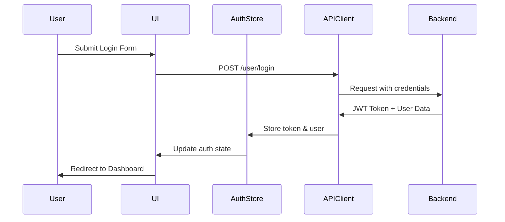

# Design Document

## Overview

The Authentication feature implements a comprehensive user authentication system using JWT tokens, email verification, and session management. The design follows modern React patterns with TypeScript, using React Query for server state management and Zustand for client state management.

## Architecture

### Component Hierarchy

```
App
├── AuthProvider (Context)
│   ├── Public Routes
│   │   ├── HomePage
│   │   ├── LoginPage
│   │   ├── RegisterPage
│   │   ├── VerifyEmailPage
│   │   ├── ForgotPasswordPage
│   │   └── ResetPasswordPage
│   └── Protected Routes (RequireAuth wrapper)
│       ├── DashboardPage
│       ├── ProfilePage
│       ├── SessionsPage
│       └── ... other authenticated pages
```

### Data Flow



## Components and Interfaces

### Core Components

#### 1. AuthProvider

**Purpose**: Manages global authentication state and provides auth context to the application.

**Props**: 
```typescript
interface AuthProviderProps {
  children: React.ReactNode;
}
```

**State**:
```typescript
interface AuthState {
  user: User | null;
  token: string | null;
  isAuthenticated: boolean;
  isLoading: boolean;
}
```

**Methods**:
```typescript
interface AuthContextValue extends AuthState {
  login: (email: string, password: string, rememberMe: boolean) => Promise<void>;
  logout: () => Promise<void>;
  register: (data: RegisterData) => Promise<void>;
  updateUser: (user: User) => void;
  clearAuth: () => void;
}
```

#### 2. RegisterForm

**Purpose**: User registration form with validation and password strength indicator.

**Fields**:
```typescript
interface RegisterFormData {
  email: string;
  password: string;
  confirmPassword: string;
  full_name: string;
  company?: string;
  accept_terms: boolean;
  marketing_consent: boolean;
}
```

**Validation Rules**:
- Email: Valid email format, max 255 characters
- Password: Min 8 chars, 1 uppercase, 1 lowercase, 1 digit, 1 special char
- Confirm Password: Must match password
- Full Name: Required, 2-100 characters
- Company: Optional, max 100 characters
- Accept Terms: Must be true

**UI Elements**:
- Email input with validation feedback
- Password input with strength indicator (Weak/Fair/Good/Strong)
- Confirm password input with match indicator
- Full name input
- Company input (optional)
- Terms checkbox with link to terms page
- Marketing consent checkbox
- Submit button with loading state
- Link to login page

#### 3. LoginForm

**Purpose**: User login form with remember me option and error handling.

**Fields**:
```typescript
interface LoginFormData {
  email: string;
  password: string;
  remember_me: boolean;
}
```

**UI Elements**:
- Email input
- Password input with show/hide toggle
- Remember me checkbox
- Submit button with loading state
- Forgot password link
- Link to registration page
- Error message display area

#### 4. VerifyEmailPage

**Purpose**: Handles email verification from link in user's inbox.

**Flow**:
1. Extract token from URL params
2. Automatically call verification API on mount
3. Display loading state during verification
4. Show success message and redirect to login
5. Show error message with resend option on failure

**UI States**:
- Loading: "Verifying your email..."
- Success: "Email verified successfully! Redirecting to login..."
- Error: "Verification failed" with resend button

#### 5. ForgotPasswordPage

**Purpose**: Request password reset email.

**Fields**:
```typescript
interface ForgotPasswordFormData {
  email: string;
}
```

**UI Elements**:
- Email input
- Submit button
- Success message (always shown for security)
- Link back to login

#### 6. ResetPasswordPage

**Purpose**: Set new password using reset token from email.

**Fields**:
```typescript
interface ResetPasswordFormData {
  token: string; // from URL
  new_password: string;
  confirm_password: string;
}
```

**UI Elements**:
- New password input with strength indicator
- Confirm password input
- Submit button with loading state
- Success message with redirect countdown
- Error message with request new reset option

#### 7. ProfilePage

**Purpose**: Display and edit user profile information.

**Sections**:
- Account Information (read-only): email, role, created_at, is_verified
- Personal Information (editable): full_name, company
- Preferences (editable): timezone, language, marketing_consent
- Profile Picture (editable): profile_picture_url with upload
- Subscription Information (read-only): plan name, price, status
- Actions: Change Password button, link to Sessions page

**UI Elements**:
- Profile form with edit/save modes
- Verification badge if email verified
- Subscription plan card with upgrade CTA if applicable
- Change password modal/page link
- Success/error toast notifications

#### 8. SessionsPage

**Purpose**: View and manage active sessions.

**Table Columns**:
- Device Info (browser, OS)
- IP Address
- Location (if available)
- Last Activity
- Created At
- Status (Active/Current)
- Actions (Revoke button)

**UI Elements**:
- Sessions table with sorting
- Current session indicator
- Revoke button for each session (disabled for current)
- Terminate All Sessions button
- Confirmation modal for terminate all
- Empty state if no sessions
- Loading skeleton during fetch

### Shared Components

#### PasswordStrengthIndicator

**Purpose**: Visual indicator of password strength.

**Props**:
```typescript
interface PasswordStrengthIndicatorProps {
  password: string;
}
```

**Strength Levels**:
- Weak (0-25%): Red
- Fair (26-50%): Orange
- Good (51-75%): Yellow
- Strong (76-100%): Green

**Criteria Checked**:
- Length >= 8
- Contains uppercase
- Contains lowercase
- Contains digit
- Contains special character
- Length >= 12 (bonus)

#### RequireAuth

**Purpose**: Route wrapper that redirects unauthenticated users to login.

**Props**:
```typescript
interface RequireAuthProps {
  children: React.ReactNode;
  redirectTo?: string;
}
```

**Behavior**:
- Check authentication state
- If not authenticated, redirect to login with return URL
- If authenticated, render children
- Show loading state while checking auth

## Data Models

### User Model

```typescript
interface User {
  id: string;
  email: string;
  full_name: string;
  company?: string;
  role: 'USER' | 'ADMIN';
  subscription_plan: SubscriptionPlan;
  is_active: boolean;
  is_verified: boolean;
  profile_picture_url?: string;
  timezone?: string;
  language?: string;
  marketing_consent: boolean;
  created_at: string;
  updated_at?: string;
}
```

### SubscriptionPlan Model

```typescript
interface SubscriptionPlan {
  id: number;
  name: string;
  price: number;
  active: boolean;
}
```

### Session Model

```typescript
interface Session {
  id: string;
  device_info?: {
    browser?: string;
    os?: string;
  };
  ip_address: string;
  user_agent: string;
  is_active: boolean;
  expires_at: string;
  last_activity_at: string;
  created_at: string;
}
```

### LoginResponse Model

```typescript
interface LoginResponse {
  access_token: string;
  token_type: 'bearer';
  expires_in: number;
  user: User;
  session_id: string;
}
```

## State Management

### Auth Store (Zustand)

```typescript
interface AuthStore {
  // State
  user: User | null;
  token: string | null;
  isAuthenticated: boolean;
  isLoading: boolean;
  
  // Actions
  setUser: (user: User) => void;
  setToken: (token: string) => void;
  clearAuth: () => void;
  setLoading: (loading: boolean) => void;
}
```

**Storage**: 
- Token stored in memory (not localStorage for security)
- Optional: Use httpOnly cookies if backend supports

### React Query Hooks

#### useLogin

```typescript
const useLogin = () => {
  return useMutation({
    mutationFn: (data: LoginFormData) => authAPI.login(data),
    onSuccess: (response) => {
      authStore.setToken(response.access_token);
      authStore.setUser(response.user);
      // Redirect to dashboard or return URL
    },
    onError: (error) => {
      // Handle error display
    }
  });
};
```

#### useRegister

```typescript
const useRegister = () => {
  return useMutation({
    mutationFn: (data: RegisterFormData) => authAPI.register(data),
    onSuccess: () => {
      // Show success message
      // Redirect to login with verification notice
    }
  });
};
```

#### useProfile

```typescript
const useProfile = () => {
  return useQuery({
    queryKey: ['profile'],
    queryFn: authAPI.getProfile,
    enabled: !!authStore.token,
    staleTime: 5 * 60 * 1000, // 5 minutes
  });
};
```

#### useSessions

```typescript
const useSessions = () => {
  return useQuery({
    queryKey: ['sessions'],
    queryFn: authAPI.getSessions,
    enabled: !!authStore.token,
  });
};
```

## API Client

### Base Configuration

```typescript
const apiClient = axios.create({
  baseURL: 'https://www.linkshield.site/api/v1',
  headers: {
    'Content-Type': 'application/json',
  },
});

// Request interceptor to add auth token
apiClient.interceptors.request.use((config) => {
  const token = authStore.getState().token;
  if (token) {
    config.headers.Authorization = `Bearer ${token}`;
  }
  return config;
});

// Response interceptor for error handling
apiClient.interceptors.response.use(
  (response) => response,
  (error) => {
    if (error.response?.status === 401) {
      authStore.getState().clearAuth();
      window.location.href = '/login';
    }
    return Promise.reject(error);
  }
);
```

### API Methods

```typescript
export const authAPI = {
  register: (data: RegisterFormData) => 
    apiClient.post('/user/register', data),
    
  login: (data: LoginFormData) => 
    apiClient.post('/user/login', {
      ...data,
      device_info: getDeviceInfo()
    }),
    
  logout: () => 
    apiClient.post('/user/logout'),
    
  verifyEmail: (token: string) => 
    apiClient.post(`/user/verify-email`, { token }),
    
  resendVerification: (email: string) => 
    apiClient.post('/user/resend-verification', { email }),
    
  getProfile: () => 
    apiClient.get('/user/profile'),
    
  updateProfile: (data: Partial<User>) => 
    apiClient.put('/user/profile', data),
    
  changePassword: (data: { current_password: string; new_password: string }) => 
    apiClient.post('/user/change-password', data),
    
  forgotPassword: (email: string) => 
    apiClient.post('/user/forgot-password', { email }),
    
  resetPassword: (data: { token: string; new_password: string }) => 
    apiClient.post('/user/reset-password', data),
    
  getSessions: () => 
    apiClient.get('/user/sessions'),
    
  revokeSession: (sessionId: string) => 
    apiClient.delete(`/user/sessions/${sessionId}`),
    
  terminateAllSessions: () => 
    apiClient.delete('/user/sessions'),
};
```

## Error Handling

### Error Display Strategy

1. **Form Validation Errors**: Display inline below each field
2. **API Errors**: Display in toast notification or alert banner
3. **Network Errors**: Display retry option with error message
4. **Authentication Errors**: Redirect to login with appropriate message

### Error Message Mapping

```typescript
const errorMessages: Record<string, string> = {
  EMAIL_ALREADY_EXISTS: 'This email is already registered. Try logging in instead.',
  INVALID_CREDENTIALS: 'Invalid email or password. Please try again.',
  ACCOUNT_LOCKED: 'Your account has been locked due to too many failed login attempts. Please try again in 30 minutes.',
  EMAIL_NOT_VERIFIED: 'Please verify your email address before logging in.',
  TOKEN_EXPIRED: 'Your session has expired. Please log in again.',
  INVALID_TOKEN: 'This link is invalid or has expired. Please request a new one.',
  RATE_LIMIT_EXCEEDED: 'Too many requests. Please try again later.',
  PASSWORD_TOO_WEAK: 'Password does not meet security requirements.',
};
```

## Testing Strategy

### Unit Tests

- Form validation logic
- Password strength calculation
- Error message mapping
- State management actions

### Integration Tests

- Login flow end-to-end
- Registration with email verification
- Password reset flow
- Session management operations

### E2E Tests

- Complete user registration and login
- Email verification workflow
- Password change and reset
- Session revocation

## Security Considerations

1. **Token Storage**: Store JWT in memory, not localStorage
2. **HTTPS Only**: All API calls over HTTPS
3. **CSRF Protection**: Include CSRF tokens if using cookies
4. **XSS Prevention**: Sanitize all user input
5. **Password Security**: Never log or expose passwords
6. **Rate Limiting**: Respect backend rate limits
7. **Session Timeout**: Handle token expiration gracefully
8. **Secure Redirects**: Validate redirect URLs to prevent open redirects

## Accessibility

1. **Keyboard Navigation**: All forms fully keyboard accessible
2. **Screen Readers**: Proper ARIA labels and announcements
3. **Focus Management**: Logical focus order and visible focus indicators
4. **Error Announcements**: Errors announced to screen readers
5. **Color Contrast**: WCAG AA compliant color contrast ratios
6. **Form Labels**: All inputs have associated labels

## Performance Considerations

1. **Code Splitting**: Lazy load authentication pages
2. **Caching**: Cache profile data with React Query
3. **Debouncing**: Debounce email availability checks
4. **Optimistic Updates**: Update UI before API confirmation where appropriate
5. **Loading States**: Show skeletons during data fetching