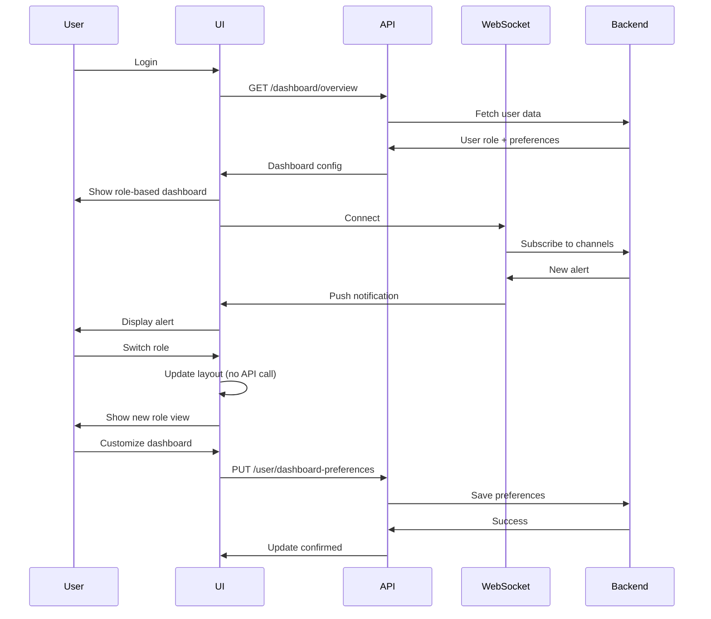

# Design Document

## Overview

The LinkShield Dashboard is a unified, role-based platform that serves multiple user personas without overwhelming them. It uses intelligent layout adaptation, progressive disclosure, and contextual navigation to present relevant features to each user type. The design integrates browser extension data, social media bot analytics, and automated scanning into a cohesive experience.

## Architecture

### Component Hierarchy

```
DashboardLayout
├── DashboardHeader
│   ├── Logo
│   ├── RoleSwitcher
│   ├── GlobalSearch
│   ├── NotificationsCenter
│   └── UserMenu
├── DashboardSidebar
│   ├── RoleBasedNavigation
│   │   ├── WebDeveloperNav
│   │   ├── SocialMediaNav
│   │   ├── BrandManagerNav
│   │   ├── NewsMediaNav
│   │   └── ExecutiveNav
│   ├── IntegrationStatus
│   │   ├── ExtensionStatus
│   │   └── BotStatus
│   └── QuickActions
├── DashboardMain
│   ├── RoleBasedDashboard
│   │   ├── WebDeveloperDashboard
│   │   │   ├── ProjectsOverview
│   │   │   ├── MonitoringStatus
│   │   │   ├── TechnicalAlerts
│   │   │   └── APIUsage
│   │   ├── SocialMediaDashboard
│   │   │   ├── PlatformsOverview
│   │   │   ├── ContentAnalysis
│   │   │   ├── AlgorithmHealth
│   │   │   └── EngagementMetrics
│   │   ├── BrandManagerDashboard
│   │   │   ├── BrandMonitoring
│   │   │   ├── CrisisManagement
│   │   │   ├── ReputationScore
│   │   │   └── CompetitorAnalysis
│   │   ├── NewsMediaDashboard
│   │   │   ├── ContentVerification
│   │   │   ├── SourceChecking
│   │   │   ├── FactChecking
│   │   │   └── MisinformationAlerts
│   │   └── ExecutiveDashboard
│   │       ├── ExecutiveSummary
│   │       ├── RiskOverview
│   │       ├── ROIMetrics
│   │       └── TeamPerformance
│   ├── IntegrationPanels
│   │   ├── ExtensionAnalytics
│   │   └── BotAnalytics
│   └── CustomizableWidgets
└── DashboardFooter
```

### Data Flow



## Components and Interfaces

### Data Models

```typescript
// Dashboard Overview
interface DashboardOverview {
  user_role: UserRole;
  available_roles: UserRole[];
  web_developer?: WebDeveloperMetrics;
  social_media?: SocialMediaMetrics;
  brand_manager?: BrandManagerMetrics;
  news_media?: NewsMediaMetrics;
  executive?: ExecutiveMetrics;
  extension_status?: ExtensionStatus;
  bot_status?: BotStatus;
  notifications_count: number;
}

type UserRole = 'web_developer' | 'social_media' | 'brand_manager' | 'news_media' | 'executive';

// Role-Specific Metrics
interface WebDeveloperMetrics {
  total_projects: number;
  active_monitoring: number;
  total_scans: number;
  active_alerts: number;
  api_usage: APIUsage;
}

interface SocialMediaMetrics {
  connected_platforms: number;
  risk_score: number;
  algorithm_health: number;
  active_crises: number;
  recent_analyses: number;
}

interface BrandManagerMetrics {
  brand_mentions: number;
  reputation_score: number;
  active_crises: number;
  competitor_alerts: number;
  sentiment_score: number;
}

interface NewsMediaMetrics {
  content_verified: number;
  sources_checked: number;
  misinformation_detected: number;
  fact_checks_performed: number;
  credibility_score: number;
}

interface ExecutiveMetrics {
  overall_risk_score: number;
  threats_prevented: number;
  cost_savings: number;
  team_performance: number;
  roi_percentage: number;
}

// Integration Status
interface ExtensionStatus {
  installed: boolean;
  version?: string;
  last_sync?: string;
  total_scans: number;
  threats_blocked: number;
  sites_protected: number;
  update_available: boolean;
}

interface BotStatus {
  active_bots: number;
  total_analyses: number;
  threats_detected: number;
  avg_response_time: number;
  platform_breakdown: Record<string, BotPlatformStats>;
}

interface BotPlatformStats {
  platform: string;
  status: 'online' | 'offline' | 'error';
  analyses: number;
  threats: number;
  last_activity: string;
}

// Dashboard Preferences
interface DashboardPreferences {
  default_role: UserRole;
  layout: DashboardLayout;
  visible_widgets: string[];
  widget_positions: Record<string, WidgetPosition>;
  theme: 'light' | 'dark' | 'auto';
  notifications_enabled: boolean;
}

interface DashboardLayout {
  sidebar_collapsed: boolean;
  panel_sizes: Record<string, number>;
  custom_order: string[];
}

interface WidgetPosition {
  x: number;
  y: number;
  width: number;
  height: number;
}

// Notifications
interface Notificatio