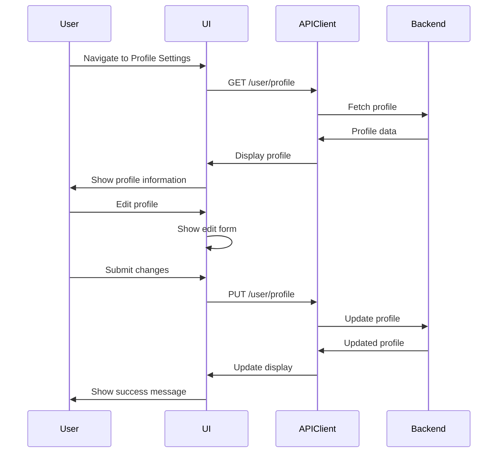

# Design Document

## Overview

The Profile & Account Settings feature provides a comprehensive interface for users to manage their personal information, preferences, security settings, and account details. The design emphasizes ease of use, clear organization, and secure handling of sensitive information.

## Architecture

### Component Hierarchy

```
ProfileSettingsLayout
├── ProfileSettingsPage
│   ├── ProfileHeader
│   │   ├── AvatarUpload
│   │   └── AccountBadges
│   ├── ProfileTabs
│   │   ├── GeneralTab
│   │   │   ├── ProfileInformationSection
│   │   │   ├── AccountInformationSection
│   │   │   └── SubscriptionSection
│   │   ├── PreferencesTab
│   │   │   ├── LocalizationSection
│   │   │   └── NotificationPreferencesSection
│   │   ├── SecurityTab
│   │   │   ├── PasswordSection
│   │   │   └── SessionsSection
│   │   └── DataTab
│   │       ├── ExportDataSection
│   │       └── DeleteAccountSection
│   └── Modals
│       ├── EditProfileModal
│       ├── ChangePasswordModal
│       ├── AvatarUploadModal
│       ├── ExportDataModal
│       └── DeleteAccountDialog
```

### Data Flow



## Components and Interfaces

### Data Models

```typescript
interface UserProfile {
  id: string;
  email: string;
  full_name: string;
  company?: string;
  role: 'USER' | 'ADMIN';
  profile_picture_url?: string;
  timezone?: string;
  language?: string;
  marketing_consent: boolean;
  is_active: boolean;
  is_verified: boolean;
  subscription_plan?: SubscriptionPlan;
  created_at: string;
  updated_at?: string;
}

interface ProfileUpdateRequest {
  full_name?: string;
  company?: string;
  profile_picture_url?: string;
  timezone?: string;
  language?: string;
  marketing_consent?: boolean;
}

interface PasswordChangeRequest {
  current_password: string;
  new_password: string;
}

interface NotificationPreferences {
  security_alerts: boolean;
  url_check_results: boolean;
  team_invitations: boolean;
  product_updates: boolean;
  marketing_emails: boolean;
}
```

### State Management

```typescript
// React Query Hooks
const useProfile = () => {
  return useQuery({
    queryKey: ['user-profile'],
    queryFn: profileAPI.getProfile,
    staleTime: 5 * 60 * 1000, // 5 minutes
  });
};

const useUpdateProfile = () => {
  const queryClient = useQueryClient();
  return useMutation({
    mutationFn: (data: ProfileUpdateRequest) => profileAPI.updateProfile(data),
    onSuccess: (updatedProfile) => {
      queryClient.setQueryData(['user-profile'], updatedProfile);
      toast.success('Profile updated successfully');
    },
    onError: (error) => {
      toast.error('Failed to update profile');
    },
  });
};

const useChangePassword = () => {
  return useMutation({
    mutationFn: (data: PasswordChangeRequest) => profileAPI.changePassword(data),
    onSuccess: () => {
      toast.success('Password changed successfully. Please log in again.');
      // Redirect to login after 3 seconds
    },
  });
};

const useUploadAvatar = () => {
  const { mutate: updateProfile } = useUpdateProfile();
  return useMutation({
    mutationFn: (file: File) => uploadService.uploadImage(file),
    onSuccess: (imageUrl) => {
      updateProfile({ profile_picture_url: imageUrl });
    },
  });
};
```

## API Client

```typescript
export const profileAPI = {
  getProfile: async (): Promise<UserProfile> => {
    const response = await apiClient.get('/user/profile');
    return response.data;
  },
  
  updateProfile: async (data: ProfileUpdateRequest): Promise<UserProfile> => {
    const response = await apiClient.put('/user/profile', data);
    return response.data;
  },
  
  changePassword: async (data: PasswordChangeRequest): Promise<void> => {
    await apiClient.post('/user/change-password', data);
  },
  
  deleteAccount: async (): Promise<void> => {
    await apiClient.delete('/user/account');
  },
  
  exportData: async (options: ExportOptions): Promise<Blob> => {
    const response = await apiClient.post('/user/export-data', options, {
      responseType: 'blob',
    });
    return response.data;
  },
};
```

## UI/UX Design

### Tab Organization

**General Tab**:
- Profile Information (name, company, avatar)
- Account Information (email, role, status, created date)
- Subscription (plan, usage, manage link)

**Preferences Tab**:
- Localization (timezone, language)
- Notification Preferences (email notifications)

**Security Tab**:
- Password (change password button)
- Sessions (view and manage sessions - link to sessions page)

**Data Tab**:
- Export Data (download account data)
- Delete Account (permanent deletion)

### Form Patterns

```typescript
// Edit Profile Form
interface EditProfileFormData {
  full_name: string;
  company: string;
  profile_picture_url: string;
}

// Validation Schema
const editProfileSchema = z.object({
  full_name: z.string().min(1).max(100),
  company: z.string().max(100).optional(),
  profile_picture_url: z.string().url().max(500).optional(),
});

// Password Change Form
interface PasswordChangeFormData {
  current_password: string;
  new_password: string;
  confirm_password: string;
}

const passwordChangeSchema = z.object({
  current_password: z.string().min(1),
  new_password: z.string()
    .min(8)
    .max(128)
    .regex(/[A-Z]/, 'Must contain uppercase')
    .regex(/[a-z]/, 'Must contain lowercase')
    .regex(/[0-9]/, 'Must contain digit')
    .regex(/[^A-Za-z0-9]/, 'Must contain special character'),
  confirm_password: z.string(),
}).refine((data) => data.new_password === data.confirm_password, {
  message: "Passwords don't match",
  path: ["confirm_password"],
});
```

### Password Strength Indicator

```typescript
const calculatePasswordStrength = (password: string): number => {
  let strength = 0;
  if (password.length >= 8) strength += 20;
  if (password.length >= 12) strength += 20;
  if (/[a-z]/.test(password)) strength += 15;
  if (/[A-Z]/.test(password)) strength += 15;
  if (/[0-9]/.test(password)) strength += 15;
  if (/[^A-Za-z0-9]/.test(password)) strength += 15;
  return strength;
};

const getPasswordStrengthLabel = (strength: number): string => {
  if (strength < 40) return 'Weak';
  if (strength < 60) return 'Fair';
  if (strength < 80) return 'Good';
  return 'Strong';
};

const getPasswordStrengthColor = (strength: number): string => {
  if (strength < 40) return 'red';
  if (strength < 60) return 'orange';
  if (strength < 80) return 'yellow';
  return 'green';
};
```

### Avatar Upload

```typescript
const handleAvatarUpload = async (file: File) => {
  // Validate file
  if (file.size > 5 * 1024 * 1024) {
    throw new Error('File size must be less than 5MB');
  }
  
  if (!['image/jpeg', 'image/png', 'image/gif'].includes(file.type)) {
    throw new Error('File must be an image (JPG, PNG, or GIF)');
  }
  
  // Upload to storage
  const formData = new FormData();
  formData.append('file', file);
  
  const response = await uploadService.upload(formData);
  const imageUrl = response.data.url;
  
  // Update profile
  await profileAPI.updateProfile({ profile_picture_url: imageUrl });
};
```

## Error Handling

```typescript
const errorMessages: Record<string, string> = {
  INVALID_FIELD: 'Invalid value provided',
  PASSWORD_INCORRECT: 'Current password is incorrect',
  PASSWORD_TOO_WEAK: 'Password does not meet security requirements',
  PASSWORD_SAME: 'New password must be different from current password',
  FILE_TOO_LARGE: 'Image file is too large (max 5MB)',
  INVALID_URL: 'Invalid profile picture URL',
  UNAUTHORIZED: 'Session expired. Please log in again.',
  RATE_LIMIT_EXCEEDED: 'Too many requests. Please try again later.',
  SERVER_ERROR: 'Unable to update profile. Please try again.',
};
```

## Testing Strategy

### Unit Tests
- Form validation logic
- Password strength calculation
- Avatar upload validation
- Error message mapping

### Component Tests
- Profile display with different data states
- Form submission and validation
- Password change flow
- Avatar upload flow

### Integration Tests
- Complete profile update flow
- Password change with session invalidation
- Preferences update
- Error handling scenarios

### E2E Tests
- Navigate to profile settings
- Update profile information
- Change password and re-login
- Upload avatar
- Export data

## Accessibility

- All forms keyboard navigable
- Proper ARIA labels and roles
- Error messages announced to screen readers
- Password strength indicator with text alternative
- Focus management in modals
- Color contrast WCAG AA compliant

## Performance Considerations

- Profile data cached for 5 minutes
- Form changes debounced (300ms)
- Optimistic updates for better UX
- Image upload with progress indicator
- Lazy load tabs
- Memoize expensive computations