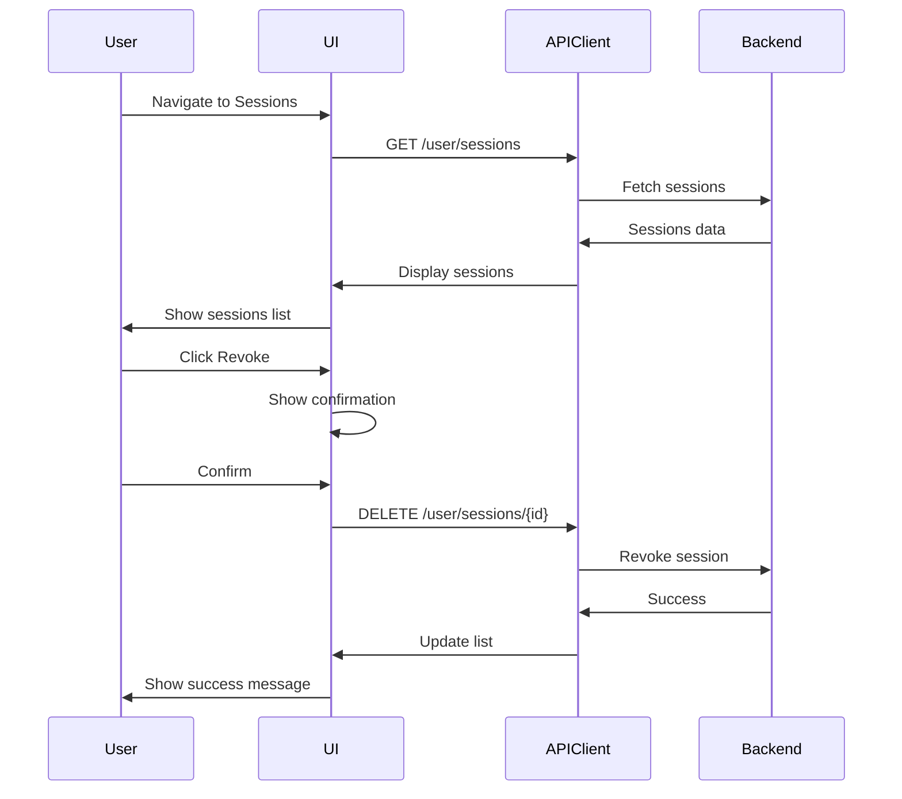

# Design Document

## Overview

The Session Management feature provides users with comprehensive visibility and control over their active sessions across different devices and locations. The design emphasizes security, clarity, and ease of use, enabling users to quickly identify and revoke unauthorized or suspicious sessions.

## Architecture

### Component Hierarchy

```
SessionsLayout
├── SessionsPage
│   ├── SessionsHeader
│   │   ├── PageTitle
│   │   ├── RefreshButton
│   │   └── TerminateAllButton
│   ├── SessionsToolbar
│   │   ├── SearchInput
│   │   ├── FilterDropdown
│   │   └── ActiveFilters
│   ├── SessionsList
│   │   ├── CurrentSessionCard
│   │   └── SessionCard[]
│   │       ├── SessionIcon
│   │       ├── SessionInfo
│   │       ├── SessionBadges
│   │       ├── SessionActions
│   │       └── SessionDetails (expandable)
│   ├── EmptyState
│   └── LoadingState
└── Modals
    ├── RevokeSessionDialog
    ├── TerminateAllDialog
    └── SessionNotificationToast
```

### Data Flow



## Components and Interfaces

### Data Models

```typescript
interface Session {
  id: string;
  device_info: string;
  ip_address: string;
  user_agent: string;
  is_active: boolean;
  expires_at: string;
  last_activity_at: string;
  created_at: string;
  location?: SessionLocation;
  is_current?: boolean;
}

interface SessionLocation {
  city?: string;
  country?: string;
  country_code?: string;
}

interface ParsedUserAgent {
  browser: string;
  browserVersion: string;
  os: string;
  osVersion: string;
  device: string;
}

interface SessionFilters {
  search: string;
  status: 'all' | 'active' | 'inactive' | 'current';
}
```

### State Management

```typescript
const useSessions = () => {
  return useQuery({
    queryKey: ['sessions'],
    queryFn: sessionsAPI.getSessions,
    refetchInterval: 60000,
    refetchIntervalInBackground: false,
    staleTime: 30000,
  });
};

const useRevokeSession = () => {
  const queryClient = useQueryClient();
  return useMutation({
    mutationFn: (sessionId: string) => sessionsAPI.revokeSession(sessionId),
    onSuccess: (_, sessionId) => {
      queryClient.setQueryData(['sessions'], (old: Session[]) =>
        old.filter(s => s.id !== sessionId)
      );
      toast.success('Session revoked successfully');
    },
  });
};

const useTerminateAllSessions = () => {
  const queryClient = useQueryClient();
  return useMutation({
    mutationFn: sessionsAPI.terminateAllSessions,
    onSuccess: () => {
      queryClient.invalidateQueries(['sessions']);
      toast.success('All other sessions terminated');
    },
  });
};
```

## API Client

```typescript
export const sessionsAPI = {
  getSessions: async (): Promise<Session[]> => {
    const response = await apiClient.get('/user/sessions');
    const sessions = response.data;
    const currentSessionId = getCurrentSessionId();
    return sessions.map(session => ({
      ...session,
      is_current: session.id === currentSessionId,
    }));
  },
  
  revokeSession: async (sessionId: string): Promise<void> => {
    await apiClient.delete(`/user/sessions/${sessionId}`);
  },
  
  terminateAllSessions: async (): Promise<void> => {
    await apiClient.delete('/user/sessions');
  },
};
```

## UI/UX Design

### Session Filtering

```typescript
const filterSessions = (
  sessions: Session[],
  filters: SessionFilters
): Session[] => {
  let filtered = sessions;
  
  if (filters.search) {
    const search = filters.search.toLowerCase();
    filtered = filtered.filter(session =>
      session.device_info.toLowerCase().includes(search) ||
      session.ip_address.includes(search) ||
      session.location?.city?.toLowerCase().includes(search)
    );
  }
  
  switch (filters.status) {
    case 'active':
      filtered = filtered.filter(s => s.is_active);
      break;
    case 'inactive':
      filtered = filtered.filter(s => !s.is_active);
      break;
    case 'current':
      filtered = filtered.filter(s => s.is_current);
      break;
  }
  
  return filtered.sort((a, b) => {
    if (a.is_current) return -1;
    if (b.is_current) return 1;
    return new Date(b.last_activity_at).getTime() - 
           new Date(a.last_activity_at).getTime();
  });
};
```

### Security Badges

```typescript
const getSessionBadges = (session: Session) => {
  const badges = [];
  
  if (session.is_current) {
    badges.push({ type: 'current', label: 'Current Session' });
  }
  
  const hoursSinceCreation = 
    (Date.now() - new Date(session.created_at).getTime()) / 3600000;
  if (hoursSinceCreation < 24) {
    badges.push({ type: 'new', label: 'New' });
  }
  
  const daysSinceActivity = 
    (Date.now() - new Date(session.last_activity_at).getTime()) / 86400000;
  if (daysSinceActivity > 7) {
    badges.push({ type: 'inactive', label: 'Inactive' });
  }
  
  return badges;
};
```

## Error Handling

```typescript
const handleSessionError = (error: ApiError) => {
  switch (error.code) {
    case 'SESSION_NOT_FOUND':
      toast.error('Session not found or already expired');
      break;
    case 'CANNOT_REVOKE_CURRENT':
      toast.error('Cannot revoke your current session');
      break;
    case 'UNAUTHORIZED':
      window.location.href = '/login';
      break;
    case 'RATE_LIMIT_EXCEEDED':
      toast.error('Too many requests. Please try again later.');
      break;
    default:
      toast.error('Unable to manage sessions');
  }
};
```

## Testing Strategy

### Unit Tests
- User agent parsing
- Session filtering and sorting
- Badge generation
- Relative time formatting

### Component Tests
- SessionCard rendering
- Session list filtering
- Revoke button states
- Confirmation dialogs

### Integration Tests
- Fetch and display sessions
- Revoke session flow
- Terminate all flow
- Auto-refresh
- Error handling

### E2E Tests
- View sessions
- Revoke session
- Terminate all sessions
- Search and filter

## Accessibility

- Keyboard navigation
- ARIA labels
- Screen reader support
- Focus management
- Color contrast WCAG AA

## Performance

- Virtual scrolling for large lists
- Debounced search (300ms)
- Optimistic updates
- Memoized filtering
- Auto-refresh paused when inactive
