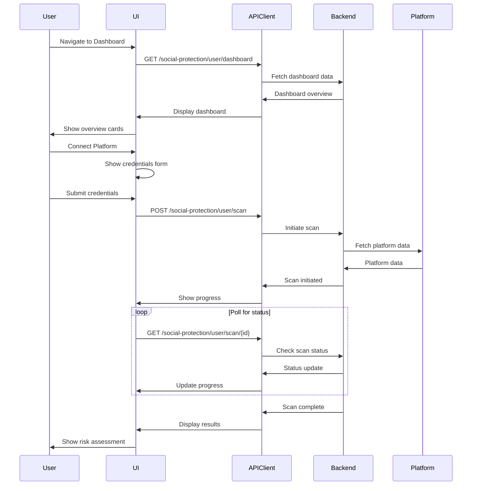

# Design Document

## Overview

The Social Protection feature provides a comprehensive social media monitoring and security platform. It integrates dashboard panels, homepage scanning, browser extension management, and documentation to help users protect their social media presence. The design emphasizes real-time monitoring, intuitive visualization, and seamless platform integration.

## Architecture

### Component Hierarchy

```
SocialProtectionLayout
├── SocialProtectionDashboard
│   ├── DashboardOverview
│   │   ├── OverviewCards
│   │   │   ├── ActivePlatformsCard
│   │   │   ├── RiskScoreCard
│   │   │   ├── RecentAlertsCard
│   │   │   └── AlgorithmHealthCard
│   │   └── ConnectedPlatformsList
│   ├── PlatformManagement
│   │   ├── ConnectPlatformModal
│   │   ├── PlatformCredentialsForm
│   │   ├── ScanProgressIndicator
│   │   └── ScanResultsPanel
│   ├── ContentAnalysis
│   │   ├── AnalyzeContentModal
│   │   ├── ContentInputForm
│   │   ├── RiskAssessmentDisplay
│   │   └── RecommendationsPanel
│   ├── AlgorithmHealth
│   │   ├── HealthOverview
│   │   ├── PlatformHealthCard
│   │   ├── MetricsChart
│   │   └── TrendIndicators
│   ├── CrisisAlerts
│   │   ├── AlertsList
│   │   ├── AlertCard
│   │   ├── AlertDetailsPanel
│   │   └── RecommendationsPanel
│   └── ExtensionPanel
│       ├── ExtensionStatus
│       ├── ExtensionAnalytics
│       ├── AnalyticsChart
│       └── ExtensionSettings
├── HomepageSocialScanner
│   ├── ScannerInput
│   ├── ScanProgress
│   └── ScanResults
├── ExtensionDownloadsPage
│   ├── BrowserDetector
│   ├── ExtensionCards
│   ├── InstallationGuide
│   └── FeaturesShowcase
├── DocumentationHub
│   ├── DocumentationNav
│   ├── GettingStarted
│   ├── PlatformSetup
│   ├── FeaturesGuide
│   ├── APIReference
│   └── Troubleshooting
└── SocialProtectionSettings
    ├── MonitoringSettings
    ├── AlertSettings
    ├── PrivacySettings
    └── PlatformSettings
```

### Data Flow



## Components and Interfaces

### Data Models

```typescript
// Dashboard Overview
interface DashboardOverview {
  active_platforms: number;
  risk_score: number;
  recent_alerts: number;
  algorithm_health: 'excellent' | 'good' | 'fair' | 'poor';
  connected_platforms: ConnectedPlatform[];
  last_scan?: string;
}

interface ConnectedPlatform {
  platform: PlatformType;
  username: string;
  connected_at: string;
  last_scan?: string;
  risk_score?: number;
  status: 'active' | 'error' | 'pending';
}

// Platform Scan
interface PlatformScan {
  scan_id: string;
  platform: PlatformType;
  status: 'pending' | 'processing' | 'complete' | 'failed';
  progress?: number;
  risk_score?: number;
  issues_found?: number;
  recommendations?: Recommendation[];
  created_at: string;
  completed_at?: string;
  error?: string;
}

interface ScanCredentials {
  platform: PlatformType;
  username?: string;
  api_key?: string;
  access_token?: string;
  [key: string]: any;
}

// Content Analysis
interface ContentAnalysis {
  analysis_id: string;
  platform: PlatformType;
  content_type: 'post' | 'comment' | 'message';
  risk_score: number;
  link_risks: LinkRisk[];
  spam_indicators: SpamIndicators;
  content_risks: ContentRisks;
  recommendations: Recommendation[];
  analyzed_at: string;
}

interface LinkRisk {
  url: string;
  safety_score: number;
  threats: string[];
  reputation: 'safe' | 'suspicious' | 'malicious';
}

interface SpamIndicators {
  spam_probability: number;
  patterns_detected: string[];
  confidence: number;
}

interface ContentRisks {
  safety_score: number;
  flagged_elements: string[];
  policy_violations: string[];
}

// Algorithm Health
interface AlgorithmHealth {
  platform: PlatformType;
  visibility_score: number;
  engagement_quality: number;
  penalty_indicators: PenaltyIndicator[];
  shadow_ban_risk: 'low' | 'medium' | 'high';
  trend: 'up' | 'down' | 'stable';
  metrics: HealthMetrics;
  last_updated: string;
}

interface PenaltyIndicator {
  type: string;
  severity: 'low' | 'medium' | 'high';
  detected_at: string;
  description: string;
}

interface HealthMetrics {
  reach: number;
  impressions: number;
  engagement_rate: number;
  follower_growth: number;
}

// Crisis Alert
interface CrisisAlert {
  alert_id: string;
  severity: 'low' | 'medium' | 'high' | 'critical';
  platform: PlatformType;
  alert_type: string;
  status: 'active' | 'acknowledged' | 'resolved';
  signals: DetectionSignal[];
  ai_summary: string;
  recommendations?: Recommendation[];
  created_at: string;
  updated_at?: string;
}

interface DetectionSignal {
  signal_type: string;
  value: number;
  threshold: number;
  description: string;
}

// Extension
interface ExtensionStatus {
  extension_installed: boolean;
  version?: string;
  last_sync?: string;
  active_sessions: number;
  update_available: boolean;
  latest_version?: string;
}

interface ExtensionAnalytics {
  total_scans: number;
  threats_blocked: number;
  content_analyzed: number;
  platforms_monitored: string[];
  time_series: AnalyticsDataPoint[];
}

interface AnalyticsDataPoint {
  date: string;
  scans: number;
  threats: number;
}

interface ExtensionSettings {
  auto_scan: boolean;
  real_time_alerts: boolean;
  platform_filters: PlatformType[];
  scan_sensitivity: 'low' | 'medium' | 'high';
  notification_preferences: NotificationPreferences;
}

// Settings
interface SocialProtectionSettings {
  monitoring: MonitoringSettings;
  alerts: AlertSettings;
  privacy: PrivacySettings;
  platforms: ConnectedPlatform[];
}

interface MonitoringSettings {
  auto_scan: boolean;
  real_time_monitoring: boolean;
  deep_analysis: boolean;
  scan_frequency: 'hourly' | 'daily' | 'weekly';
}

interface AlertSettings {
  email_alerts: boolean;
  push_notifications: boolean;
  alert_severity_threshold: 'low' | 'medium' | 'high';
  alert_channels: string[];
}

interface PrivacySettings {
  data_retention: number; // days
  anonymous_scanning: boolean;
  share_threat_intelligence: boolean;
}

// Common Types
type PlatformType = 'twitter' | 'facebook' | 'instagram' | 'tiktok' | 'linkedin' | 'telegram' | 'discord';

interface Recommendation {
  title: string;
  description: string;
  priority: 'low' | 'medium' | 'high';
  action_url?: string;
}
```

### State Management

```typescript
// React Query Hooks
const useDashboardOverview = () => {
  return useQuery({
    queryKey: ['social-protection-dashboard'],
    queryFn: socialProtectionAPI.getDashboard,
    staleTime: 2 * 60 * 1000, // 2 minutes
    refetchInterval: 60 * 1000, // Auto-refresh every minute
  });
};

const usePlatformScan = () => {
  const queryClient = useQueryClient();
  return useMutation({
    mutationFn: (credentials: ScanCredentials) => 
      socialProtectionAPI.initiateScan(credentials),
    onSuccess: (scan) => {
      queryClient.invalidateQueries(['social-protection-dashboard']);
      // Start polling for scan status
    },
  });
};

const useScanStatus = (scanId: string, enabled: boolean) => {
  return useQuery({
    queryKey: ['scan-status', scanId],
    queryFn: () => socialProtectionAPI.getScanStatus(scanId),
    enabled: enabled,
    refetchInterval: 5000, // Poll every 5 seconds
  });
};

const useContentAnalysis = () => {
  return useMutation({
    mutationFn: (content: ContentAnalysisRequest) => 
      socialProtectionAPI.analyzeContent(content),
  });
};

const useAlgorithmHealth = () => {
  return useQuery({
    queryKey: ['algorithm-health'],
    queryFn: socialProtectionAPI.getAlgorithmHealth,
    staleTime: 5 * 60 * 1000, // 5 minutes
  });
};

const useCrisisAlerts = () => {
  return useQuery({
    queryKey: ['crisis-alerts'],
    queryFn: socialProtectionAPI.getCrisisAlerts,
    staleTime: 1 * 60 * 1000, // 1 minute
    refetchInterval: 30 * 1000, // Auto-refresh every 30 seconds
  });
};

const useUpdateAlertStatus = () => {
  const queryClient = useQueryClient();
  return useMutation({
    mutationFn: ({ alertId, status }: { alertId: string; status: string }) =>
      socialProtectionAPI.updateAlertStatus(alertId, status),
    onSuccess: () => {
      queryClient.invalidateQueries(['crisis-alerts']);
      toast.success('Alert status updated');
    },
  });
};

const useExtensionStatus = () => {
  return useQuery({
    queryKey: ['extension-status'],
    queryFn: socialProtectionAPI.getExtensionStatus,
    staleTime: 5 * 60 * 1000, // 5 minutes
  });
};

const useExtensionAnalytics = () => {
  return useQuery({
    queryKey: ['extension-analytics'],
    queryFn: socialProtectionAPI.getExtensionAnalytics,
    staleTime: 5 * 60 * 1000, // 5 minutes
  });
};

const useSocialProtectionSettings = () => {
  return useQuery({
    queryKey: ['social-protection-settings'],
    queryFn: socialProtectionAPI.getSettings,
    staleTime: 10 * 60 * 1000, // 10 minutes
  });
};

const useUpdateSettings = () => {
  const queryClient = useQueryClient();
  return useMutation({
    mutationFn: (settings: Partial<SocialProtectionSettings>) =>
      socialProtectionAPI.updateSettings(settings),
    onSuccess: (updatedSettings) => {
      queryClient.setQueryData(['social-protection-settings'], updatedSettings);
      toast.success('Settings updated successfully');
    },
  });
};
```

## API Client

```typescript
export const socialProtectionAPI = {
  // Dashboard
  getDashboard: async (): Promise<DashboardOverview> => {
    const response = await apiClient.get('/social-protection/user/dashboard');
    return response.data;
  },
  
  // Platform Scanning
  initiateScan: async (credentials: ScanCredentials): Promise<PlatformScan> => {
    const response = await apiClient.post('/social-protection/user/scan', credentials);
    return response.data;
  },
  
  getScanStatus: async (scanId: string): Promise<PlatformScan> => {
    const response = await apiClient.get(`/social-protection/user/scan/${scanId}`);
    return response.data;
  },
  
  // Content Analysis
  analyzeContent: async (content: ContentAnalysisRequest): Promise<ContentAnalysis> => {
    const response = await apiClient.post('/social-protection/user/analyze', content);
    return response.data;
  },
  
  // Algorithm Health
  getAlgorithmHealth: async (): Promise<AlgorithmHealth[]> => {
    const response = await apiClient.get('/social-protection/user/algorithm-health');
    return response.data;
  },
  
  // Crisis Alerts
  getCrisisAlerts: async (): Promise<CrisisAlert[]> => {
    const response = await apiClient.get('/social-protection/crisis/alerts');
    return response.data;
  },
  
  getAlertDetails: async (alertId: string): Promise<CrisisAlert> => {
    const response = await apiClient.get(`/social-protection/crisis/alerts/${alertId}`);
    return response.data;
  },
  
  updateAlertStatus: async (alertId: string, status: string): Promise<CrisisAlert> => {
    const response = await apiClient.put(`/social-protection/crisis/alerts/${alertId}`, { status });
    return response.data;
  },
  
  getAlertRecommendations: async (alertId: string): Promise<Recommendation[]> => {
    const response = await apiClient.get(`/social-protection/crisis/alerts/${alertId}/recommendations`);
    return response.data;
  },
  
  // Extension
  getExtensionStatus: async (): Promise<ExtensionStatus> => {
    const response = await apiClient.get('/social-protection/extension/status');
    return response.data;
  },
  
  getExtensionAnalytics: async (): Promise<ExtensionAnalytics> => {
    const response = await apiClient.get('/social-protection/extension/analytics');
    return response.data;
  },
  
  getExtensionSettings: async (): Promise<ExtensionSettings> => {
    const response = await apiClient.get('/social-protection/extension/settings');
    return response.data;
  },
  
  updateExtensionSettings: async (settings: Partial<ExtensionSettings>): Promise<ExtensionSettings> => {
    const response = await apiClient.put('/social-protection/extension/settings', settings);
    return response.data;
  },
  
  // Settings
  getSettings: async (): Promise<SocialProtectionSettings> => {
    const response = await apiClient.get('/social-protection/user/settings');
    return response.data;
  },
  
  updateSettings: async (settings: Partial<SocialProtectionSettings>): Promise<SocialProtectionSettings> => {
    const response = await apiClient.put('/social-protection/user/settings', settings);
    return response.data;
  },
};
```

## UI/UX Design

### Dashboard Layout

The dashboard uses a card-based layout with four main sections:

1. **Overview Cards** (Top Row)
   - Active Platforms: Shows count with platform icons
   - Risk Score: Large number with color coding and trend
   - Recent Alerts: Count with severity breakdown
   - Algorithm Health: Overall status with icon

2. **Connected Platforms** (Second Row)
   - Grid of platform cards
   - Each card shows: platform icon, username, last scan, risk score
   - Quick actions: Rescan, Disconnect, View Details

3. **Tabbed Content** (Main Area)
   - Content Analysis
   - Algorithm Health
   - Crisis Alerts
   - Extension

### Risk Score Visualization

```typescript
const getRiskScoreColor = (score: number): string => {
  if (score >= 80) return 'red';
  if (score >= 60) return 'orange';
  if (score >= 40) return 'yellow';
  return 'green';
};

const getRiskScoreLabel = (score: number): string => {
  if (score >= 80) return 'Critical Risk';
  if (score >= 60) return 'High Risk';
  if (score >= 40) return 'Medium Risk';
  if (score >= 20) return 'Low Risk';
  return 'Minimal Risk';
};
```

### Platform Credentials Forms

Each platform has specific credential requirements:

```typescript
const platformCredentialFields: Record<PlatformType, CredentialField[]> = {
  twitter: [
    { name: 'username', label: 'Twitter Username', type: 'text', required: true },
    { name: 'api_key', label: 'API Key', type: 'password', required: true },
    { name: 'api_secret', label: 'API Secret', type: 'password', required: true },
  ],
  facebook: [
    { name: 'page_id', label: 'Page ID', type: 'text', required: true },
    { name: 'access_token', label: 'Access Token', type: 'password', required: true },
  ],
  instagram: [
    { name: 'username', label: 'Instagram Username', type: 'text', required: true },
    { name: 'access_token', label: 'Access Token', type: 'password', required: true },
  ],
  // ... other platforms
};
```

### Scan Progress Indicator

```typescript
const ScanProgressIndicator: React.FC<{ scan: PlatformScan }> = ({ scan }) => {
  const getStatusMessage = () => {
    switch (scan.status) {
      case 'pending': return 'Initializing scan...';
      case 'processing': return `Analyzing ${scan.platform} data...`;
      case 'complete': return 'Scan complete!';
      case 'failed': return 'Scan failed';
    }
  };
  
  return (
    <div className="scan-progress">
      <ProgressBar value={scan.progress || 0} />
      <p>{getStatusMessage()}</p>
      {scan.status === 'processing' && (
        <p className="text-sm text-gray-500">
          This may take 1-2 minutes depending on account size
        </p>
      )}
    </div>
  );
};
```

### Homepage Social Scanner

The homepage scanner is a simplified version for anonymous users:

```typescript
const HomepageSocialScanner: React.FC = () => {
  const [url, setUrl] = useState('');
  const [scanning, setScanning] = useState(false);
  const [results, setResults] = useState<ContentAnalysis | null>(null);
  
  const handleScan = async () => {
    if (!isValidSocialMediaUrl(url)) {
      toast.error('Please enter a valid social media URL');
      return;
    }
    
    setScanning(true);
    try {
      const analysis = await socialProtectionAPI.analyzeContent({
        url,
        anonymous: true,
      });
      setResults(analysis);
    } catch (error) {
      toast.error('Scan failed. Please try again.');
    } finally {
      setScanning(false);
    }
  };
  
  return (
    <div className="social-scanner">
      <h2>Social Media Scanner</h2>
      <p>Check the safety of any social media profile or post</p>
      <div className="scanner-input">
        <input
          type="url"
          value={url}
          onChange={(e) => setUrl(e.target.value)}
          placeholder="Enter social media profile or post URL"
        />
        <button onClick={handleScan} disabled={scanning}>
          {scanning ? 'Scanning...' : 'Scan'}
        </button>
      </div>
      {results && <ScanResults results={results} />}
    </div>
  );
};
```

### Extension Downloads Page

```typescript
const ExtensionDownloadsPage: React.FC = () => {
  const detectedBrowser = detectBrowser();
  
  const extensions = [
    {
      browser: 'chrome',
      name: 'Chrome',
      icon: ChromeIcon,
      url: 'https://chrome.google.com/webstore/detail/linkshield',
      recommended: detectedBrowser === 'chrome',
    },
    {
      browser: 'firefox',
      name: 'Firefox',
      icon: FirefoxIcon,
      url: 'https://addons.mozilla.org/firefox/addon/linkshield',
      recommended: detectedBrowser === 'firefox',
    },
    // ... other browsers
  ];
  
  return (
    <div className="extensions-page">
      <h1>Browser Extensions</h1>
      <p>Get real-time social media protection in your browser</p>
      
      <div className="extensions-grid">
        {extensions.map((ext) => (
          <ExtensionCard
            key={ext.browser}
            extension={ext}
            recommended={ext.recommended}
          />
        ))}
      </div>
      
      <InstallationGuide />
      <FeaturesShowcase />
    </div>
  );
};
```

## Error Handling

```typescript
const errorMessages: Record<string, string> = {
  PLATFORM_NOT_SUPPORTED: 'This platform is not currently supported',
  INVALID_CREDENTIALS: 'Invalid credentials. Please check and try again.',
  SCAN_IN_PROGRESS: 'A scan is already in progress for this platform',
  PLATFORM_API_ERROR: 'Unable to connect to platform. Please try again later.',
  RATE_LIMIT_EXCEEDED: 'Rate limit exceeded. Please try again later.',
  UNAUTHORIZED: 'Session expired. Please log in again.',
  EXTENSION_NOT_FOUND: 'Extension not installed',
  INVALID_URL: 'Please enter a valid social media URL',
  ANALYSIS_FAILED: 'Analysis failed. Please try again.',
  ALERT_NOT_FOUND: 'Alert not found',
};

const handleSocialProtectionError = (error: any) => {
  const errorCode = error.response?.data?.error_code;
  const message = errorMessages[errorCode] || 'An error occurred. Please try again.';
  toast.error(message);
};
```

## Testing Strategy

### Unit Tests
- Risk score calculation
- URL validation
- Platform credential validation
- Error message mapping

### Component Tests
- Dashboard overview rendering
- Platform connection flow
- Content analysis submission
- Alert status updates
- Extension status display

### Integration Tests
- Complete platform scan flow
- Content analysis with results
- Crisis alert management
- Extension settings update
- Settings persistence

### E2E Tests
- Connect platform and scan
- Analyze content from homepage
- Resolve crisis alert
- Install extension guide
- Update protection settings

## Accessibility

- All dashboard cards keyboard navigable
- Risk scores have text alternatives
- Alert severity uses icons + text
- Color contrast WCAG AA compliant
- Documentation fully accessible
- Extension installation guide screen reader friendly

## Performance Considerations

- Dashboard data cached for 2 minutes
- Scan status polling every 5 seconds
- Extension analytics cached for 5 minutes
- Crisis alerts auto-refresh every 30 seconds
- Lazy load documentation sections
- Virtual scrolling for long alert lists
- Debounced search in documentation
