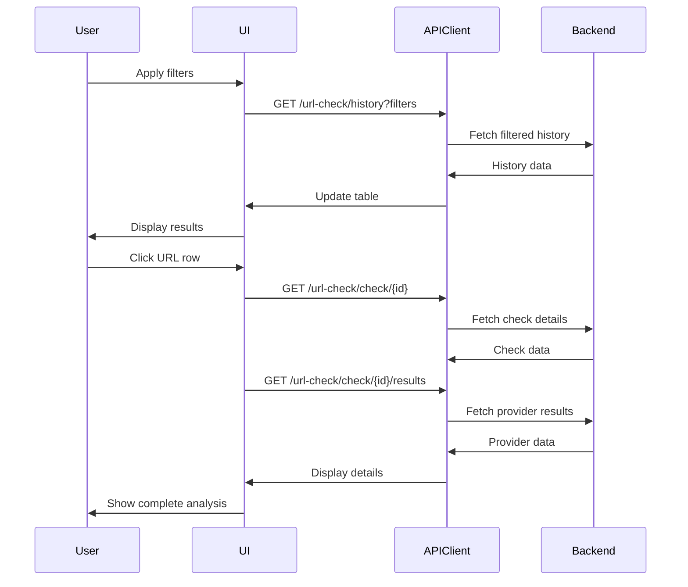

# Design Document

## Overview

The URL Analysis feature provides authenticated users with comprehensive URL security analysis tools including history tracking, detailed results viewing, bulk analysis, domain reputation lookup, and usage statistics. The design emphasizes efficient data presentation, intuitive filtering, and clear visualization of security threats.

## Architecture

### Component Hierarchy

```
UrlAnalysisLayout
├── UrlHistoryPage
│   ├── HistoryFilters
│   ├── UrlHistoryTable
│   └── HistoryPagination
├── CheckDetailPage
│   ├── CheckSummary
│   ├── ProviderResults (accordion)
│   └── BrokenLinksTab
├── BulkAnalysisPage
│   ├── BulkInputForm
│   ├── ProgressIndicator
│   └── BulkResultsTable
├── ReputationLookupPage
│   ├── DomainInput
│   └── ReputationPanel
└── StatsPage
    ├── StatsFilters
    └── StatsCharts
```

### Data Flow



## Components and Interfaces

### 1. UrlHistoryPage

**Purpose**: Display paginated list of URL checks with filtering.

**Props**: None (uses auth context and query params)

**State**:
```typescript
interface HistoryFilters {
  url?: string;
  domain?: string;
  threat_level?: ThreatLevel;
  status?: CheckStatus;
  date_from?: string;
  date_to?: string;
  page: number;
  page_size: number;
}

type ThreatLevel = 'SAFE' | 'SUSPICIOUS' | 'MALICIOUS' | 'UNKNOWN';
type CheckStatus = 'PENDING' | 'COMPLETED' | 'FAILED' | 'TIMEOUT';
```

### 2. HistoryFilters

**Props**:
```typescript
interface HistoryFiltersProps {
  filters: HistoryFilters;
  onFiltersChange: (filters: Partial<HistoryFilters>) => void;
  onReset: () => void;
}
```

**Features**:
- Domain search input with debounce
- Threat level dropdown
- Status dropdown
- Date range picker
- Reset filters button

### 3. UrlHistoryTable

**Props**:
```typescript
interface UrlHistoryTableProps {
  checks: UrlCheck[];
  isLoading: boolean;
  onRowClick: (checkId: string) => void;
}

interface UrlCheck {
  id: string;
  url: string;
  domain: string;
  threat_level: ThreatLevel;
  risk_score: number;
  status: CheckStatus;
  checked_at: string;
}
```

**Columns**:
- URL (truncated with tooltip)
- Domain
- Threat Level (badge with color)
- Risk Score (0-100)
- Status
- Checked Date
- Actions (View Details)

### 4. CheckDetailPage

**Purpose**: Display comprehensive details of a single URL check.

**Data Model**:
```typescript
interface UrlCheckDetail {
  id: string;
  url: string;
  domain: string;
  threat_level: ThreatLevel;
  risk_score: number;
  status: CheckStatus;
  scan_type: 'QUICK' | 'COMPREHENSIVE' | 'DEEP';
  checked_at: string;
  completed_at?: string;
  error_message?: string;
}

interface ScanResult {
  provider: 'VIRUSTOTAL' | 'GOOGLE_SAFE_BROWSING' | 'URLVOID';
  threat_detected: boolean;
  threat_types: string[];
  confidence_score: number;
  details: Record<string, any>;
  scanned_at: string;
}

interface BrokenLink {
  url: string;
  status_code: number;
  error_message?: string;
  response_time: number;
  depth: number;
  found_on_url: string;
}
```

### 5. BulkAnalysisPage

**Purpose**: Analyze multiple URLs simultaneously.

**Props**:
```typescript
interface BulkAnalysisFormData {
  urls: string[];
  scan_type: 'QUICK' | 'COMPREHENSIVE';
}

interface BulkAnalysisResult {
  total: number;
  completed: number;
  safe: number;
  suspicious: number;
  malicious: number;
  errors: number;
  results: UrlCheck[];
}
```

**Features**:
- Textarea input (one URL per line)
- File upload (txt, csv)
- URL validation before submission
- Real-time progress indicator
- Results summary cards
- Results table with export option

### 6. ReputationLookupPage

**Purpose**: Lookup and display domain reputation.

**Data Model**:
```typescript
interface DomainReputation {
  domain: string;
  reputation_score: number; // 0-100
  trust_level: 'TRUSTED' | 'NEUTRAL' | 'SUSPICIOUS' | 'MALICIOUS';
  total_checks: number;
  safe_checks: number;
  malicious_checks: number;
  last_checked: string;
  first_seen: string;
  community_reports: number;
  historical_data: {
    date: string;
    threat_level: ThreatLevel;
    checks_count: number;
  }[];
}
```

### 7. StatsPage

**Purpose**: Display usage statistics and trends.

**Data Model**:
```typescript
interface UrlCheckStats {
  total_checks: number;
  safe_urls: number;
  suspicious_urls: number;
  malicious_urls: number;
  time_series: {
    date: string;
    checks: number;
  }[];
  threat_distribution: {
    threat_level: ThreatLevel;
    count: number;
    percentage: number;
  }[];
  scan_type_distribution: {
    scan_type: string;
    count: number;
  }[];
  plan_usage: {
    used: number;
    limit: number;
    percentage: number;
  };
}
```

## State Management

### React Query Hooks

```typescript
// History
const useUrlHistory = (filters: HistoryFilters) => {
  return useQuery({
    queryKey: ['url-history', filters],
    queryFn: () => urlAnalysisAPI.getHistory(filters),
    keepPreviousData: true,
  });
};

// Check Detail
const useCheckDetail = (checkId: string) => {
  return useQuery({
    queryKey: ['url-check', checkId],
    queryFn: () => urlAnalysisAPI.getCheckDetail(checkId),
  });
};

const useScanResults = (checkId: string) => {
  return useQuery({
    queryKey: ['scan-results', checkId],
    queryFn: () => urlAnalysisAPI.getScanResults(checkId),
  });
};

const useBrokenLinks = (checkId: string) => {
  return useQuery({
    queryKey: ['broken-links', checkId],
    queryFn: () => urlAnalysisAPI.getBrokenLinks(checkId),
    enabled: false, // Only fetch when tab is opened
  });
};

// Bulk Analysis
const useBulkAnalysis = () => {
  return useMutation({
    mutationFn: (data: BulkAnalysisFormData) => 
      urlAnalysisAPI.bulkCheck(data),
  });
};

// Reputation
const useDomainReputation = (domain: string) => {
  return useQuery({
    queryKey: ['domain-reputation', domain],
    queryFn: () => urlAnalysisAPI.getDomainReputation(domain),
    enabled: !!domain,
  });
};

// Stats
const useUrlCheckStats = (days: number = 30) => {
  return useQuery({
    queryKey: ['url-check-stats', days],
    queryFn: () => urlAnalysisAPI.getStats(days),
    staleTime: 5 * 60 * 1000, // 5 minutes
  });
};
```

## API Client

```typescript
export const urlAnalysisAPI = {
  getHistory: async (filters: HistoryFilters): Promise<UrlHistoryResponse> => {
    const params = new URLSearchParams();
    Object.entries(filters).forEach(([key, value]) => {
      if (value !== undefined) params.append(key, String(value));
    });
    const response = await apiClient.get(`/url-check/history?${params}`);
    return response.data;
  },
  
  getCheckDetail: async (checkId: string): Promise<UrlCheckDetail> => {
    const response = await apiClient.get(`/url-check/check/${checkId}`);
    return response.data;
  },
  
  getScanResults: async (checkId: string): Promise<ScanResult[]> => {
    const response = await apiClient.get(`/url-check/check/${checkId}/results`);
    return response.data;
  },
  
  getBrokenLinks: async (checkId: string): Promise<BrokenLink[]> => {
    const response = await apiClient.get(`/url-check/check/${checkId}/broken-links`);
    return response.data;
  },
  
  bulkCheck: async (data: BulkAnalysisFormData): Promise<BulkAnalysisResult> => {
    const response = await apiClient.post('/url-check/bulk-check', data);
    return response.data;
  },
  
  getDomainReputation: async (domain: string): Promise<DomainReputation> => {
    const response = await apiClient.get(`/url-check/reputation/${domain}`);
    return response.data;
  },
  
  getStats: async (days: number): Promise<UrlCheckStats> => {
    const response = await apiClient.get(`/url-check/stats?days=${days}`);
    return response.data;
  },
};
```

## Error Handling

```typescript
const errorMessages: Record<string, string> = {
  INVALID_URL_FORMAT: 'Invalid URL format. Please check and try again.',
  URL_TOO_LONG: 'URL exceeds maximum length of 2048 characters.',
  SCAN_TIMEOUT: 'URL analysis timed out. Please try again.',
  SCAN_FAILED: 'Analysis could not be completed. Please try again.',
  DAILY_LIMIT_EXCEEDED: 'Daily scan limit reached. Upgrade your plan for more checks.',
  CHECK_NOT_FOUND: 'URL check not found.',
  BULK_LIMIT_EXCEEDED: 'Too many URLs in batch. Your plan allows up to {limit} URLs.',
  RATE_LIMIT_EXCEEDED: 'Too many requests. Please try again in {retry_after} seconds.',
};
```

## UI/UX Design

### Threat Level Badges

```typescript
const getThreatLevelBadge = (threatLevel: ThreatLevel) => {
  const config = {
    SAFE: { color: 'green', icon: 'check-circle', label: 'Safe' },
    SUSPICIOUS: { color: 'yellow', icon: 'alert-triangle', label: 'Suspicious' },
    MALICIOUS: { color: 'red', icon: 'x-circle', label: 'Malicious' },
    UNKNOWN: { color: 'gray', icon: 'help-circle', label: 'Unknown' },
  };
  return config[threatLevel];
};
```

### Risk Score Display

```typescript
const getRiskScoreColor = (score: number) => {
  if (score >= 80) return 'red';
  if (score >= 50) return 'yellow';
  if (score >= 20) return 'orange';
  return 'green';
};
```

## Testing Strategy

### Unit Tests
- Filter logic and URL validation
- Threat level badge rendering
- Risk score calculations
- Date formatting utilities

### Integration Tests
- History page with filters and pagination
- Check detail page with provider results
- Bulk analysis flow
- Reputation lookup
- Stats page with charts

### E2E Tests
- Complete URL analysis workflow
- Filter and search history
- View detailed results
- Perform bulk analysis
- Export history data

## Accessibility

- Tables with proper headers and ARIA labels
- Charts with text alternatives
- Keyboard navigation for all filters
- Screen reader announcements for loading states
- Color-blind friendly threat indicators

## Performance Considerations

- Virtual scrolling for large history lists
- Debounced search inputs (300ms)
- Lazy loading of provider results
- Chart data memoization
- Pagination with keepPreviousData
- Optimistic updates for filters
