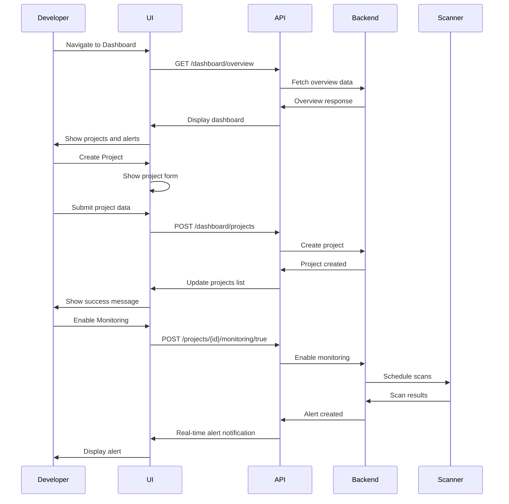

# Design Document

## Overview

The Web Developer Monitoring feature provides a comprehensive dashboard for developers to monitor their websites for security threats. It integrates project management, team collaboration, alert systems, analytics, and API integration to create a complete monitoring solution. The design emphasizes developer workflows, automation capabilities, and actionable insights.

## Architecture

### Component Hierarchy

```
DeveloperDashboardLayout
├── DashboardOverview
│   ├── OverviewCards
│   │   ├── ProjectsCard
│   │   ├── ScansCard
│   │   ├── AlertsCard
│   │   └── HealthScoreCard
│   ├── RecentProjects
│   ├── RecentAlerts
│   └── QuickActions
├── ProjectsPage
│   ├── ProjectsList
│   ├── ProjectCard
│   ├── CreateProjectModal
│   └── ProjectFilters
├── ProjectDetailsPage
│   ├── ProjectHeader
│   ├── ProjectTabs
│   │   ├── OverviewTab
│   │   │   ├── HealthScore
│   │   │   ├── MonitoringStatus
│   │   │   └── RecentActivity
│   │   ├── AlertsTab
│   │   │   ├── AlertsList
│   │   │   ├── AlertCard
│   │   │   ├── AlertFilters
│   │   │   └── AlertDetailsPanel
│   │   ├── TeamTab
│   │   │   ├── MembersList
│   │   │   ├── InviteMemberModal
│   │   │   └── RoleManagement
│   │   ├── AnalyticsTab
│   │   │   ├── AnalyticsCharts
│   │   │   ├── DateRangePicker
│   │   │   └── ExportButton
│   │   ├── SettingsTab
│   │   │   ├── MonitoringSchedule
│   │   │   ├── NotificationPreferences
│   │   │   └── ProjectSettings
│   │   └── ActivityTab
│   │       └── ActivityLogsList
│   └── ProjectActions
│       ├── ScanURLModal
│       ├── BulkScanModal
│       └── EditProjectModal
├── AlertsPage
│   ├── AlertsList
│   ├── AlertFilters
│   ├── AlertStatistics
│   └── AlertDetailsModal
├── AnalyticsPage
│   ├── AnalyticsOverview
│   ├── ChartsGrid
│   ├── DateRangePicker
│   └── ExportOptions
└── APIDocumentationPage
    ├── DocumentationNav
    ├── AuthenticationSection
    ├── EndpointsSection
    ├── CodeExamples
    ├── WebhooksSection
    └── InteractiveAPITester
```

### Data Flow



## Components and Interfaces

### Data Models

```typescript
// Dashboard Overview
interface DashboardOverview {
  total_projects: number;
  active_projects: number;
  total_scans: number;
  total_alerts: number;
  recent_projects: RecentProject[];
  recent_alerts: RecentAlert[];
  subscription_status: SubscriptionStatus;
  social_protection?: SocialProtectionOverview;
}

interface RecentProject {
  id: string;
  name: string;
  domain: string;
  last_scan_at?: string;
  alert_count: number;
  health_score?: number;
}

interface RecentAlert {
  id: string;
  project_id: string;
  project_name: string;
  severity: 'low' | 'medium' | 'high' | 'critical';
  title: string;
  created_at: string;
}

// Project
interface Project {
  id: string;
  name: string;
  description?: string;
  website_url: string;
  domain: string;
  is_active: boolean;
  monitoring_enabled: boolean;
  settings?: ProjectSettings;
  member_count: number;
  created_at: string;
  updated_at: string;
  last_scan_at?: string;
  health_score?: number;
}

interface ProjectSettings {
  scan_frequency_minutes: number;
  scan_depth_limit: number;
  max_links_per_scan: number;
  exclude_patterns?: string[];
  notifications?: NotificationSettings;
}

interface NotificationSettings {
  email_enabled: boolean;
  email_addresses?: string[];
  slack_enabled: boolean;
  slack_webhook_url?: string;
  webhook_enabled: boolean;
  webhook_url?: string;
  severity_filter: ('low' | 'medium' | 'high' | 'critical')[];
}

interface ProjectCreateRequest {
  name: string;
  description?: string;
  website_url: string;
  settings?: Partial<ProjectSettings>;
}

interface ProjectUpdateRequest {
  name?: string;
  description?: string;
  website_url?: string;
  settings?: Partial<ProjectSettings>;
  is_active?: boolean;
}

// Alerts
interface Alert {
  id: string;
  project_id: string;
  alert_type: string;
  severity: 'low' | 'medium' | 'high' | 'critical';
  title: string;
  description?: string;
  context_data?: Record<string, any>;
  affected_urls?: string[];
  status: 'active' | 'acknowledged' | 'resolved' | 'dismissed';
  created_at: string;
  acknowledged_at?: string;
  resolved_at?: string;
  updated_at: string;
}

interface AlertStatistics {
  total_alerts: number;
  active_alerts: number;
  resolved_alerts: number;
  dismissed_alerts: number;
  severity_breakdown: Record<string, number>;
  alert_types: Record<string, number>;
  timeline: TimelineDataPoint[];
  top_threats: ThreatSummary[];
  affected_urls: AffectedURL[];
}

// Team
interface TeamMember {
  id: string;
  user_id: string;
  email: string;
  full_name?: string;
  role: 'owner' | 'admin' | 'editor' | 'viewer';
  is_active: boolean;
  joined_at?: string;
  invited_at: string;
}

interface MemberInviteRequest {
  email: string;
  role: 'owner' | 'admin' | 'editor' | 'viewer';
}

// Analytics
interface Analytics {
  total_scans: number;
  threats_detected: number;
  urls_checked: number;
  avg_response_time: number;
  time_series: AnalyticsDataPoint[];
  threat_breakdown: Record<string, number>;
  scan_success_rate: number;
}

interface AnalyticsDataPoint {
  date: string;
  scans: number;
  threats: number;
  clean_urls: number;
}

// Activity Logs
interface ActivityLog {
  id: string;
  project_id: string;
  user_id?: string;
  user_email?: string;
  action: string;
  details?: Record<string, any>;
  timestamp: string;
}

// Health Score
interface HealthScore {
  overall_score: number;
  url_safety_score: number;
  social_protection_score: number;
  risk_breakdown: Record<string, number>;
  trending: 'improving' | 'stable' | 'declining';
  last_updated: string;
  recommendations: string[];
}
```

### State Management

```typescript
// React Query Hooks
const useDashboardOverview = () => {
  return useQuery({
    queryKey: ['dashboard-overview'],
    queryFn: dashboardAPI.getOverview,
    staleTime: 2 * 60 * 1000, // 2 minutes
    refetchInterval: 60 * 1000, // Auto-refresh every minute
  });
};

const useProjects = (page: number, limit: number, filters?: ProjectFilters) => {
  return useQuery({
    queryKey: ['projects', page, limit, filters],
    queryFn: () => dashboardAPI.listProjects(page, limit, filters),
    staleTime: 5 * 60 * 1000, // 5 minutes
    keepPreviousData: true,
  });
};

const useProject = (projectId: string) => {
  return useQuery({
    queryKey: ['project', projectId],
    queryFn: () => dashboardAPI.getProject(projectId),
    staleTime: 2 * 60 * 1000,
  });
};

const useCreateProject = () => {
  const queryClient = useQueryClient();
  return useMutation({
    mutationFn: (data: ProjectCreateRequest) => dashboardAPI.createProject(data),
    onSuccess: () => {
      queryClient.invalidateQueries(['projects']);
      queryClient.invalidateQueries(['dashboard-overview']);
      toast.success('Project created successfully');
    },
  });
};

const useUpdateProject = () => {
  const queryClient = useQueryClient();
  return useMutation({
    mutationFn: ({ projectId, data }: { projectId: string; data: ProjectUpdateRequest }) =>
      dashboardAPI.updateProject(projectId, data),
    onSuccess: (_, variables) => {
      queryClient.invalidateQueries(['project', variables.projectId]);
      queryClient.invalidateQueries(['projects']);
      toast.success('Project updated successfully');
    },
  });
};

const useToggleMonitoring = () => {
  const queryClient = useQueryClient();
  return useMutation({
    mutationFn: ({ projectId, enabled }: { projectId: string; enabled: boolean }) =>
      dashboardAPI.toggleMonitoring(projectId, enabled),
    onSuccess: (_, variables) => {
      queryClient.invalidateQueries(['project', variables.projectId]);
      toast.success(`Monitoring ${variables.enabled ? 'enabled' : 'disabled'}`);
    },
  });
};

const useProjectAlerts = (projectId: string, filters?: AlertFilters) => {
  return useQuery({
    queryKey: ['project-alerts', projectId, filters],
    queryFn: () => dashboardAPI.getProjectAlerts(projectId, filters),
    staleTime: 1 * 60 * 1000, // 1 minute
    refetchInterval: 30 * 1000, // Auto-refresh every 30 seconds
  });
};

const useUpdateAlertStatus = () => {
  const queryClient = useQueryClient();
  return useMutation({
    mutationFn: ({ projectId, alertId, status }: { projectId: string; alertId: string; status: string }) =>
      dashboardAPI.updateAlertStatus(projectId, alertId, status),
    onSuccess: (_, variables) => {
      queryClient.invalidateQueries(['project-alerts', variables.projectId]);
      toast.success('Alert status updated');
    },
  });
};

const useProjectMembers = (projectId: string) => {
  return useQuery({
    queryKey: ['project-members', projectId],
    queryFn: () => dashboardAPI.getProjectMembers(projectId),
    staleTime: 5 * 60 * 1000,
  });
};

const useInviteMember = () => {
  const queryClient = useQueryClient();
  return useMutation({
    mutationFn: ({ projectId, data }: { projectId: string; data: MemberInviteRequest }) =>
      dashboardAPI.inviteMember(projectId, data),
    onSuccess: (_, variables) => {
      queryClient.invalidateQueries(['project-members', variables.projectId]);
      toast.success('Invitation sent successfully');
    },
  });
};

const useAnalytics = (dateFrom?: string, dateTo?: string) => {
  return useQuery({
    queryKey: ['analytics', dateFrom, dateTo],
    queryFn: () => dashboardAPI.getAnalytics(dateFrom, dateTo),
    staleTime: 5 * 60 * 1000,
  });
};

const useActivityLogs = (projectId: string, limit: number, offset: number) => {
  return useQuery({
    queryKey: ['activity-logs', projectId, limit, offset],
    queryFn: () => dashboardAPI.getActivityLogs(projectId, limit, offset),
    staleTime: 2 * 60 * 1000,
    keepPreviousData: true,
  });
};
```

## API Client

```typescript
export const dashboardAPI = {
  // Dashboard Overview
  getOverview: async (): Promise<DashboardOverview> => {
    const response = await apiClient.get('/dashboard/overview');
    return response.data;
  },
  
  // Projects
  listProjects: async (page: number, limit: number, filters?: ProjectFilters): Promise<ProjectsResponse> => {
    const params = { page, limit, ...filters };
    const response = await apiClient.get('/dashboard/projects', { params });
    return response.data;
  },
  
  createProject: async (data: ProjectCreateRequest): Promise<Project> => {
    const response = await apiClient.post('/dashboard/projects', data);
    return response.data;
  },
  
  getProject: async (projectId: string): Promise<Project> => {
    const response = await apiClient.get(`/dashboard/projects/${projectId}`);
    return response.data;
  },
  
  updateProject: async (projectId: string, data: ProjectUpdateRequest): Promise<Project> => {
    const response = await apiClient.patch(`/dashboard/projects/${projectId}`, data);
    return response.data;
  },
  
  deleteProject: async (projectId: string): Promise<void> => {
    await apiClient.delete(`/dashboard/projects/${projectId}`);
  },
  
  // Monitoring
  toggleMonitoring: async (projectId: string, enabled: boolean): Promise<MonitoringConfig> => {
    const response = await apiClient.post(`/dashboard/projects/${projectId}/monitoring/${enabled}`);
    return response.data;
  },
  
  // Alerts
  getProjectAlerts: async (projectId: string, filters?: AlertFilters): Promise<Alert[]> => {
    const params = filters;
    const response = await apiClient.get(`/dashboard/projects/${projectId}/alerts`, { params });
    return response.data;
  },
  
  getAlert: async (projectId: string, alertId: string): Promise<Alert> => {
    const response = await apiClient.get(`/dashboard/projects/${projectId}/alerts/${alertId}`);
    return response.data;
  },
  
  updateAlertStatus: async (projectId: string, alertId: string, status: string): Promise<Alert> => {
    const response = await apiClient.patch(`/dashboard/projects/${projectId}/alerts/${alertId}`, { status });
    return response.data;
  },
  
  acknowledgeAlert: async (projectId: string, alertId: string): Promise<Alert> => {
    const response = await apiClient.post(`/dashboard/projects/${projectId}/alerts/${alertId}/acknowledge`);
    return response.data;
  },
  
  resolveAlert: async (projectId: string, alertId: string): Promise<Alert> => {
    const response = await apiClient.post(`/dashboard/projects/${projectId}/alerts/${alertId}/resolve`);
    return response.data;
  },
  
  dismissAlert: async (projectId: string, alertId: string): Promise<Alert> => {
    const response = await apiClient.post(`/dashboard/projects/${projectId}/alerts/${alertId}/dismiss`);
    return response.data;
  },
  
  getAlertStatistics: async (projectId: string): Promise<AlertStatistics> => {
    const response = await apiClient.get(`/dashboard/projects/${projectId}/alerts/stats`);
    return response.data;
  },
  
  // Team
  getProjectMembers: async (projectId: string): Promise<TeamMember[]> => {
    const response = await apiClient.get(`/dashboard/projects/${projectId}/members`);
    return response.data;
  },
  
  inviteMember: async (projectId: string, data: MemberInviteRequest): Promise<TeamMember> => {
    const response = await apiClient.post(`/dashboard/projects/${projectId}/members/invite`, data);
    return response.data;
  },
  
  // Analytics
  getAnalytics: async (dateFrom?: string, dateTo?: string): Promise<Analytics> => {
    const params = { date_from: dateFrom, date_to: dateTo };
    const response = await apiClient.get('/dashboard/analytics', { params });
    return response.data;
  },
  
  // Activity Logs
  getActivityLogs: async (projectId: string, limit: number, offset: number): Promise<ActivityLog[]> => {
    const params = { limit, offset };
    const response = await apiClient.get(`/dashboard/projects/${projectId}/activity-logs`, { params });
    return response.data;
  },
};
```

## UI/UX Design

### Dashboard Layout

The dashboard uses a card-based layout optimized for developer workflows:

1. **Overview Cards** (Top Row)
   - Projects: Total and active count
   - Scans: Total scans performed
   - Alerts: Active alerts count
   - Health Score: Average across projects

2. **Recent Activity** (Middle Section)
   - Recent Projects: Last 5 projects with quick actions
   - Recent Alerts: Last 10 alerts with severity badges

3. **Quick Actions** (Sidebar)
   - Scan URL
   - Create Project
   - View All Alerts
   - API Documentation

### Health Score Visualization

```typescript
const getHealthScoreColor = (score: number): string => {
  if (score >= 80) return 'green';
  if (score >= 60) return 'yellow';
  if (score >= 40) return 'orange';
  return 'red';
};

const getHealthScoreLabel = (score: number): string => {
  if (score >= 80) return 'Excellent';
  if (score >= 60) return 'Good';
  if (score >= 40) return 'Fair';
  return 'Poor';
};

const getHealthScoreTrend = (trend: string): { icon: string; color: string } => {
  switch (trend) {
    case 'improving': return { icon: '↗', color: 'green' };
    case 'declining': return { icon: '↘', color: 'red' };
    default: return { icon: '→', color: 'gray' };
  }
};
```

### Alert Severity Styling

```typescript
const alertSeverityConfig = {
  critical: {
    color: 'red',
    bgColor: 'red-50',
    icon: '🔴',
    priority: 1,
  },
  high: {
    color: 'orange',
    bgColor: 'orange-50',
    icon: '🟠',
    priority: 2,
  },
  medium: {
    color: 'yellow',
    bgColor: 'yellow-50',
    icon: '🟡',
    priority: 3,
  },
  low: {
    color: 'blue',
    bgColor: 'blue-50',
    icon: '🔵',
    priority: 4,
  },
};
```

### Project Card Design

```typescript
const ProjectCard: React.FC<{ project: Project }> = ({ project }) => {
  const healthColor = getHealthScoreColor(project.health_score || 0);
  
  return (
    <div className="project-card">
      <div className="project-header">
        <h3>{project.name}</h3>
        <Badge color={project.monitoring_enabled ? 'green' : 'gray'}>
          {project.monitoring_enabled ? 'Active' : 'Inactive'}
        </Badge>
      </div>
      
      <div className="project-domain">{project.domain}</div>
      
      <div className="project-metrics">
        <div className="health-score" style={{ color: healthColor }}>
          <span className="score">{project.health_score || 0}</span>
          <span className="label">Health Score</span>
        </div>
        
        <div className="last-scan">
          <span className="label">Last Scan</span>
          <span className="time">{formatRelativeTime(project.last_scan_at)}</span>
        </div>
      </div>
      
      <div className="project-actions">
        <Button onClick={() => handleScanNow(project.id)}>Scan Now</Button>
        <Button variant="secondary" onClick={() => handleViewAlerts(project.id)}>
          Alerts ({project.alert_count || 0})
        </Button>
      </div>
    </div>
  );
};
```

## Error Handling

```typescript
const errorMessages: Record<string, string> = {
  PROJECT_NOT_FOUND: 'Project not found',
  INVALID_URL: 'Please enter a valid website URL',
  DUPLICATE_PROJECT: 'A project already exists for this domain',
  INSUFFICIENT_PERMISSIONS: 'You don\'t have permission for this action',
  MEMBER_ALREADY_EXISTS: 'User is already a member of this project',
  MONITORING_LIMIT_REACHED: 'Monitoring limit reached. Please upgrade your plan.',
  ALERT_NOT_FOUND: 'Alert not found',
  INVALID_SCHEDULE: 'Invalid monitoring schedule',
  WEBHOOK_TEST_FAILED: 'Webhook test failed. Please check the URL.',
  UNAUTHORIZED: 'Session expired. Please log in again.',
  RATE_LIMIT_EXCEEDED: 'Too many requests. Please try again later.',
  SERVER_ERROR: 'Unable to process request. Please try again.',
};
```

## Testing Strategy

### Unit Tests
- Health score calculation
- Alert severity sorting
- URL validation
- Date formatting

### Component Tests
- Dashboard overview rendering
- Project creation flow
- Alert status updates
- Team member invitation

### Integration Tests
- Complete project lifecycle
- Monitoring enable/disable
- Alert management flow
- Analytics data fetching

### E2E Tests
- Create project and enable monitoring
- Scan URL and create alert
- Invite team member
- View analytics and export

## Accessibility

- All dashboard panels keyboard navigable
- Alert severity uses icons + text
- Health scores have text alternatives
- Charts have data tables
- Forms have proper labels

## Performance Considerations

- Dashboard data cached for 2 minutes
- Project list pagination (20 per page)
- Alert list virtual scrolling
- Analytics charts cached for 5 minutes
- Lazy load project details
- Debounced search (300ms)
