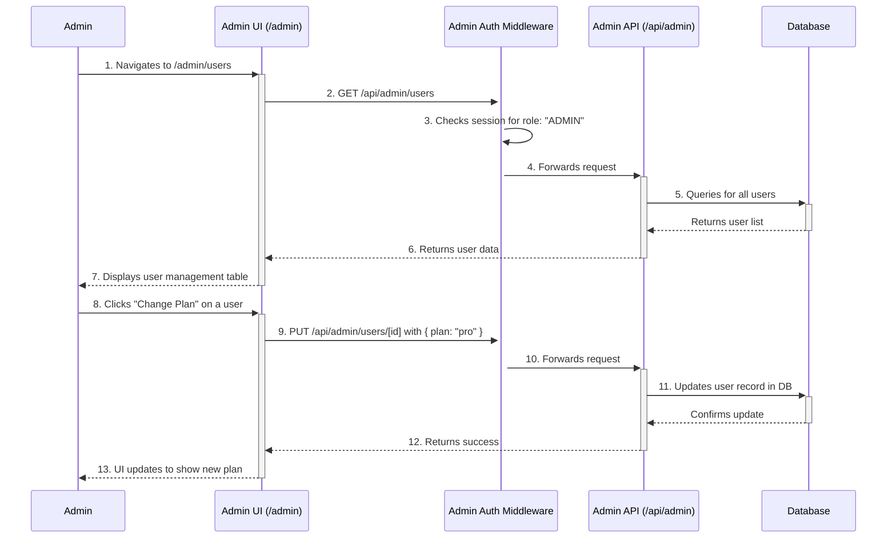

# Admin Feature Documentation

This document outlines the design and functionality of the LinkShield Admin Dashboard, a feature for privileged users to manage the application, its users, and its content.

## 1. Overview

The Admin Dashboard is a protected section of the application accessible only to users with the `ADMIN` role. It provides a centralized interface for monitoring system health, managing users, and moderating content (reports).

## 2. Role-Based Access Control (RBAC)

To support this feature, a `role` attribute is added to the `User` model.

### 2.1. Database Schema (`prisma/schema.prisma`)
The `User` model will be updated to include a `role` field:

```prisma
model User {
  id                        String   @id @default(cuid())
  email                     String   @unique
  name                      String?
  role                      String   @default("USER") // "USER" or "ADMIN"
  plan                      String   @default("free")
  // ... other fields
}
```

### 2.2. Authentication & Session
The authentication flow in `src/lib/auth.ts` will be modified to include the `role` in the session JWT. This makes the role available globally for authorization checks.

```typescript
// In src/lib/auth.ts callbacks
async jwt({ token, user }) {
  if (user) {
    token.id = user.id
    token.plan = user.plan
    token.role = user.role // Add role to token
  }
  return token
},
async session({ session, token }) {
  if (token) {
    session.user.id = token.id as string
    session.user.plan = token.plan as string
    session.user.role = token.role as string // Add role to session
  }
  return session
}
```

## 3. Admin Workflow

The diagram below illustrates a typical admin workflow for managing a user.



## 4. Backend - Admin API

A new set of API endpoints will be created under `/api/admin/`. All endpoints in this section are protected by a middleware that verifies the user has the `ADMIN` role.

- **`GET /api/admin/stats`**
  - **Description:** Retrieves aggregate statistics for the entire system.
  - **Response:** `{ users: { total, pro, enterprise }, reports: { total, public }, subscriptions: { active, ... } }`

- **`GET /api/admin/users`**
  - **Description:** Fetches a paginated list of all users. Supports searching and sorting.
  - **Query Params:** `?page=1&limit=20&search=test@example.com`

- **`PUT /api/admin/users/[id]`**
  - **Description:** Updates a specific user's details.
  - **Body:** `{ "plan": "enterprise", "role": "ADMIN" }`

- **`DELETE /api/admin/users/[id]`**
  - **Description:** Deletes a user from the system.

- **`GET /api/admin/reports`**
  - **Description:** Fetches a paginated list of all reports.

- **`DELETE /api/admin/reports/[id]`**
  - **Description:** Deletes a specific report.

## 5. Frontend - Admin UI

Access to the `/admin` routes will be protected at the layout or page level, redirecting any non-admin users.

- **`/admin/dashboard`**: Displays the high-level statistics from the `stats` endpoint using cards and charts.
- **`/admin/users`**: A page containing a data table of users. The table will include columns for email, name, plan, role, and join date. Each row will have action buttons to "Edit" or "Delete" the user.
- **`/admin/reports`**: A page with a data table of all reports, showing the URL, creator, creation date, and public status. Each row will have an action button to "Delete" the report.
