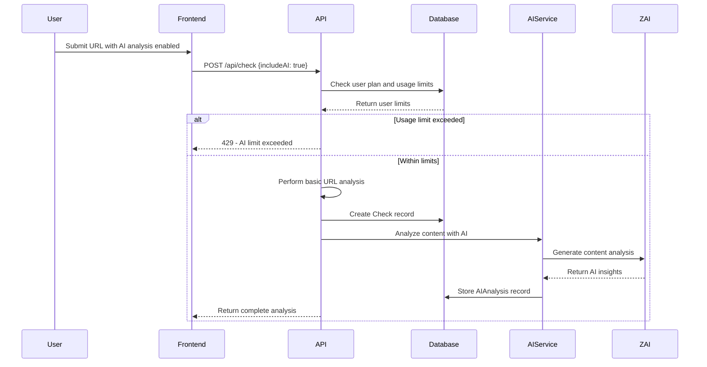

# AI-Powered Content Analysis

LinkShield integrates advanced AI capabilities to provide deep content analysis, quality scoring, and intelligent insights for URL analysis. These features leverage modern AI technologies to deliver comprehensive content understanding beyond basic security checks.

## Overview

The AI analysis system provides multi-dimensional content evaluation including:

- **Content Summarization** - AI-generated summaries of web page content
- **Quality Scoring** - Multi-metric quality assessment with detailed breakdowns
- **Topic Classification** - Automatic categorization and topic extraction
- **Content Similarity** - Detection of duplicate or similar content
- **Language Detection** - Automatic language identification
- **SEO Analysis** - Content optimization recommendations

### Plan Availability

| Feature | Free | Pro | Enterprise |
|---------|------|-----|------------|
| AI Analyses per Month | 2 | 50 | 500 |
| Content Summarization | ✓ | ✓ | ✓ |
| Quality Scoring | ✓ | ✓ | ✓ |
| Topic Classification | ✓ | ✓ | ✓ |
| Content Similarity | ✗ | ✓ | ✓ |
| Advanced Metrics | ✗ | ✓ | ✓ |
| Bulk Analysis | ✗ | ✗ | ✓ |

## Architecture Overview

### Database Schema

The AI analysis system uses two primary models:

#### AIAnalysis Model
```typescript
model AIAnalysis {
  id                  String   @id @default(cuid())
  userId              String?
  checkId             String?
  url                 String
  contentHash         String   @unique
  contentSummary      String?
  contentEmbedding    String?  // JSON array for vector storage
  qualityMetrics      String?  // JSON with detailed scoring
  topicCategories     String?  // JSON array of topics
  keywordDensity      String?  // JSON with keyword analysis
  contentLength       Int?
  language            String?
  processingStatus    String   @default("pending")
  errorMessage        String?
  createdAt           DateTime @default(now())
  updatedAt           DateTime @updatedAt
}
```

#### SimilarPage Model
```typescript
model SimilarPage {
  id                  String   @id @default(cuid())
  sourceAnalysisId    String
  targetAnalysisId    String
  similarityScore     Float    // 0.000 to 1.000
  similarityType      String   // semantic, structural, topical
  comparisonMetadata  String?  // JSON with comparison details
}
```

### Technology Stack

- **AI Provider**: ZAI (Zero AI) for content analysis
- **Vector Storage**: Pinecone for content embeddings (planned)
- **Content Processing**: Custom analysis pipeline
- **Caching**: Content hash-based deduplication
- **Background Processing**: Asynchronous analysis workflow

## AI Analysis Workflow

### 1. Request Initiation



### 2. Content Analysis Process

#### Step 1: Content Extraction
```typescript
// Extract and prepare content for analysis
const analysisResult = await performURLAnalysis(url)
if (analysisResult.content) {
  const contentHash = crypto.createHash('sha256')
    .update(analysisResult.content)
    .digest('hex')
}
```

#### Step 2: Deduplication Check
```typescript
// Check for existing analysis
const existingAIAnalysis = await db.aIAnalysis.findUnique({
  where: { contentHash }
})

if (existingAIAnalysis) {
  // Return cached analysis
  return existingAIAnalysis
}
```

#### Step 3: AI Processing
```typescript
// Perform new AI analysis
const aiResult = await analyzeContentWithAI(analysisResult.content, url)

// Store comprehensive analysis
const aiAnalysis = await db.aIAnalysis.create({
  data: {
    userId: session.user.id,
    checkId: check.id,
    url,
    contentHash,
    contentSummary: aiResult.summary,
    qualityMetrics: JSON.stringify({
      readabilityScore: aiResult.readabilityScore,
      contentDepthScore: aiResult.qualityScore,
      seoOptimizationScore: calculateSEOScore(content),
      originalityScore: calculateOriginalityScore(content),
      engagementScore: calculateEngagementScore(content),
      overallQuality: calculateOverallQuality(metrics)
    }),
    topicCategories: JSON.stringify(aiResult.topics),
    contentLength: analysisResult.content.length,
    language: detectLanguage(content),
    processingStatus: 'completed'
  }
})
```

## AI Analysis Features

### Content Summarization

AI-powered content summarization provides:

- **Executive Summary** - 2-3 sentence overview of page content
- **Key Points** - Bullet-point extraction of main topics
- **Content Type Detection** - Article, product page, landing page, etc.
- **Reading Time Estimation** - Based on content length and complexity

#### Implementation
```typescript
const summaryPrompt = `
  Analyze the following web content and provide:
  1. A brief summary (2-3 sentences)
  2. Content quality score (0-100)
  3. Readability score (0-100)
  4. Main topics/categories
  5. Estimated reading time
  
  Content: ${content.substring(0, 4000)}
`

const summaryResponse = await zai.chat.completions.create({
  messages: [
    {
      role: 'system',
      content: 'You are an expert content analyst. Provide detailed analysis in JSON format.'
    },
    {
      role: 'user',
      content: summaryPrompt
    }
  ],
  temperature: 0.3,
  max_tokens: 500
})
```

### Quality Scoring System

Comprehensive quality assessment across multiple dimensions:

#### Quality Metrics

1. **Readability Score (0-100)**
   - Sentence complexity analysis
   - Vocabulary difficulty assessment
   - Paragraph structure evaluation
   - Reading level determination

2. **Content Depth Score (0-100)**
   - Information density measurement
   - Topic coverage analysis
   - Supporting evidence evaluation
   - Comprehensive coverage assessment

3. **SEO Optimization Score (0-100)**
   - Meta tag optimization
   - Header structure analysis
   - Keyword density evaluation
   - Internal linking assessment

4. **Originality Score (0-100)**
   - Content uniqueness detection
   - Plagiarism risk assessment
   - Duplicate content identification
   - Original insight evaluation

5. **Engagement Score (0-100)**
   - Content engagement potential
   - Call-to-action effectiveness
   - Visual content integration
   - User interaction elements

6. **Overall Quality Score**
   - Weighted average of all metrics
   - Contextual adjustments
   - Industry-specific considerations

#### Quality Level Classification

```typescript
const getQualityLevel = (score: number) => {
  if (score >= 90) return { level: 'Excellent', color: 'text-green-600' }
  if (score >= 80) return { level: 'Very Good', color: 'text-blue-600' }
  if (score >= 70) return { level: 'Good', color: 'text-yellow-600' }
  if (score >= 60) return { level: 'Fair', color: 'text-orange-600' }
  return { level: 'Poor', color: 'text-red-600' }
}
```

### Topic Classification

Automatic content categorization and topic extraction:

#### Topic Categories
- **Technology** - Software, hardware, programming, AI
- **Business** - Finance, marketing, entrepreneurship
- **Health** - Medical, wellness, fitness, nutrition
- **Education** - Learning, courses, academic content
- **Entertainment** - Media, gaming, sports, culture
- **News** - Current events, politics, journalism
- **E-commerce** - Products, shopping, reviews
- **Travel** - Destinations, guides, booking
- **Lifestyle** - Fashion, food, home, personal
- **Science** - Research, discoveries, analysis

#### Topic Extraction Process
```typescript
function extractTopics(content: string): string[] {
  const topics: string[] = []
  
  // Keyword-based topic detection
  const topicKeywords = {
    'technology': ['software', 'programming', 'AI', 'tech', 'digital'],
    'business': ['marketing', 'finance', 'startup', 'company'],
    'health': ['medical', 'wellness', 'fitness', 'nutrition'],
    // ... more categories
  }
  
  // AI-enhanced topic classification
  const aiTopics = await classifyTopicsWithAI(content)
  
  return [...topics, ...aiTopics]
}
```

### Content Similarity Detection

Advanced similarity analysis for duplicate content detection:

#### Similarity Types

1. **Semantic Similarity**
   - Meaning-based content comparison
   - Vector embedding analysis
   - Contextual understanding

2. **Structural Similarity**
   - HTML structure comparison
   - Layout pattern analysis
   - Template detection

3. **Topical Similarity**
   - Subject matter overlap
   - Category classification
   - Theme consistency

#### Similarity Scoring
```typescript
interface SimilarityResult {
  similarityScore: number // 0.0 to 1.0
  similarityType: 'semantic' | 'structural' | 'topical'
  comparisonMetadata: {
    matchingPhrases: string[]
    structuralElements: string[]
    topicOverlap: string[]
    confidenceLevel: number
  }
}
```

## Usage Tracking and Limits

### Plan-Based Limits

```typescript
const PLAN_LIMITS = {
  free: {
    checksPerMonth: 5,
    aiAnalysesPerMonth: 2
  },
  pro: {
    checksPerMonth: 500,
    aiAnalysesPerMonth: 50
  },
  enterprise: {
    checksPerMonth: 2500,
    aiAnalysesPerMonth: 500
  }
}
```

### Usage Validation
```typescript
function checkAIUsageLimit(user: User): boolean {
  const limit = PLAN_LIMITS[user.plan as keyof typeof PLAN_LIMITS]
  return user.ai_analyses_used_this_month < limit.aiAnalysesPerMonth
}
```

### Usage Tracking
```typescript
// Increment usage counter after successful analysis
await db.user.update({
  where: { id: userId },
  data: {
    ai_analyses_used_this_month: {
      increment: 1
    }
  }
})
```

## API Integration

### Request Format

```typescript
// Enable AI analysis in URL check request
const response = await fetch('/api/check', {
  method: 'POST',
  headers: {
    'Content-Type': 'application/json'
  },
  body: JSON.stringify({
    url: 'https://example.com',
    includeAI: true,
    isPublic: false,
    customTitle: 'AI Analysis Report'
  })
})
```

### Response Format

```typescript
interface AIAnalysisResponse {
  success: boolean
  data: {
    id: string
    slug: string
    url: string
    securityScore: number
    aiAnalysis: {
      summary: string
      qualityMetrics: {
        readabilityScore: number
        contentDepthScore: number
        seoOptimizationScore: number
        originalityScore: number
        engagementScore: number
        overallQuality: number
      }
      topics: string[]
      contentLength: number
      language: string
      processingStatus: 'completed' | 'pending' | 'failed'
    }
  }
  cached: boolean
}
```

## Frontend Integration

### AI Insights Display

```tsx
// Display AI analysis results in report
function AIInsightsSection({ aiInsights }: { aiInsights: AIAnalysis }) {
  const qualityLevel = getQualityLevel(aiInsights.qualityScore)
  
  return (
    <div className="space-y-6">
      {/* Quality Score */}
      <div>
        <div className="flex items-center gap-2 mb-2">
          <Target className="h-5 w-5 text-purple-600" />
          <span className="text-sm font-medium">Content Quality Score</span>
        </div>
        <div className="flex justify-between items-center mb-2">
          <span className="text-2xl font-bold">{aiInsights.qualityScore}/100</span>
          <span className={`text-sm font-medium ${qualityLevel.color}`}>
            {qualityLevel.level}
          </span>
        </div>
        <Progress value={aiInsights.qualityScore} className="h-3" />
      </div>

      {/* AI Summary */}
      <div>
        <div className="flex items-center gap-2 mb-3">
          <FileText className="h-5 w-5 text-blue-600" />
          <h3 className="text-lg font-semibold">Content Summary</h3>
        </div>
        <p className="text-gray-700 dark:text-gray-300 bg-gray-50 dark:bg-gray-800 p-4 rounded-lg">
          {aiInsights.summary}
        </p>
      </div>

      {/* Topics */}
      <div>
        <h3 className="text-lg font-semibold mb-3">Topics & Categories</h3>
        <div className="flex flex-wrap gap-2">
          {aiInsights.topics.map((topic, index) => (
            <Badge key={index} variant="secondary">
              {topic}
            </Badge>
          ))}
        </div>
      </div>
    </div>
  )
}
```

### Usage Limits Display

```tsx
// Show AI usage limits in dashboard
function AIUsageCard({ usage }: { usage: UserUsage }) {
  const aiUsagePercentage = (usage.aiAnalysesThisMonth / usage.aiAnalysesLimit) * 100
  
  return (
    <Card>
      <CardHeader>
        <CardTitle className="flex items-center gap-2">
          <Brain className="h-5 w-5" />
          AI Analyses
        </CardTitle>
      </CardHeader>
      <CardContent>
        <div className="space-y-2">
          <div className="flex justify-between text-sm">
            <span>Used this month</span>
            <span>{usage.aiAnalysesThisMonth} / {usage.aiAnalysesLimit}</span>
          </div>
          <Progress value={aiUsagePercentage} className="h-2" />
          <p className="text-xs text-gray-600">
            {usage.aiAnalysesRemaining} analyses remaining
          </p>
        </div>
      </CardContent>
    </Card>
  )
}
```

## Error Handling

### AI Analysis Errors

```typescript
// Graceful error handling for AI analysis
try {
  const aiResult = await analyzeContentWithAI(content, url)
  // Process successful result
} catch (error) {
  console.error('AI analysis error:', error)
  
  // Return basic analysis if AI fails
  return {
    summary: 'AI analysis temporarily unavailable',
    qualityScore: 50,
    readabilityScore: 50,
    topics: extractBasicTopics(content),
    processingStatus: 'failed',
    errorMessage: error.message
  }
}
```

### Common Error Scenarios

1. **AI Service Unavailable**
   - Fallback to basic analysis
   - Queue for retry processing
   - User notification of degraded service

2. **Content Too Large**
   - Content truncation for analysis
   - Chunked processing for large documents
   - Size limit warnings

3. **Language Not Supported**
   - Language detection and notification
   - Basic metrics for unsupported languages
   - Graceful degradation

4. **Rate Limiting**
   - Queue management for high-volume requests
   - Priority processing for premium users
   - Retry mechanisms with backoff

## Performance Optimization

### Caching Strategy

1. **Content Hash Caching**
   - SHA-256 hash-based deduplication
   - Instant results for identical content
   - Cross-user cache sharing

2. **Result Caching**
   - Redis-based temporary caching
   - 1-hour cache for recent analyses
   - Intelligent cache invalidation

3. **Embedding Caching**
   - Vector embedding storage
   - Similarity search optimization
   - Batch processing efficiency

### Background Processing

```typescript
// Asynchronous AI processing queue
interface AIProcessingJob {
  id: string
  contentHash: string
  content: string
  url: string
  userId: string
  priority: 'low' | 'normal' | 'high'
  createdAt: Date
}

// Process AI analysis jobs in background
async function processAIAnalysisQueue() {
  const pendingJobs = await db.aIAnalysis.findMany({
    where: { processingStatus: 'pending' },
    orderBy: { createdAt: 'asc' },
    take: 10
  })
  
  for (const job of pendingJobs) {
    await processAIAnalysisJob(job)
  }
}
```

## Security and Privacy

### Data Protection

1. **Content Hashing**
   - SHA-256 hashing for content identification
   - No storage of sensitive content
   - Anonymized analysis results

2. **User Privacy**
   - Optional AI analysis (opt-in)
   - User-controlled data retention
   - GDPR compliance for EU users

3. **API Security**
   - Rate limiting for AI endpoints
   - Authentication required for analysis
   - Input validation and sanitization

### Compliance

- **GDPR** - Right to deletion, data portability
- **CCPA** - California privacy compliance
- **SOC 2** - Security and availability controls
- **ISO 27001** - Information security management

## Future Enhancements

### Planned Features

1. **Advanced Similarity Search**
   - Vector database integration (Pinecone)
   - Semantic search capabilities
   - Content recommendation engine

2. **Multi-language Support**
   - Extended language detection
   - Localized quality metrics
   - Cultural context analysis

3. **Custom AI Models**
   - Industry-specific analysis models
   - Custom quality scoring criteria
   - Personalized content insights

4. **Real-time Analysis**
   - WebSocket-based live updates
   - Progressive analysis results
   - Streaming AI responses

5. **Batch Processing**
   - Bulk URL analysis
   - CSV import/export
   - Scheduled analysis jobs

### API Roadmap

- **v2.0** - Enhanced quality metrics
- **v2.1** - Similarity search API
- **v2.2** - Custom model support
- **v3.0** - Real-time analysis streaming

The AI-powered features in LinkShield provide comprehensive content analysis capabilities that go far beyond basic security checks, offering users deep insights into content quality, topics, and optimization opportunities while maintaining high performance and user privacy standards.
