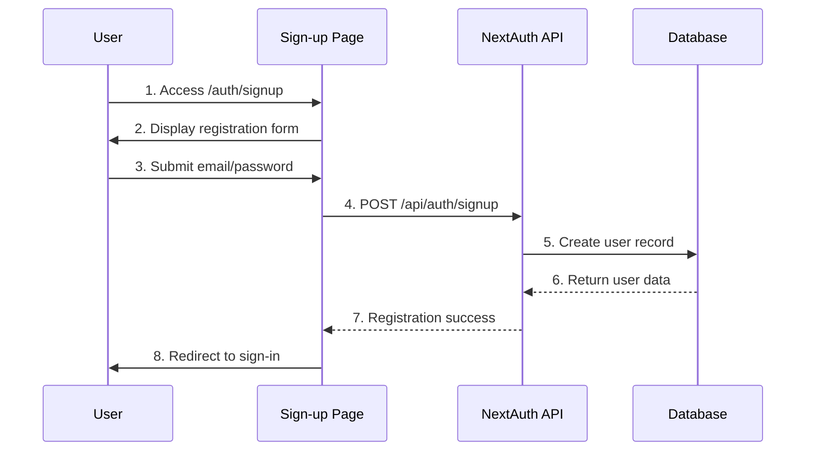
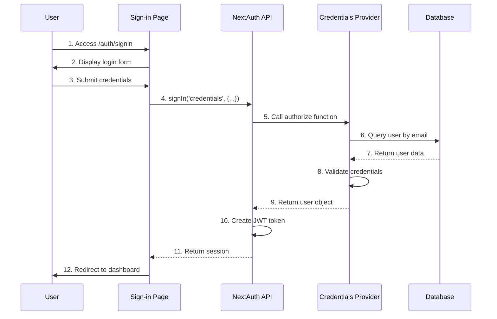
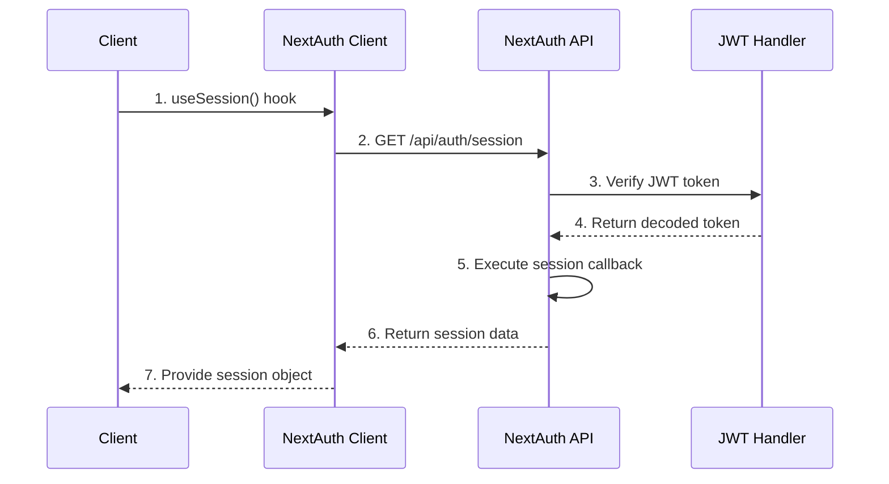

# Authentication Flow

This document describes the authentication and user management system in LinkShield, which is built using NextAuth.js with Prisma adapter for database integration.

## Overview

LinkShield uses NextAuth.js for authentication, providing:
- Email/password authentication with credentials provider
- JWT-based session management
- Prisma database adapter for user data persistence
- Custom authentication pages with modern UI
- Role-based access control
- Plan-based feature restrictions

## Authentication Architecture

### Core Components

1. **NextAuth.js Configuration** (`/lib/auth.ts`)
   - Defines authentication providers and options
   - Configures session strategy and callbacks
   - Sets up custom authentication pages

2. **API Routes** (`/api/auth/[...nextauth]/route.ts`)
   - Handles all authentication requests
   - Provides OAuth endpoints and session management
   - Integrates with NextAuth.js handler

3. **Authentication Pages**
   - Custom sign-in page (`/auth/signin`)
   - Custom sign-up page (`/auth/signup`)
   - Modern UI with error handling and loading states

4. **Database Integration**
   - Prisma adapter for user data storage
   - User model with plan and role information
   - Session and account management

## Authentication Flow Diagrams

### User Registration Flow



### User Sign-in Flow



### Session Management Flow



## Authentication Configuration

### NextAuth.js Setup

```typescript
// /lib/auth.ts
export const authOptions: NextAuthOptions = {
  adapter: PrismaAdapter(db),
  providers: [
    CredentialsProvider({
      // Email/password authentication
      async authorize(credentials) {
        // User validation logic
      }
    })
  ],
  session: {
    strategy: 'jwt' // JWT-based sessions
  },
  callbacks: {
    // Custom JWT and session callbacks
  },
  pages: {
    signIn: '/auth/signin',
    signUp: '/auth/signup'
  }
}
```

### Database Schema

The authentication system uses these Prisma models:

```prisma
model User {
  id            String    @id @default(cuid())
  email         String    @unique
  name          String?
  password      String?
  role          Role      @default(USER)
  plan          Plan      @default(FREE)
  createdAt     DateTime  @default(now())
  updatedAt     DateTime  @updatedAt
  
  // Relations
  accounts      Account[]
  sessions      Session[]
  checks        Check[]
  aiAnalyses    AIAnalysis[]
  projects      Project[]
}

model Account {
  // OAuth account information
}

model Session {
  // User session data
}
```

## User Registration Process

### Registration Steps

1. **Form Submission**
   - User accesses `/auth/signup`
   - Fills out registration form with email and password
   - Client-side validation for email format and password strength

2. **Account Creation**
   - API validates input data
   - Checks for existing user with same email
   - Hashes password using bcryptjs
   - Creates new user record in database

3. **Initial Setup**
   - Assigns default FREE plan
   - Sets USER role
   - Creates initial user preferences
   - Sends welcome email (optional)

4. **Redirect to Sign-in**
   - Successful registration redirects to sign-in page
   - User can immediately log in with new credentials

### Registration Validation

```typescript
// Registration validation rules
const registrationSchema = {
  email: {
    required: true,
    format: 'email',
    unique: true
  },
  password: {
    required: true,
    minLength: 8,
    pattern: /^(?=.*[a-z])(?=.*[A-Z])(?=.*\d)/
  },
  name: {
    optional: true,
    maxLength: 100
  }
}
```

## User Sign-in Process

### Sign-in Steps

1. **Credential Submission**
   - User accesses `/auth/signin`
   - Enters email and password
   - Form validation and submission

2. **Authentication**
   - NextAuth.js processes credentials
   - Credentials provider validates user
   - Database lookup by email
   - Password verification (currently simplified for demo)

3. **Session Creation**
   - JWT token generated with user information
   - Session callbacks add plan and role data
   - Token stored in secure HTTP-only cookie

4. **Dashboard Redirect**
   - Successful authentication redirects to `/dashboard`
   - User session is available throughout the application

### Error Handling

```typescript
// Common authentication errors
const authErrors = {
  'CredentialsSignin': 'Invalid email or password',
  'EmailNotVerified': 'Please verify your email address',
  'AccountNotLinked': 'Account linking required',
  'SessionRequired': 'Please sign in to continue'
}
```

## Session Management

### JWT Strategy

LinkShield uses JWT tokens for session management:

```typescript
// JWT callback configuration
async jwt({ token, user }) {
  if (user) {
    token.plan = user.plan
    token.id = user.id
    token.role = user.role
  }
  return token
}

// Session callback configuration
async session({ session, token }) {
  if (token) {
    session.user.id = token.id
    session.user.plan = token.plan
    session.user.role = token.role
  }
  return session
}
```

### Session Data Structure

```typescript
interface Session {
  user: {
    id: string
    email: string
    name?: string
    plan: 'FREE' | 'PRO' | 'ENTERPRISE'
    role: 'USER' | 'ADMIN'
  }
  expires: string
}
```

### Client-Side Session Access

```typescript
// Using the useSession hook
import { useSession } from 'next-auth/react'

function Component() {
  const { data: session, status } = useSession()
  
  if (status === 'loading') return <Loading />
  if (status === 'unauthenticated') return <SignIn />
  
  return <Dashboard user={session.user} />
}
```

## Role-Based Access Control

### User Roles

1. **USER** (Default)
   - Access to basic URL analysis features
   - Personal dashboard and reports
   - Limited API usage based on plan

2. **ADMIN**
   - Full system access
   - User management capabilities
   - System analytics and monitoring
   - Unlimited API usage

### Permission Checking

```typescript
// Server-side permission check
export async function requireAuth(req: NextRequest) {
  const session = await getServerSession(authOptions)
  
  if (!session) {
    throw new Error('Authentication required')
  }
  
  return session
}

// Role-based access check
export async function requireAdmin(req: NextRequest) {
  const session = await requireAuth(req)
  
  if (session.user.role !== 'ADMIN') {
    throw new Error('Admin access required')
  }
  
  return session
}
```

## Plan-Based Feature Access

### Plan Restrictions

```typescript
// Plan limits configuration
const PLAN_LIMITS = {
  FREE: {
    monthlyChecks: 10,
    aiAnalysis: 0,
    projects: 1,
    teamMembers: 1
  },
  PRO: {
    monthlyChecks: 1000,
    aiAnalysis: 100,
    projects: 10,
    teamMembers: 5
  },
  ENTERPRISE: {
    monthlyChecks: -1, // Unlimited
    aiAnalysis: -1,    // Unlimited
    projects: -1,      // Unlimited
    teamMembers: -1    // Unlimited
  }
}
```

### Usage Validation

```typescript
// Check usage limits before analysis
async function checkUsageLimits(userId: string, plan: string) {
  const limits = PLAN_LIMITS[plan]
  const usage = await getUserUsage(userId)
  
  if (limits.monthlyChecks !== -1 && 
      usage.monthlyChecks >= limits.monthlyChecks) {
    throw new Error('Monthly check limit exceeded')
  }
  
  return true
}
```

## Security Considerations

### Password Security

1. **Hashing**
   - Passwords hashed using bcryptjs
   - Salt rounds configured for security
   - No plain text password storage

2. **Validation**
   - Minimum password length requirements
   - Complexity requirements (uppercase, lowercase, numbers)
   - Common password detection

### Session Security

1. **JWT Tokens**
   - Secure token generation
   - HTTP-only cookie storage
   - Automatic token expiration

2. **CSRF Protection**
   - Built-in CSRF protection via NextAuth.js
   - Secure cookie settings
   - SameSite cookie attributes

### Rate Limiting

```typescript
// Authentication rate limiting
const authRateLimit = {
  windowMs: 15 * 60 * 1000, // 15 minutes
  max: 5, // 5 attempts per window
  message: 'Too many authentication attempts'
}
```

## Error Handling and Recovery

### Common Error Scenarios

1. **Invalid Credentials**
   - Clear error messages
   - Account lockout after multiple failures
   - Password reset options

2. **Session Expiration**
   - Automatic redirect to sign-in
   - Session refresh mechanisms
   - Graceful error handling

3. **Network Issues**
   - Retry mechanisms for authentication
   - Offline state handling
   - Connection error messages

### Recovery Procedures

1. **Password Reset**
   - Email-based password reset flow
   - Secure token generation
   - Time-limited reset links

2. **Account Recovery**
   - Email verification for account access
   - Support contact for locked accounts
   - Manual account recovery procedures

## Integration with Application Features

### Protected Routes

```typescript
// Middleware for route protection
export async function middleware(request: NextRequest) {
  const session = await getToken({ req: request })
  
  // Protect dashboard routes
  if (request.nextUrl.pathname.startsWith('/dashboard')) {
    if (!session) {
      return NextResponse.redirect('/auth/signin')
    }
  }
  
  // Protect admin routes
  if (request.nextUrl.pathname.startsWith('/admin')) {
    if (!session || session.role !== 'ADMIN') {
      return NextResponse.redirect('/dashboard')
    }
  }
}
```

### API Authentication

```typescript
// API route authentication
export async function POST(request: NextRequest) {
  const session = await getServerSession(authOptions)
  
  if (!session) {
    return NextResponse.json(
      { error: 'Authentication required' },
      { status: 401 }
    )
  }
  
  // Process authenticated request
}
```

### Client-Side Protection

```typescript
// Component-level authentication
function ProtectedComponent() {
  const { data: session, status } = useSession({
    required: true,
    onUnauthenticated() {
      router.push('/auth/signin')
    }
  })
  
  if (status === 'loading') return <Loading />
  
  return <AuthenticatedContent />
}
```

## Future Enhancements

### Planned Features

1. **OAuth Providers**
   - Google OAuth integration
   - GitHub OAuth integration
   - Microsoft OAuth integration

2. **Two-Factor Authentication**
   - TOTP-based 2FA
   - SMS-based verification
   - Backup codes

3. **Advanced Security**
   - Device fingerprinting
   - Suspicious activity detection
   - Geographic access controls

4. **User Management**
   - Self-service account management
   - Profile customization
   - Privacy controls

### Implementation Roadmap

1. **Phase 1**: OAuth provider integration
2. **Phase 2**: Two-factor authentication
3. **Phase 3**: Advanced security features
4. **Phase 4**: Enhanced user management

This authentication system provides a secure, scalable foundation for LinkShield's user management needs while maintaining flexibility for future enhancements.
