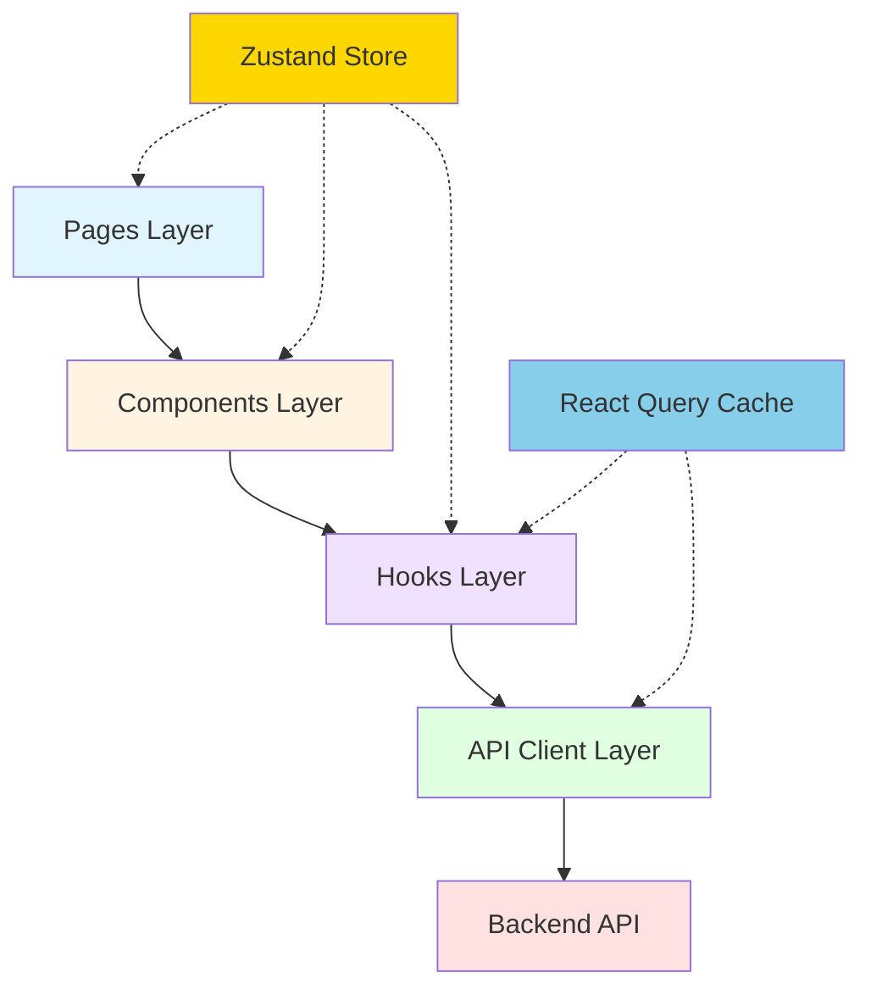
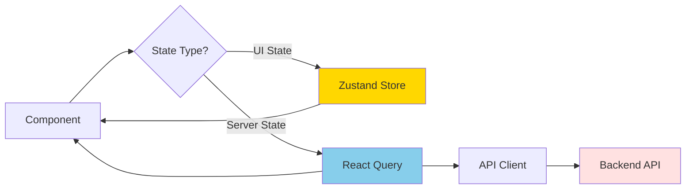
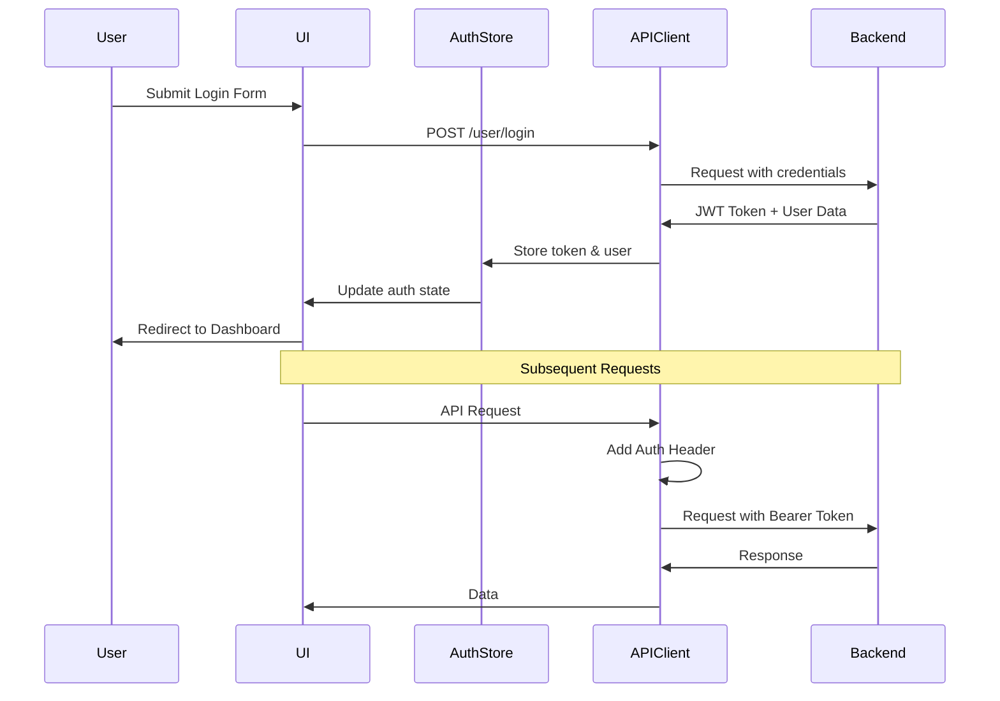

# Architecture

## Overview

The LinkShield client application follows a modern, layered architecture designed for maintainability, scalability, and clear separation of concerns. This document outlines the core architectural principles, patterns, and design decisions that guide the development of the client application.

## Core Architectural Principles

### 1. API-Driven Thin Client

The LinkShield client is a **thin presentation layer** that consumes the backend API at `https://www.linkshield.site/api/v1`. This is the most fundamental architectural principle that influences all design decisions.

#### Backend Responsibilities

The backend handles all critical business operations:

- **Business Logic**: All rules, calculations, and decision-making
- **Data Validation**: Server-side validation is the source of truth
- **Security Enforcement**: Authentication, authorization, rate limiting
- **Data Persistence**: Database operations and data integrity
- **External Service Integration**: Third-party API calls (VirusTotal, OpenAI, etc.)
- **Rate Limiting**: Request throttling and quota management
- **Audit Logging**: Security events and user actions

#### Client Responsibilities

The client focuses solely on presentation and user experience:

- **User Interface Rendering**: Display data and UI components
- **User Interaction Handling**: Capture user input and actions
- **Client-Side Routing**: Navigate between pages without server requests
- **State Management**: Manage UI state and cache server data
- **API Communication**: Make HTTP requests to backend endpoints
- **Form Handling**: Collect and validate user input (UX only)
- **User Experience Optimization**: Loading states, error messages, animations

#### Why This Matters

This architectural separation has important implications:

**Security**:
- Security is enforced on the backend, not the client
- Client-side validation is for UX enhancement only, not security
- Route protection is a UX feature to improve navigation, not a security measure
- Users can bypass any client-side checks, so never rely on them for security

**Flexibility**:
- The client can be rebuilt with different technologies (Vue, Angular, mobile apps) without changing business logic
- Multiple clients (web, mobile, desktop) can consume the same backend API
- Frontend and backend can be developed and deployed independently

**Maintainability**:
- Clear separation of concerns makes code easier to understand and maintain
- Business logic changes don't require client updates (in most cases)
- Testing is simpler with clear boundaries between layers

### 2. Functional Components with Hooks

All components use React functional components with hooks. Class components are not used.

**Why Functional Components**:
- Simpler syntax and less boilerplate
- Hooks provide powerful composition patterns
- Better performance with React 18+ concurrent features
- Easier to test and reason about

**Example**:
```typescript
// ✅ Good: Functional component with TypeScript
interface UserCardProps {
  user: User;
  onEdit: (user: User) => void;
}

export const UserCard: React.FC<UserCardProps> = ({ user, onEdit }) => {
  const [isExpanded, setIsExpanded] = useState(false);
  
  return (
    <div className="user-card">
      <h3>{user.full_name}</h3>
      <button onClick={() => setIsExpanded(!isExpanded)}>
        {isExpanded ? 'Collapse' : 'Expand'}
      </button>
      {isExpanded && (
        <div className="user-details">
          <p>Email: {user.email}</p>
          <button onClick={() => onEdit(user)}>Edit</button>
        </div>
      )}
    </div>
  );
};

// ❌ Bad: Class component (don't use)
class UserCard extends React.Component {
  // Don't use class components
}
```

### 3. Composition Over Inheritance

Build complex UIs by composing small, focused components rather than using inheritance.

**Example**:
```typescript
// Large feature component composed of smaller components
export const DashboardPage = () => {
  const { data: stats } = useDashboardStats();
  const { data: activities } = useRecentActivity();
  
  return (
    <PageLayout>
      <PageHeader title="Dashboard" />
      <StatsGrid>
        <StatCard label="Total Checks" value={stats.totalChecks} icon={<CheckIcon />} />
        <StatCard label="Threats Detected" value={stats.threats} icon={<AlertIcon />} />
        <StatCard label="API Calls" value={stats.apiCalls} icon={<ApiIcon />} />
      </StatsGrid>
      <RecentActivity activities={activities} />
    </PageLayout>
  );
};
```

## Layered Architecture

The client follows a clear four-layer architecture with well-defined responsibilities:



### 1. Pages Layer

**Responsibility**: Route-level components that represent entire pages or views.

**Characteristics**:
- One page component per route
- Orchestrates data fetching for the entire page
- Composes multiple feature components
- Handles page-level layout
- Manages page-specific state

**Example**:
```typescript
// src/pages/UrlAnalysisPage.tsx
export const UrlAnalysisPage = () => {
  const [filters, setFilters] = useState<UrlHistoryFilters>({});
  const { data, isLoading } = useUrlHistory(filters);
  
  return (
    <PageLayout>
      <PageHeader title="URL Analysis" />
      <UrlHistoryFilters filters={filters} onChange={setFilters} />
      {isLoading ? (
        <LoadingSkeleton />
      ) : (
        <UrlHistoryTable data={data} />
      )}
    </PageLayout>
  );
};
```

### 2. Components Layer

**Responsibility**: Reusable UI components that handle presentation logic.

**Types of Components**:

**Shared Components** (`src/components/ui/`):
- Base UI components from shadcn/ui
- Button, Input, Dialog, Table, etc.
- No business logic, pure presentation

**Layout Components** (`src/components/layout/`):
- PageLayout, Header, Sidebar, Footer
- Provide consistent structure across pages

**Feature Components** (`src/components/` or `src/features/*/components/`):
- Feature-specific components
- UrlHistoryTable, CheckDetailView, etc.
- May contain feature-specific logic

**Example**:
```typescript
// src/components/url-analysis/UrlHistoryTable.tsx
interface UrlHistoryTableProps {
  data: UrlCheck[];
  onRowClick?: (check: UrlCheck) => void;
}

export const UrlHistoryTable: React.FC<UrlHistoryTableProps> = ({ 
  data, 
  onRowClick 
}) => {
  return (
    <Table>
      <TableHeader>
        <TableRow>
          <TableHead>URL</TableHead>
          <TableHead>Status</TableHead>
          <TableHead>Date</TableHead>
        </TableRow>
      </TableHeader>
      <TableBody>
        {data.map((check) => (
          <TableRow 
            key={check.id} 
            onClick={() => onRowClick?.(check)}
            className="cursor-pointer hover:bg-gray-50"
          >
            <TableCell>{check.url}</TableCell>
            <TableCell>
              <ThreatBadge level={check.threat_level} />
            </TableCell>
            <TableCell>{formatDate(check.created_at)}</TableCell>
          </TableRow>
        ))}
      </TableBody>
    </Table>
  );
};
```

### 3. Hooks Layer

**Responsibility**: Custom React hooks that encapsulate reusable logic.

**Types of Hooks**:

**API Hooks** (React Query):
- Data fetching hooks (useUrlHistory, useProfile)
- Mutation hooks (useCreateReport, useUpdateProfile)
- Encapsulate API calls and caching logic

**Form Hooks** (React Hook Form):
- Form state management
- Validation logic
- Submission handling

**Utility Hooks**:
- Shared logic extraction (useDebounce, useLocalStorage)
- Browser API wrappers (useMediaQuery, useOnClickOutside)

**Example**:
```typescript
// src/hooks/useUrlHistory.ts
export const useUrlHistory = (filters: UrlHistoryFilters) => {
  return useQuery({
    queryKey: ['url-history', filters],
    queryFn: () => urlCheckService.getHistory(filters),
    staleTime: 2 * 60 * 1000, // 2 minutes
    gcTime: 10 * 60 * 1000, // 10 minutes
  });
};

// src/hooks/useCreateReport.ts
export const useCreateReport = () => {
  const queryClient = useQueryClient();
  
  return useMutation({
    mutationFn: (data: CreateReportData) => reportsService.create(data),
    onSuccess: () => {
      queryClient.invalidateQueries({ queryKey: ['reports'] });
      toast.success('Report submitted successfully');
    },
    onError: (error) => {
      toast.error('Failed to submit report');
    },
  });
};
```

### 4. API Client Layer

**Responsibility**: HTTP communication with the backend API.

**Structure**:
- Axios instance with base configuration
- Request/response interceptors
- API service modules organized by domain
- TypeScript interfaces for requests/responses

**Example**:
```typescript
// src/services/api.ts
export const apiClient = axios.create({
  baseURL: 'https://www.linkshield.site/api/v1',
  timeout: 30000,
  headers: {
    'Content-Type': 'application/json',
  },
});

// Request interceptor
apiClient.interceptors.request.use((config) => {
  const token = authStore.getState().token;
  if (token) {
    config.headers.Authorization = `Bearer ${token}`;
  }
  return config;
});

// Response interceptor
apiClient.interceptors.response.use(
  (response) => response.data,
  (error) => {
    if (error.response?.status === 401) {
      authStore.getState().clearAuth();
      window.location.href = '/login';
    }
    return Promise.reject(error);
  }
);

// src/services/url-check.service.ts
export const urlCheckService = {
  check: (url: string) => 
    apiClient.post<UrlCheckResponse>('/url-check/check', { url }),
    
  getHistory: (filters: UrlHistoryFilters) => 
    apiClient.get<UrlCheck[]>('/url-check/history', { params: filters }),
    
  getDetail: (checkId: string) => 
    apiClient.get<UrlCheckDetail>(`/url-check/check/${checkId}`),
};
```

## State Management Architecture

The application uses two separate state management solutions for different concerns:



### Zustand for Global UI State

**Use Cases**:
- Authentication state (user, token, isAuthenticated)
- UI preferences (theme, language, sidebar collapsed)
- Global notifications (toasts, alerts)
- Temporary UI state shared across components

**Why Zustand**:
- Lightweight (~1KB) with minimal boilerplate
- No context providers needed
- Excellent TypeScript support
- Middleware for persistence and devtools

**Example**:
```typescript
// src/stores/authStore.ts
interface AuthStore {
  user: User | null;
  token: string | null;
  isAuthenticated: boolean;
  
  setUser: (user: User) => void;
  setToken: (token: string) => void;
  clearAuth: () => void;
}

export const useAuthStore = create<AuthStore>((set) => ({
  user: null,
  token: null,
  isAuthenticated: false,
  
  setUser: (user) => set({ user, isAuthenticated: true }),
  setToken: (token) => set({ token }),
  clearAuth: () => set({ user: null, token: null, isAuthenticated: false }),
}));

// Usage in components
const { user, isAuthenticated } = useAuthStore();
```

### React Query for Server State

**Use Cases**:
- All data fetched from the API
- Caching and background updates
- Optimistic updates
- Request deduplication
- Pagination and infinite queries

**Why React Query**:
- Automatic caching with configurable stale time
- Background refetching keeps data fresh
- Built-in loading and error states
- Optimistic updates for better UX
- Request cancellation and deduplication

**Example**:
```typescript
// Query for fetching data
const { data, isLoading, error } = useQuery({
  queryKey: ['url-history', filters],
  queryFn: () => urlCheckService.getHistory(filters),
  staleTime: 2 * 60 * 1000,
});

// Mutation for updating data
const mutation = useMutation({
  mutationFn: (data: CreateReportData) => reportsService.create(data),
  onSuccess: () => {
    queryClient.invalidateQueries({ queryKey: ['reports'] });
  },
});
```

### Why This Separation?

**Clear Boundaries**:
- UI state vs server state are fundamentally different
- UI state is synchronous and client-only
- Server state is asynchronous and requires synchronization

**Optimized Caching**:
- React Query handles server state caching automatically
- Zustand handles client state without unnecessary complexity

**Simpler Code**:
- Each tool does what it's best at
- No need to manage API caching manually
- Clear patterns for where to put state

**Better Performance**:
- React Query prevents unnecessary API calls
- Zustand minimizes re-renders with selective subscriptions

## Routing Architecture

### Route Structure

The application has two types of routes:

**Public Routes** (no authentication required):
- `/` - Homepage with URL checker
- `/login` - User login
- `/register` - User registration
- `/verify-email/:token` - Email verification
- `/forgot-password` - Password reset request
- `/reset-password/:token` - Password reset
- `/privacy` - Privacy policy
- `/terms` - Terms of service

**Protected Routes** (authentication required):
- `/dashboard` - User dashboard
- `/url-analysis` - URL checking history and analysis
- `/ai-analysis` - AI-powered content analysis
- `/reports` - Community reports
- `/api-keys` - API key management
- `/profile` - User profile and settings
- `/subscriptions` - Subscription management
- `/sessions` - Active sessions management

### Route Protection Pattern

Protected routes use a wrapper component that checks authentication:

```typescript
// src/components/auth/RequireAuth.tsx
interface RequireAuthProps {
  children: React.ReactNode;
}

export const RequireAuth: React.FC<RequireAuthProps> = ({ children }) => {
  const { isAuthenticated, isLoading } = useAuthStore();
  const location = useLocation();
  
  if (isLoading) {
    return <LoadingSpinner />;
  }
  
  if (!isAuthenticated) {
    // Redirect to login with return URL
    return <Navigate to="/login" state={{ from: location }} replace />;
  }
  
  return <>{children}</>;
};

// Usage in router configuration
{
  path: '/dashboard',
  element: (
    <RequireAuth>
      <DashboardPage />
    </RequireAuth>
  ),
}
```

**Important**: Route protection is a UX feature, not a security measure. The backend enforces actual access control.

### Nested Routes and Layouts

Use nested routes for consistent layouts:

```typescript
// Router configuration
const router = createBrowserRouter([
  {
    path: '/',
    element: <RootLayout />,
    children: [
      { index: true, element: <HomePage /> },
      { path: 'login', element: <LoginPage /> },
      {
        path: 'dashboard',
        element: (
          <RequireAuth>
            <DashboardLayout />
          </RequireAuth>
        ),
        children: [
          { index: true, element: <DashboardOverview /> },
          { path: 'projects', element: <ProjectsPage /> },
          { path: 'projects/:id', element: <ProjectDetailPage /> },
        ],
      },
    ],
  },
]);
```

## Error Handling Architecture

### Global Error Boundary

Catch React errors at the top level:

```typescript
// src/components/ErrorBoundary.tsx
export class ErrorBoundary extends React.Component<Props, State> {
  state = { hasError: false, error: null };
  
  static getDerivedStateFromError(error: Error) {
    return { hasError: true, error };
  }
  
  componentDidCatch(error: Error, errorInfo: ErrorInfo) {
    console.error('Error caught by boundary:', error, errorInfo);
    // Log to error tracking service
  }
  
  render() {
    if (this.state.hasError) {
      return <ErrorFallback error={this.state.error} />;
    }
    return this.props.children;
  }
}
```

### API Error Handling

Handle API errors in the response interceptor:

```typescript
apiClient.interceptors.response.use(
  (response) => response.data,
  (error) => {
    const status = error.response?.status;
    const errorCode = error.response?.data?.error_code;
    
    // Handle specific error cases
    if (status === 401) {
      authStore.getState().clearAuth();
      window.location.href = '/login';
    } else if (status === 429) {
      toast.error('Rate limit exceeded. Please try again later.');
    } else if (errorCode) {
      const message = ERROR_MESSAGES[errorCode] || 'An error occurred';
      toast.error(message);
    }
    
    return Promise.reject(error);
  }
);
```

### Component-Level Error Handling

Handle errors in components with React Query:

```typescript
const { data, error, isError } = useQuery({
  queryKey: ['url-history'],
  queryFn: urlCheckService.getHistory,
});

if (isError) {
  return <ErrorMessage error={error} />;
}
```

## Authentication Flow



### JWT Token Management

**Storage**: Tokens are stored in memory (Zustand store), not localStorage, for security.

**Injection**: Request interceptor automatically adds token to all requests:
```typescript
config.headers.Authorization = `Bearer ${token}`;
```

**Expiration**: When a 401 response is received, clear auth state and redirect to login.

**Refresh**: Currently, users must log in again when tokens expire. Future enhancement: implement refresh token flow.

## Feature Organization

### Feature-Based Structure

For large features, use feature folders:

```
src/features/
├── url-analysis/
│   ├── components/
│   │   ├── UrlHistoryTable.tsx
│   │   ├── CheckDetailView.tsx
│   │   └── BulkAnalysisForm.tsx
│   ├── hooks/
│   │   ├── useUrlCheck.ts
│   │   └── useUrlHistory.ts
│   ├── types/
│   │   └── url-check.types.ts
│   ├── services/
│   │   └── url-check.service.ts
│   └── pages/
│       ├── UrlAnalysisPage.tsx
│       └── CheckDetailPage.tsx
└── dashboard/
    ├── components/
    ├── hooks/
    ├── types/
    └── pages/
```

**Benefits**:
- Co-location of related code
- Easier to find and modify feature code
- Clear feature boundaries
- Can be extracted into separate packages if needed

### Shared vs Feature-Specific

**Shared** (`src/components/`, `src/hooks/`, `src/utils/`):
- Used by multiple features
- Generic and reusable
- No feature-specific logic

**Feature-Specific** (`src/features/*/`):
- Used only within one feature
- Feature-specific logic
- Can reference shared code

## Performance Considerations

### Code Splitting

Lazy load routes for smaller initial bundle:

```typescript
const DashboardPage = lazy(() => import('./pages/DashboardPage'));

<Route 
  path="/dashboard" 
  element={
    <Suspense fallback={<LoadingSpinner />}>
      <DashboardPage />
    </Suspense>
  } 
/>
```

### React Query Caching

Configure appropriate stale times:

```typescript
// Frequently changing data: short stale time
useQuery({
  queryKey: ['alerts'],
  queryFn: getAlerts,
  staleTime: 30 * 1000, // 30 seconds
});

// Rarely changing data: long stale time
useQuery({
  queryKey: ['subscription-plans'],
  queryFn: getPlans,
  staleTime: 60 * 60 * 1000, // 1 hour
});
```

### Optimistic Updates

Update UI immediately for better perceived performance:

```typescript
const mutation = useMutation({
  mutationFn: voteOnReport,
  onMutate: async (variables) => {
    // Cancel outgoing refetches
    await queryClient.cancelQueries({ queryKey: ['report', variables.reportId] });
    
    // Snapshot previous value
    const previous = queryClient.getQueryData(['report', variables.reportId]);
    
    // Optimistically update
    queryClient.setQueryData(['report', variables.reportId], (old) => ({
      ...old,
      votes: old.votes + 1,
    }));
    
    return { previous };
  },
  onError: (err, variables, context) => {
    // Rollback on error
    queryClient.setQueryData(['report', variables.reportId], context.previous);
  },
});
```

## Summary

The LinkShield client architecture is designed with these key principles:

1. **Thin Client**: All business logic in backend, client handles only UI/UX
2. **Layered Structure**: Clear separation between pages, components, hooks, and API client
3. **Dual State Management**: Zustand for UI state, React Query for server state
4. **Functional Components**: Modern React with hooks, no class components
5. **Composition**: Build complex UIs from small, focused components
6. **Type Safety**: TypeScript throughout with strict mode
7. **Performance**: Code splitting, caching, optimistic updates
8. **Security Awareness**: Client-side security is UX, not enforcement

These principles ensure the application is maintainable, scalable, and provides an excellent user experience while maintaining clear boundaries with the backend API.

---

**Last Updated**: January 2025