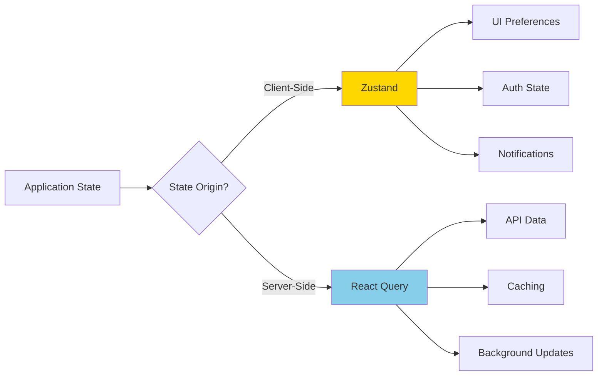

# State Management

## Overview

The LinkShield client uses a dual state management approach, separating concerns between UI state and server state. This document explains when and how to use each solution.

## State Management Philosophy



### Why Two Solutions?

**UI State** and **Server State** are fundamentally different:

**UI State** (Zustand):
- Synchronous and client-only
- No network requests involved
- Persists only in client memory (or localStorage)
- Examples: theme, sidebar collapsed, current tab

**Server State** (React Query):
- Asynchronous and requires network requests
- Needs synchronization with backend
- Has caching, staleness, and refetching concerns
- Examples: user data, URL history, reports

Using separate tools for each provides:
- Clear boundaries and responsibilities
- Optimal performance for each use case
- Simpler code with less boilerplate
- Better developer experience

## Zustand for Global UI State

### When to Use Zustand

Use Zustand for:
- ✅ Authentication state (user, token, isAuthenticated)
- ✅ UI preferences (theme, language, sidebar state)
- ✅ Global notifications and toasts
- ✅ Temporary UI state shared across components
- ✅ Form wizards with multi-step state
- ✅ Modal/dialog open/close state (if shared)

Don't use Zustand for:
- ❌ Data fetched from API (use React Query)
- ❌ Component-local state (use useState)
- ❌ Form state (use React Hook Form)

### Creating a Zustand Store

```typescript
// src/stores/authStore.ts
import { create } from 'zustand';
import type { User } from '@/types/user.types';

interface AuthStore {
  // State
  user: User | null;
  token: string | null;
  isAuthenticated: boolean;
  isLoading: boolean;
  
  // Actions
  setUser: (user: User) => void;
  setToken: (token: string) => void;
  setLoading: (loading: boolean) => void;
  clearAuth: () => void;
}

export const useAuthStore = create<AuthStore>((set) => ({
  // Initial state
  user: null,
  token: null,
  isAuthenticated: false,
  isLoading: true,
  
  // Actions
  setUser: (user) => set({ user, isAuthenticated: true }),
  setToken: (token) => set({ token }),
  setLoading: (loading) => set({ isLoading: loading }),
  clearAuth: () => set({ 
    user: null, 
    token: null, 
    isAuthenticated: false 
  }),
}));
```

### Using Zustand in Components

```typescript
// Select specific state (recommended - prevents unnecessary re-renders)
const user = useAuthStore((state) => state.user);
const isAuthenticated = useAuthStore((state) => state.isAuthenticated);

// Select multiple values
const { user, isAuthenticated, setUser } = useAuthStore((state) => ({
  user: state.user,
  isAuthenticated: state.isAuthenticated,
  setUser: state.setUser,
}));

// Select entire store (not recommended - causes re-renders on any change)
const authStore = useAuthStore();
```

### Zustand with Persistence

Persist state to localStorage:

```typescript
// src/stores/uiStore.ts
import { create } from 'zustand';
import { persist } from 'zustand/middleware';

interface UiStore {
  theme: 'light' | 'dark';
  sidebarCollapsed: boolean;
  language: string;
  
  setTheme: (theme: 'light' | 'dark') => void;
  toggleSidebar: () => void;
  setLanguage: (language: string) => void;
}

export const useUiStore = create<UiStore>()(
  persist(
    (set) => ({
      theme: 'light',
      sidebarCollapsed: false,
      language: 'en',
      
      setTheme: (theme) => set({ theme }),
      toggleSidebar: () => set((state) => ({ 
        sidebarCollapsed: !state.sidebarCollapsed 
      })),
      setLanguage: (language) => set({ language }),
    }),
    {
      name: 'linkshield-ui-preferences', // localStorage key
    }
  )
);
```

### Zustand with Devtools

Enable Redux DevTools for debugging:

```typescript
import { create } from 'zustand';
import { devtools } from 'zustand/middleware';

export const useAuthStore = create<AuthStore>()(
  devtools(
    (set) => ({
      // ... store implementation
    }),
    {
      name: 'AuthStore', // Name in DevTools
    }
  )
);
```

## React Query for Server State

### When to Use React Query

Use React Query for:
- ✅ All data fetched from API (GET requests)
- ✅ All data mutations (POST, PUT, DELETE)
- ✅ Paginated data
- ✅ Infinite scroll data
- ✅ Real-time data with polling
- ✅ Optimistic updates

Don't use React Query for:
- ❌ Client-only state (use Zustand or useState)
- ❌ Synchronous operations

### React Query Configuration

```typescript
// src/config/queryClient.ts
import { QueryClient } from '@tanstack/react-query';

export const queryClient = new QueryClient({
  defaultOptions: {
    queries: {
      staleTime: 60 * 1000, // 1 minute
      gcTime: 5 * 60 * 1000, // 5 minutes (formerly cacheTime)
      retry: 1,
      refetchOnWindowFocus: false,
    },
    mutations: {
      retry: 0,
    },
  },
});

// src/main.tsx
import { QueryClientProvider } from '@tanstack/react-query';
import { ReactQueryDevtools } from '@tanstack/react-query-devtools';

root.render(
  <QueryClientProvider client={queryClient}>
    <App />
    <ReactQueryDevtools initialIsOpen={false} />
  </QueryClientProvider>
);
```

### Query Hooks (GET Requests)

```typescript
// src/hooks/url-check/useUrlHistory.ts
import { useQuery } from '@tanstack/react-query';
import { urlCheckService } from '@/services/url-check.service';
import type { UrlHistoryFilters } from '@/types/url-check.types';

export const useUrlHistory = (filters: UrlHistoryFilters) => {
  return useQuery({
    queryKey: ['url-history', filters],
    queryFn: () => urlCheckService.getHistory(filters),
    staleTime: 2 * 60 * 1000, // 2 minutes
    gcTime: 10 * 60 * 1000, // 10 minutes
  });
};

// Usage in component
const { data, isLoading, error, isError, refetch } = useUrlHistory(filters);

if (isLoading) return <LoadingSkeleton />;
if (isError) return <ErrorMessage error={error} />;

return <UrlHistoryTable data={data} />;
```

### Mutation Hooks (POST/PUT/DELETE)

```typescript
// src/hooks/reports/useCreateReport.ts
import { useMutation, useQueryClient } from '@tanstack/react-query';
import { reportsService } from '@/services/reports.service';
import { toast } from 'react-hot-toast';
import type { CreateReportData } from '@/types/reports.types';

export const useCreateReport = () => {
  const queryClient = useQueryClient();
  
  return useMutation({
    mutationFn: (data: CreateReportData) => reportsService.create(data),
    onSuccess: () => {
      // Invalidate reports list to refetch
      queryClient.invalidateQueries({ queryKey: ['reports'] });
      toast.success('Report submitted successfully');
    },
    onError: (error: any) => {
      toast.error('Failed to submit report');
      console.error('Report submission error:', error);
    },
  });
};

// Usage in component
const createReport = useCreateReport();

const handleSubmit = async (data: CreateReportData) => {
  try {
    await createReport.mutateAsync(data);
    navigate('/reports');
  } catch (error) {
    // Error already handled in onError
  }
};

return (
  <form onSubmit={handleSubmit}>
    {/* Form fields */}
    <button type="submit" disabled={createReport.isPending}>
      {createReport.isPending ? 'Submitting...' : 'Submit Report'}
    </button>
  </form>
);
```

### Query Keys Organization

Organize query keys for easy invalidation:

```typescript
// src/config/queryKeys.ts
export const queryKeys = {
  urlCheck: {
    all: ['url-check'] as const,
    lists: () => [...queryKeys.urlCheck.all, 'list'] as const,
    list: (filters: UrlHistoryFilters) => 
      [...queryKeys.urlCheck.lists(), filters] as const,
    details: () => [...queryKeys.urlCheck.all, 'detail'] as const,
    detail: (id: string) => [...queryKeys.urlCheck.details(), id] as const,
  },
};

// Usage
useQuery({
  queryKey: queryKeys.urlCheck.detail(checkId),
  queryFn: () => urlCheckService.getDetail(checkId),
});

// Invalidate all url-check queries
queryClient.invalidateQueries({ queryKey: queryKeys.urlCheck.all });

// Invalidate only lists
queryClient.invalidateQueries({ queryKey: queryKeys.urlCheck.lists() });
```

### Caching Strategies

Configure stale time based on data volatility:

```typescript
// Frequently changing data: short stale time
useQuery({
  queryKey: ['alerts'],
  queryFn: getAlerts,
  staleTime: 30 * 1000, // 30 seconds
});

// Moderately changing data: medium stale time
useQuery({
  queryKey: ['url-history'],
  queryFn: getUrlHistory,
  staleTime: 2 * 60 * 1000, // 2 minutes
});

// Rarely changing data: long stale time
useQuery({
  queryKey: ['subscription-plans'],
  queryFn: getPlans,
  staleTime: 60 * 60 * 1000, // 1 hour
});

// Static data: infinite stale time
useQuery({
  queryKey: ['report-templates'],
  queryFn: getTemplates,
  staleTime: Infinity,
});
```

### Optimistic Updates

Update UI immediately before server confirmation:

```typescript
// src/hooks/reports/useVoteReport.ts
import { useMutation, useQueryClient } from '@tanstack/react-query';
import { reportsService } from '@/services/reports.service';
import type { Report } from '@/types/reports.types';

export const useVoteReport = () => {
  const queryClient = useQueryClient();
  
  return useMutation({
    mutationFn: ({ reportId, voteType }: { reportId: string; voteType: 'up' | 'down' }) =>
      reportsService.vote(reportId, voteType),
      
    // Optimistic update
    onMutate: async ({ reportId, voteType }) => {
      // Cancel any outgoing refetches
      await queryClient.cancelQueries({ queryKey: ['reports', 'detail', reportId] });
      
      // Snapshot the previous value
      const previousReport = queryClient.getQueryData<Report>(['reports', 'detail', reportId]);
      
      // Optimistically update to the new value
      queryClient.setQueryData<Report>(['reports', 'detail', reportId], (old) => {
        if (!old) return old;
        return {
          ...old,
          votes: old.votes + (voteType === 'up' ? 1 : -1),
          user_vote: voteType,
        };
      });
      
      // Return context with the previous value
      return { previousReport };
    },
    
    // Rollback on error
    onError: (err, variables, context) => {
      if (context?.previousReport) {
        queryClient.setQueryData(
          ['reports', 'detail', variables.reportId],
          context.previousReport
        );
      }
      toast.error('Failed to vote on report');
    },
    
    // Always refetch after error or success
    onSettled: (data, error, variables) => {
      queryClient.invalidateQueries({ 
        queryKey: ['reports', 'detail', variables.reportId] 
      });
    },
  });
};
```

### Cache Invalidation

Invalidate queries after mutations:

```typescript
// Invalidate specific query
queryClient.invalidateQueries({ queryKey: ['reports', 'detail', reportId] });

// Invalidate all reports queries
queryClient.invalidateQueries({ queryKey: ['reports'] });

// Invalidate and refetch immediately
queryClient.invalidateQueries({ 
  queryKey: ['reports'],
  refetchType: 'active', // Only refetch active queries
});

// Remove query from cache
queryClient.removeQueries({ queryKey: ['reports', 'detail', reportId] });

// Reset query to initial state
queryClient.resetQueries({ queryKey: ['reports'] });
```

### Pagination

Handle paginated data:

```typescript
// src/hooks/reports/useReports.ts
import { useQuery } from '@tanstack/react-query';
import { reportsService } from '@/services/reports.service';

export const useReports = (page: number, filters: ReportFilters) => {
  return useQuery({
    queryKey: ['reports', 'list', page, filters],
    queryFn: () => reportsService.getList({ page, ...filters }),
    keepPreviousData: true, // Keep old data while fetching new page
  });
};

// Usage in component
const [page, setPage] = useState(1);
const { data, isLoading, isFetching } = useReports(page, filters);

return (
  <>
    <ReportsTable data={data?.items} />
    <Pagination
      currentPage={page}
      totalPages={data?.total_pages}
      onPageChange={setPage}
      isLoading={isFetching}
    />
  </>
);
```

### Infinite Queries

Handle infinite scroll:

```typescript
// src/hooks/reports/useInfiniteReports.ts
import { useInfiniteQuery } from '@tanstack/react-query';
import { reportsService } from '@/services/reports.service';

export const useInfiniteReports = (filters: ReportFilters) => {
  return useInfiniteQuery({
    queryKey: ['reports', 'infinite', filters],
    queryFn: ({ pageParam = 1 }) => 
      reportsService.getList({ page: pageParam, ...filters }),
    getNextPageParam: (lastPage) => {
      if (lastPage.page < lastPage.total_pages) {
        return lastPage.page + 1;
      }
      return undefined;
    },
    initialPageParam: 1,
  });
};

// Usage in component
const {
  data,
  fetchNextPage,
  hasNextPage,
  isFetchingNextPage,
} = useInfiniteReports(filters);

const allReports = data?.pages.flatMap((page) => page.items) ?? [];

return (
  <>
    <ReportsList reports={allReports} />
    {hasNextPage && (
      <button onClick={() => fetchNextPage()} disabled={isFetchingNextPage}>
        {isFetchingNextPage ? 'Loading...' : 'Load More'}
      </button>
    )}
  </>
);
```

### Real-Time Updates with Polling

Poll for updates:

```typescript
// src/hooks/dashboard/useAlerts.ts
import { useQuery } from '@tanstack/react-query';
import { dashboardService } from '@/services/dashboard.service';

export const useAlerts = (projectId: string) => {
  return useQuery({
    queryKey: ['dashboard', 'alerts', projectId],
    queryFn: () => dashboardService.getAlerts(projectId),
    refetchInterval: 30 * 1000, // Poll every 30 seconds
    refetchIntervalInBackground: false, // Stop polling when tab is not active
  });
};
```

### Dependent Queries

Run queries that depend on other queries:

```typescript
// First query
const { data: user } = useQuery({
  queryKey: ['user', 'profile'],
  queryFn: getProfile,
});

// Second query depends on first
const { data: subscription } = useQuery({
  queryKey: ['subscription', user?.id],
  queryFn: () => getSubscription(user!.id),
  enabled: !!user?.id, // Only run if user.id exists
});
```

## Combining Zustand and React Query

Use both together when needed:

```typescript
// Component that uses both
const DashboardPage = () => {
  // UI state from Zustand
  const sidebarCollapsed = useUiStore((state) => state.sidebarCollapsed);
  const user = useAuthStore((state) => state.user);
  
  // Server state from React Query
  const { data: stats, isLoading } = useDashboardStats();
  const { data: projects } = useProjects();
  
  if (isLoading) return <LoadingSkeleton />;
  
  return (
    <PageLayout sidebarCollapsed={sidebarCollapsed}>
      <h1>Welcome, {user?.full_name}</h1>
      <StatsGrid stats={stats} />
      <ProjectsList projects={projects} />
    </PageLayout>
  );
};
```

## Best Practices

### Do's ✅

1. **Use Zustand for UI state**: Theme, sidebar, notifications
2. **Use React Query for API data**: All server data
3. **Use selective subscriptions**: Only subscribe to needed state
4. **Configure appropriate stale times**: Based on data volatility
5. **Implement optimistic updates**: For better UX
6. **Organize query keys**: Use hierarchical structure
7. **Handle loading and error states**: Provide good UX
8. **Invalidate queries after mutations**: Keep data fresh

### Don'ts ❌

1. **Don't use Zustand for API data**: Use React Query instead
2. **Don't subscribe to entire store**: Causes unnecessary re-renders
3. **Don't set staleTime too low**: Causes excessive refetching
4. **Don't forget to handle errors**: Always show error states
5. **Don't mix state management**: Keep concerns separate
6. **Don't store derived state**: Compute it on the fly
7. **Don't forget cleanup**: Cancel requests on unmount
8. **Don't over-optimize**: Start simple, optimize when needed

## Summary

The dual state management approach provides:

- **Clear Separation**: UI state vs server state
- **Optimal Performance**: Each tool optimized for its use case
- **Better DX**: Simpler code with less boilerplate
- **Automatic Caching**: React Query handles server state caching
- **Type Safety**: Full TypeScript support
- **DevTools**: Debug state easily
- **Flexibility**: Use the right tool for each job

**Decision Tree**:
```
Is the state from the server?
├─ Yes → Use React Query
└─ No → Is it shared across components?
    ├─ Yes → Use Zustand
    └─ No → Use useState
```

---

**Last Updated**: January 2025