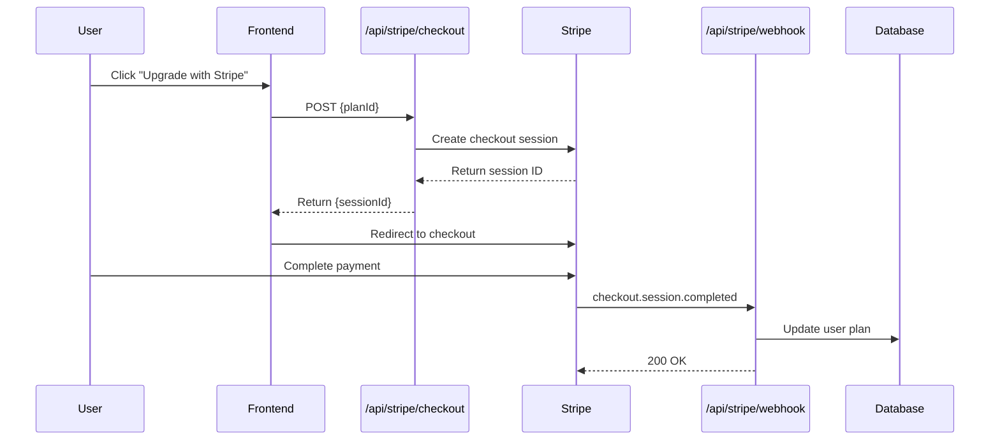
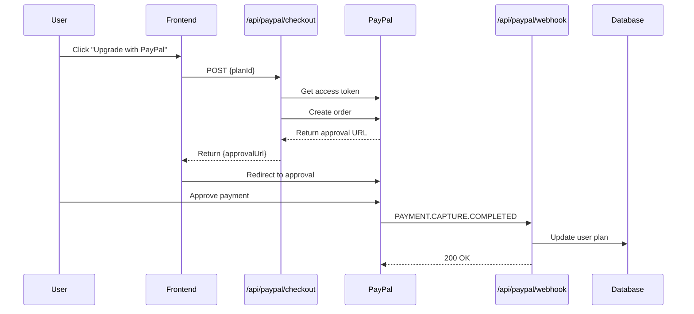

# Payment Integration Documentation

LinkShield supports dual payment processing through both Stripe and PayPal, providing users with flexible payment options for subscription management.

## Overview

The payment system handles the complete subscription lifecycle including:
- Checkout session creation
- Payment processing
- Subscription activation via webhooks
- Plan upgrades and cancellations
- Billing cycle management

**Supported Payment Providers:**
- **Stripe**: Primary payment processor with full subscription management
- **PayPal**: Alternative payment option with order-based processing

## Architecture

### Key Components

**Frontend:**
- `src/app/pricing/page.tsx`: Pricing page with payment provider selection
- Payment provider selection and checkout initiation

**Backend API Endpoints:**
- `src/app/api/stripe/checkout/route.ts`: Stripe checkout session creation
- `src/app/api/stripe/webhook/route.ts`: Stripe webhook event processing
- `src/app/api/paypal/checkout/route.ts`: PayPal order creation
- `src/app/api/paypal/webhook/route.ts`: PayPal webhook event processing

**Utilities:**
- `src/lib/paypal.ts`: PayPal API client and utilities
- `src/lib/db.ts`: Database connection and operations

### Database Schema

```prisma
model User {
  id                     String   @id @default(cuid())
  email                  String   @unique
  name                   String?
  plan                   String   @default("free")
  plan_expires_at        DateTime?
  stripe_customer_id     String?  @unique
  paypal_subscription_id String?  @unique
  paypal_order_id        String?  @unique
  // ... other fields
}
```

## Stripe Integration

### Checkout Flow



### Implementation Details

**Checkout Session Creation:**
```typescript
// Mock implementation in /api/stripe/checkout
const mockPrices = {
  'pro': 'price_pro_monthly',
  'premium': 'price_premium_monthly'
}

// Creates checkout session with user reference
const session = {
  id: 'mock_session_id',
  url: 'https://checkout.stripe.com/mock',
  client_reference_id: user.id,
  metadata: { plan: planId }
}
```

**Webhook Event Handling:**
- `checkout.session.completed`: Activates subscription and updates user plan
- `invoice.payment_succeeded`: Extends subscription period
- `customer.subscription.deleted`: Downgrades user to free plan

### Stripe Webhook Events

```typescript
// Key webhook handlers
async function handleCheckoutSessionCompleted(data: any) {
  const { client_reference_id, metadata } = data
  const planId = metadata?.plan || 'pro'
  
  await db.user.update({
    where: { id: client_reference_id },
    data: {
      plan: planId,
      plan_expires_at: new Date(Date.now() + 30 * 24 * 60 * 60 * 1000)
    }
  })
}

async function handleSubscriptionDeleted(data: any) {
  await db.user.updateMany({
    where: { email: data.customer_email },
    data: {
      plan: 'free',
      plan_expires_at: null
    }
  })
}
```

## PayPal Integration

### Checkout Flow



### Implementation Details

**Order Creation:**
```typescript
// PayPal order structure
const orderData = {
  intent: 'CAPTURE',
  purchase_units: [{
    amount: {
      currency_code: 'USD',
      value: planPrices[planId]
    },
    custom_id: JSON.stringify({ userId: user.id, planId })
  }],
  application_context: {
    return_url: `${process.env.NEXTAUTH_URL}/payment/success`,
    cancel_url: `${process.env.NEXTAUTH_URL}/pricing`
  }
}
```

**Webhook Event Handling:**
- `CHECKOUT.ORDER.APPROVED`: Order approved by user
- `PAYMENT.CAPTURE.COMPLETED`: Payment successfully captured
- `CHECKOUT.ORDER.COMPLETED`: Order processing completed
- `PAYMENT.CAPTURE.DENIED`: Payment failed or denied

### PayPal Webhook Events

```typescript
// Webhook verification and processing
export async function POST(request: NextRequest) {
  const webhookEvent = await request.json()
  
  // Verify webhook signature
  const verifyResponse = await fetch(`${PAYPAL_BASE}/v1/notifications/verify-webhook-signature`, {
    method: 'POST',
    headers: {
      'Content-Type': 'application/json',
      'Authorization': `Bearer ${accessToken}`
    },
    body: JSON.stringify({
      transmission_id: request.headers.get('paypal-transmission-id'),
      cert_id: request.headers.get('paypal-cert-id'),
      auth_algo: request.headers.get('paypal-auth-algo'),
      transmission_sig: request.headers.get('paypal-transmission-sig'),
      transmission_time: request.headers.get('paypal-transmission-time'),
      webhook_id: process.env.PAYPAL_WEBHOOK_ID,
      webhook_event: webhookEvent
    })
  })
  
  // Process successful payments
  if (eventType === 'PAYMENT.CAPTURE.COMPLETED') {
    const expiration = new Date()
    expiration.setMonth(expiration.getMonth() + 1)
    
    await db.user.updateMany({
      where: { id: parsed.userId },
      data: {
        plan: parsed.planId,
        plan_expires_at: expiration,
        paypal_order_id: webhookEvent.resource?.id
      }
    })
  }
}
```

## Environment Variables

### Required Configuration

```env
# Stripe Configuration
STRIPE_PUBLISHABLE_KEY=pk_test_...
STRIPE_SECRET_KEY=sk_test_...
STRIPE_WEBHOOK_SECRET=whsec_...

# PayPal Configuration
PAYPAL_CLIENT_ID=your_paypal_client_id
PAYPAL_CLIENT_SECRET=your_paypal_client_secret
PAYPAL_WEBHOOK_ID=your_webhook_id

# Application URLs
NEXTAUTH_URL=http://localhost:3000
```

## Plan Configuration

### Available Plans

```typescript
// Stripe price mapping
const stripePrices = {
  'pro': 'price_pro_monthly',
  'premium': 'price_premium_monthly'
}

// PayPal price mapping
const paypalPrices = {
  'pro': '9.99',
  'premium': '19.99'
}
```

### Plan Features
- **Free**: Basic URL checking, limited requests
- **Pro**: Enhanced features, higher limits, AI analysis
- **Premium**: Full feature access, unlimited requests, priority support

## Security Considerations

### Webhook Security
- **Stripe**: Webhook signatures verified using `STRIPE_WEBHOOK_SECRET`
- **PayPal**: Webhook signatures verified through PayPal's verification API
- All webhook endpoints validate request authenticity before processing

### Data Protection
- User payment data handled exclusively by payment providers
- Only subscription status and customer IDs stored locally
- PCI compliance maintained through provider integration

### Error Handling
- Comprehensive error logging for payment failures
- Graceful degradation for webhook processing errors
- User notification system for payment issues

## Testing

### Development Setup
1. Configure test API keys for both providers
2. Set up webhook endpoints using ngrok or similar tunneling
3. Test both successful and failed payment scenarios
4. Verify webhook event processing

### Test Scenarios
- Successful subscription creation
- Payment failure handling
- Webhook event processing
- Plan upgrades and downgrades
- Subscription cancellations

## Monitoring and Analytics

### Key Metrics
- Conversion rates by payment provider
- Payment failure rates
- Subscription churn analysis
- Revenue tracking by plan type

### Logging
- All payment events logged with user context
- Webhook processing status tracking
- Error monitoring and alerting

## Future Enhancements

### Planned Features
- Subscription plan changes without cancellation
- Proration handling for mid-cycle upgrades
- Multi-currency support
- Enterprise billing options
- Usage-based billing integration

### Integration Improvements
- Real-time subscription status synchronization
- Enhanced webhook retry mechanisms
- Advanced fraud detection
- Customer billing portal integration

This dual-provider payment system ensures maximum user convenience while maintaining robust subscription management and security standards.